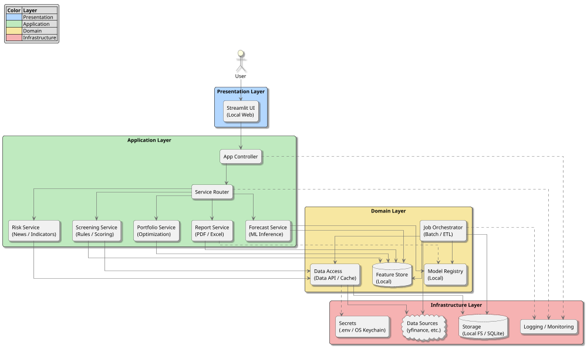
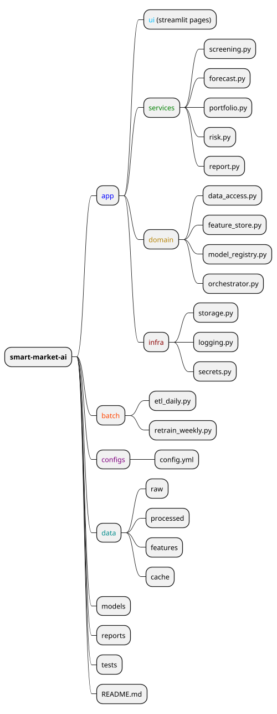

# 🏗️ System Architecture — Smart Market AI (Based on Refined Requirements)

## 0. Guiding Principles
- **Simplicity First**: ローカル実行を前提に、依存を最小化。
- **Modular Design**: UI・アプリケーション・データ・MLを疎結合化。
- **Reproducibility**: 同一データ・同一モデルで同一結果を再現。
- **Security by Default**: 外部送信を極小化、秘匿情報は暗号化管理。

---

## 1. Architecture Overview
**目的**: NISA対応を含む個人投資家向けの高配当銘柄選定・市場予測・リスク分析を、ローカル中心で高速に提供。  

**アーキテクチャスタイル**: 分割層（Layered）+ パイプライン/バッチ（ETL + ML Training）+ リアルタイム（Inference & UI）

---

## 2. Component Breakdown

### 2.1 Presentation Layer (UI)
- **Streamlit App**: ダッシュボード、検索・条件入力、結果可視化、レポートDL。
- **Session State**: ユーザー設定（最低利回り、通貨、リスク許容度等）の保持。
- **Visualization**: plotly/matplotlib によるチャート。

### 2.2 Application Layer (Services)
- **Screening Service**  
  - 指標（配当利回り、成長率、自己資本比率、PER 等）によるスコアリング。  
  - 重み付け変更、フィルタリング、ランキング生成。  
- **Forecast Service**  
  - 価格/配当の回帰・分類推論（scikit-learn / XGBoost / Prophet / PyTorch）。  
  - 不確実性指標（予測区間、信頼度）の出力。  
- **Portfolio Service**  
  - PyPortfolioOpt/cvxpy で平均分散最適化、制約（銘柄数、比率上限、通貨）対応。  
- **Risk Service**  
  - 経済指標・ニューススコア集計（シンプルなキーワード/辞書→将来はNLP）。  
  - リスクヒートマップ生成。  
- **Report Service**  
  - PDF/Excel 出力、テンプレート（会社別/ポートフォリオ別/市場別）。  

### 2.3 Domain Layer
- **Feature Store (Local)**: 特徴量の計算・格納（Parquet/Feather）。
- **Model Registry (Local)**: モデルとメタデータ（学習日、指標、ハイパラ）を管理。
- **Data Access**: yfinance/pandas_datareader などのコネクタ＋キャッシュ層。
- **Job Orchestrator**: ETL・学習・評価・モデル登録のバッチワークフロー。

### 2.4 Infrastructure Layer
- **Storage**: ローカルFS、SQLite（メタ/小規模DB）、将来はDuckDB/Lightweight-Postgresに拡張可。
- **Secrets**: .env + OSキーチェーン（将来 Vault 互換に対応）。
- **Logging/Monitoring**: Python logging + ローカルメトリクス（CSV/JSON）。

---

## 3. Data Flow (ETL & Inference)

### 3.1 Batch Pipeline (Daily/Weekly)
1. **Extract**: yfinance 等から株価・配当・指標を取得。  
2. **Transform**: 欠損処理、通貨換算、ビジネスルール標準化。  
3. **Feature Build**: テクニカル/ファンダ特徴量・ターゲット作成。  
4. **Train**: モデル学習（CV/時系列分割）→ 指標算出（RMSE/ROC/PR）。  
5. **Register**: モデル・特徴量を Model Registry / Feature Store へ登録。  
6. **Validate**: バイアス/ドリフト簡易チェック、しきい値評価。  

### 3.2 Inference Path (On-demand)
UI入力 → Data Access (キャッシュ確認) → Feature Store → Forecast Service → 結果表示・保存。

---

## 4. Deployment View
- **Local (Default)**: 単一マシンでの実行（Python + Streamlit）。
- **Optional Container**: Docker 化（再現性向上）。
- **Scheduler**: Windows Task Scheduler / cron でバッチ起動。

---

## 5. Data Model (Logical)
- **MarketData**: symbol, date, ohlcv, dividends, splits, currency  
- **Fundamentals**: symbol, period, revenue, eps, roe, debt_ratio, payout  
- **Features**: symbol, date, feature_vector (Parquet)  
- **Models**: model_id, task, algo, params, metrics, created_at  
- **Predictions**: symbol, date, y_pred, interval_low/high, model_id  
- **Portfolio**: weights, constraints, risk_metrics  

---

## 6. API Design (Internal Python Interfaces)
- `DataAccess.get_prices(symbols, start, end, interval)`
- `FeatureBuilder.build(price_df, fundamentals_df, config)`
- `ModelTrainer.train(task, dataset, algo, params)`
- `ModelRegistry.save(model_obj, meta)` / `load(task)`
- `Forecaster.predict(model, X)`
- `Screener.rank(candidates, weights, filters)`
- `Portfolio.optimize(returns, cov, constraints)`
- `Reporter.to_pdf(context)` / `to_excel(context)`

---

## 7. Configuration & Secrets
- **config.yml**: データ期間、対象指数、通貨、ランキング重み、学習パラメータ。  
- **.env**: APIキー、プロキシ、レポート出力先。  
- **環境切替**: `config.local.yml` / `config.prod.yml`（将来）。  

---

## 8. Observability & Quality
- **Logging**: INFO（操作/処理時間）、DEBUG（特徴量/パラメタ）。  
- **Metrics**: 学習/推論時間、モデル指標、データ欠損率。  
- **Reports**: モデル比較表、ドリフト簡易レポート。  

---

## 9. Security & Compliance
- 外部送信を最小化（オフライン許容）、HTTPS（将来的にFlask併用時）。  
- データ/モデル/レポートのフォルダ分離とアクセス権管理。  
- 免責表示のUI常設（投資助言ではなく情報提供）。  

---

## 10. Performance Targets
- UI操作→結果: 5秒以内（キャッシュ利用時）。  
- バッチETL(100〜300銘柄/1年分): 3〜10分目安（ローカルCPU）。  
- レポート生成: 5〜30秒。  

---

## 11. Testing Strategy
- **Unit**: 各サービス/ユーティリティ（pytest）。  
- **Integration**: ETL→Feature→Train→Registry の通し確認。  
- **E2E**: Streamlit UI テスト（playwright/selenium 簡易）。  
- **Data Tests**: Great Expectations 代替の軽量チェック（欠損・範囲）。  

---

## 12. CI/CD & Packaging
- **CI**: Lint + Unit + 小規模データでのSmoke学習。  
- **Artifact**: `models/`, `reports/` バージョニング（日付+hash）。  
- **Packaging**: `pipx` / `uv` 対応、Dockerは任意。  

---

## 13. Risks & Mitigations
- **データ品質のばらつき** → 前処理の強化、フェイルソフト（既存キャッシュ利用）。  
- **モデル過学習** → 時系列CV、正則化、単純モデルの併用。  
- **実行時間の悪化** → キャッシュ/並列処理、特徴量削減。  
- **ユーザー操作の複雑化** → プリセット（初心者/中級者）を提供。  

---

## 14. Roadmap (Architecture → Implementation)
1. Skeleton 実装（層/ディレクトリ/抽象インターフェース）  
2. DataAccess + Cache、FeatureBuilder MVP  
3. Screening/Forecast/Portfolio のMVP統合  
4. Report 出力、設定UI  
5. Batch ETL、週次再学習  
6. リスク分析（ニュース/NLP）強化  

---

## 15. Directory Layout (Proposal)

---

## 16. Open Questions
- 海外株の**為替レート**の扱い（スポット/終値、手数料想定）。  
- **投信データ**の標準化ソース（信託報酬、リスク指標）。  
- リスク分析の**ニュース取得**（RSS/手動アップロードの当面運用）。  

---

### Appendix: Minimal Tech Choices
- **DB**: SQLite（→ DuckDB 拡張余地）  
- **ファイル形式**: Parquet（features）, CSV（raw/cache）, XLSX/PDF（reports）  
- **モデリング**: Prophet（指数トレンド）、XGBoost/LightGBM（銘柄）、LR baseline  
- **スケジューラ**: cron/Task Scheduler  

