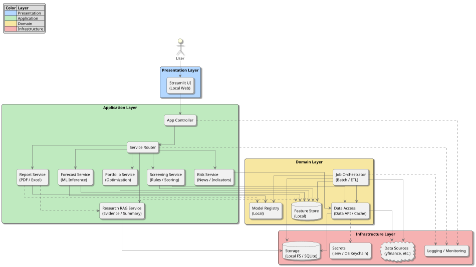
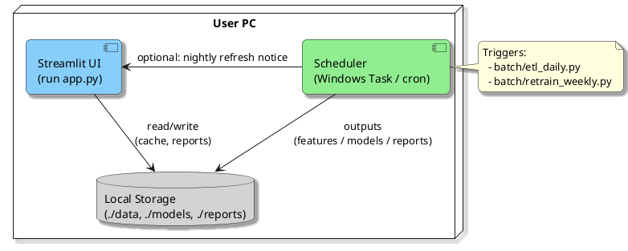
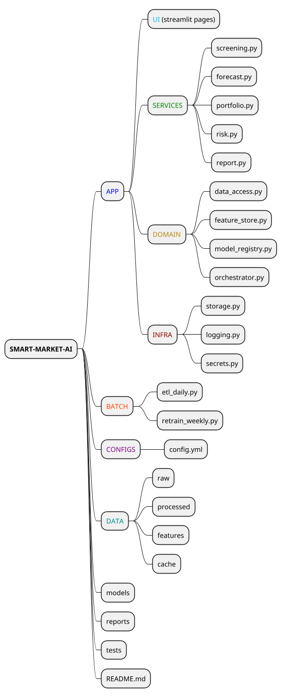

# 🏗️ System Architecture — Smart Market AI (Based on Refined Requirements)

#### [BACK TO README](../README.md)

## 実装状態との同期メモ（2026-05-17）

現在の実装構成は、以下の layered architecture として整理します。

- Presentation: Streamlit `ui/app.py`
  - Market Data: `銘柄コックピット` / `銘柄ランキング`
  - Rebalance: `Rebalance Cockpit`
- Application/API: `backend/app/main.py`
  - Health / Risk / Portfolio / Screening / Forecast / Scoring endpoints
- Domain services:
  - `backend/marketdata`
  - `backend/forecast`
  - `backend/screening`
  - `backend/scoring`
  - `backend/risk`
  - `backend/portfolio`
- Infrastructure-like adapters:
  - deterministic `mock` / `csv`
  - explicit opt-in `yahoo` live adapter path
  - provider registry / factory / capability metadata

Research RAG、Decision Report、Execution は設計上の将来コンポーネントです。
現時点の通常経路には含めず、planned / optional adapter として扱います。
後続の旧来アーキテクチャ記述には future scope も含まれるため、現在の実装状態はこの同期メモとコードを優先します。

## 次期アーキテクチャ方針: Multi-Model Investment Intelligence

Phase 9 以降の重点は、Execution よりも、外部データ取得、特徴量管理、複数モデル予測、スコアリング、可視化、判断補助レポートです。
既存の deterministic MVP 経路を保ちながら、次の構成を段階的に追加します。

### 追加予定コンポーネント

- External Provider Adapter
  - `mock` / `csv` と同じ契約へ正規化する live provider adapter。
  - opt-in 設定、timeout、rate limit、schema mismatch を明示的に扱う。
- Feature Store Lite
  - 銘柄、as-of date、provider、feature version を持つ特徴量 snapshot。
  - return、volatility、momentum、ADV、drawdown、data completeness などを保持する。
- Screening Service
  - 複数銘柄を比較し、サブスコア付きの ranking を返す。
- Forecast Service
  - `ForecastModel` インターフェースを通じて複数モデルを実行する。
  - baseline model から始め、後で研究モデル adapter を追加する。
- Model Registry Lite
  - 利用可能モデル、horizon、入力特徴量、出力形式、model card を管理する。
- Investment Score Service
  - screening、forecast、risk、data quality を統合して総合スコアを返す。
- Research RAG Layer
  - IR資料、有価証券報告書、決算資料、中期経営計画、ニュース等を local-first に登録・検索する。
  - 根拠 chunk、資料メタデータ、Research Score を Decision Report / Assistant / Investment Score に渡す。
- Visualization Cockpit
  - ranking、score breakdown、forecast chart、model comparison を表示する。
- Decision Report
  - ユーザーが判断材料、注意点、モデル間の不一致を読み取れる Markdown/JSON/CSV/ZIP report を出力する。

### データフロー

1. MarketData provider が `Bar` / `Quote` / `FxRate` へ正規化した市場データを返す。
2. Feature Store Lite が銘柄ごとの特徴量 snapshot を作る。
3. Screening Service が特徴量から候補銘柄を ranking する。
4. Forecast Service が複数モデルの予測を実行する。
5. Research RAG Layer がIR資料・決算資料・ニュースから evidence と Research Score を生成する。
6. Investment Score Service が screening、forecast、risk、data quality、optional research を統合する。
7. API / UI / report がスコア、予測、根拠、不確実性を表示する。

この構成では、CI と通常のローカル検証は引き続き外部 API なしで実行できます。
live provider や高度なモデルは、明示設定または optional adapter として扱います。

## 0. Guiding Principles
- **Simplicity First**: ローカル実行を前提に、依存を最小化。
- **Modular Design**: UI・アプリケーション・データ・MLを疎結合化。
- **Reproducibility**: 同一データ・同一モデルで同一結果を再現。
- **Security by Default**: 外部送信を極小化、秘匿情報は暗号化管理。

---

## 1. Architecture Overview
**目的**: NISA対応を含む個人投資家向けの高配当銘柄選定・市場予測・リスク分析を、ローカル中心で高速に提供。

**アーキテクチャスタイル**: 分割層（Layered）+ パイプライン/バッチ（ETL + ML Training）+ リアルタイム（Inference & UI）

---

## 2. Component Breakdown

### 2.1 Presentation Layer (UI)
- **Streamlit App**: ダッシュボード、検索・条件入力、結果可視化、レポートDL。
- **Session State**: ユーザー設定（最低利回り、通貨、リスク許容度等）の保持。
- **Visualization**: 現状は Streamlit + Altair。plotly/matplotlib は future optional。

### 2.2 Application Layer (Services)
- **Screening Service**
  - 指標（配当利回り、成長率、自己資本比率、PER 等）によるスコアリング。
  - 重み付け変更、フィルタリング、ランキング生成。
- **Forecast Service**
  - 現状は naive / moving average / momentum baseline と consensus。
  - scikit-learn / XGBoost / Prophet / PyTorch などは future optional adapter。
- **Portfolio Service**
  - 現状は JPY valuation と no-solver rebalance proposal。
  - PyPortfolioOpt/cvxpy での平均分散最適化は future scope。
- **Risk Service**
  - 経済指標・ニューススコア集計（シンプルなキーワード/辞書→将来はNLP）。
  - リスクヒートマップ生成。
- **Report Service**
  - 現状は Rebalance の JSON / CSV / Markdown / manifest / ZIP export。
  - PDF/Excel 出力、テンプレート（会社別/ポートフォリオ別/市場別）は future scope。
- **Research RAG Service**
  - ローカル資料登録、chunk化、keyword/vector検索、企業分析サマリ、Research Score生成。
  - 初期はlocal documentとkeyword searchを優先し、外部ソース・embedding・LLMはoptional adapterとして扱う。

### 2.3 Domain Layer
- **Feature Store (Local)**: 特徴量の計算・格納（Parquet/Feather）。
- **Model Registry (Local)**: モデルとメタデータ（学習日、指標、ハイパラ）を管理。
- **Data Access**: yfinance/pandas_datareader などのコネクタ＋キャッシュ層。
- **Job Orchestrator**: ETL・学習・評価・モデル登録のバッチワークフロー。

### 2.4 Infrastructure Layer
- **Storage**: ローカルFS、SQLite（メタ/小規模DB）、将来はDuckDB/Lightweight-Postgresに拡張可。
- **Secrets**: .env + OSキーチェーン（将来 Vault 互換に対応）。
- **Logging/Monitoring**: Python logging + ローカルメトリクス（CSV/JSON）。

---

## 3. Data Flow (ETL & Inference)

### 3.1 Batch Pipeline (Daily/Weekly)
1. **Extract**: yfinance 等から株価・配当・指標を取得。
2. **Transform**: 欠損処理、通貨換算、ビジネスルール標準化。
3. **Feature Build**: テクニカル/ファンダ特徴量・ターゲット作成。
4. **Train**: モデル学習（CV/時系列分割）→ 指標算出（RMSE/ROC/PR）。
5. **Register**: モデル・特徴量を Model Registry / Feature Store へ登録。
6. **Validate**: バイアス/ドリフト簡易チェック、しきい値評価。

### 3.2 Inference Path (On-demand)
UI入力 → Data Access (キャッシュ確認) → Feature Store → Forecast Service → 結果表示・保存。

---

## 4. Deployment View
- **Local (Default)**: 単一マシンでの実行（Python + Streamlit）。
- **Optional Container**: Docker 化（再現性向上）。
- **Scheduler**: Windows Task Scheduler / cron でバッチ起動。

---

## 5. Data Model (Logical)
- **MarketData**: symbol, date, ohlcv, dividends, splits, currency
- **Fundamentals**: symbol, period, revenue, eps, roe, debt_ratio, payout
- **Features**: symbol, date, feature_vector (Parquet)
- **Models**: model_id, task, algo, params, metrics, created_at
- **Predictions**: symbol, date, y_pred, interval_low/high, model_id
- **Portfolio**: weights, constraints, risk_metrics

---

## 6. API Design (Internal Python Interfaces)
- `DataAccess.get_prices(symbols, start, end, interval)`
- `FeatureBuilder.build(price_df, fundamentals_df, config)`
- `ModelTrainer.train(task, dataset, algo, params)`
- `ModelRegistry.save(model_obj, meta)` / `load(task)`
- `Forecaster.predict(model, X)`
- `Screener.rank(candidates, weights, filters)`
- `Portfolio.optimize(returns, cov, constraints)`
- `Reporter.to_pdf(context)` / `to_excel(context)`

---

## 7. Configuration & Secrets
- **config.yml**: データ期間、対象指数、通貨、ランキング重み、学習パラメータ。
- **.env**: APIキー、プロキシ、レポート出力先。
- **環境切替**: `config.local.yml` / `config.prod.yml`（将来）。

---

## 8. Observability & Quality
- **Logging**: INFO（操作/処理時間）、DEBUG（特徴量/パラメタ）。
- **Metrics**: 学習/推論時間、モデル指標、データ欠損率。
- **Reports**: モデル比較表、ドリフト簡易レポート。

---

## 9. Security & Compliance
- 外部送信を最小化（オフライン許容）、HTTPS（将来的にFlask併用時）。
- データ/モデル/レポートのフォルダ分離とアクセス権管理。
- 免責表示のUI常設（投資助言ではなく情報提供）。

---

## 10. Performance Targets
- UI操作→結果: 5秒以内（キャッシュ利用時）。
- バッチETL(100〜300銘柄/1年分): 3〜10分目安（ローカルCPU）。
- レポート生成: 5〜30秒。

---

## 11. Testing Strategy
- **Unit**: 各サービス/ユーティリティ（pytest）。
- **Integration**: ETL→Feature→Train→Registry の通し確認。
- **E2E**: Streamlit UI テスト（playwright/selenium 簡易）。
- **Data Tests**: Great Expectations 代替の軽量チェック（欠損・範囲）。

---

## 12. CI/CD & Packaging
- **CI**: Lint + Unit + 小規模データでのSmoke学習。
- **Artifact**: `models/`, `reports/` バージョニング（日付+hash）。
- **Packaging**: `pipx` / `uv` 対応、Dockerは任意。

---

## 13. Risks & Mitigations
- **データ品質のばらつき** → 前処理の強化、フェイルソフト（既存キャッシュ利用）。
- **モデル過学習** → 時系列CV、正則化、単純モデルの併用。
- **実行時間の悪化** → キャッシュ/並列処理、特徴量削減。
- **ユーザー操作の複雑化** → プリセット（初心者/中級者）を提供。

---

## 14. Roadmap (Architecture → Implementation)
1. Skeleton 実装（層/ディレクトリ/抽象インターフェース）
2. DataAccess + Cache、FeatureBuilder MVP
3. Screening/Forecast/Portfolio のMVP統合
4. Report 出力、設定UI
5. Batch ETL、週次再学習
6. リスク分析（ニュース/NLP）強化

---

## 15. Directory Layout (Proposal)

---

## 16. Open Questions
- 海外株の**為替レート**の扱い（スポット/終値、手数料想定）。
- **投信データ**の標準化ソース（信託報酬、リスク指標）。
- リスク分析の**ニュース取得**（RSS/手動アップロードの当面運用）。

---

### Appendix: Minimal Tech Choices
- **DB**: SQLite（→ DuckDB 拡張余地）
- **ファイル形式**: 現状は CSV / JSON / Markdown / ZIP。Parquet、XLSX/PDF は future scope
- **モデリング**: 現状は deterministic baseline。Prophet、XGBoost/LightGBM、LR baseline は future optional
- **スケジューラ**: cron/Task Scheduler
