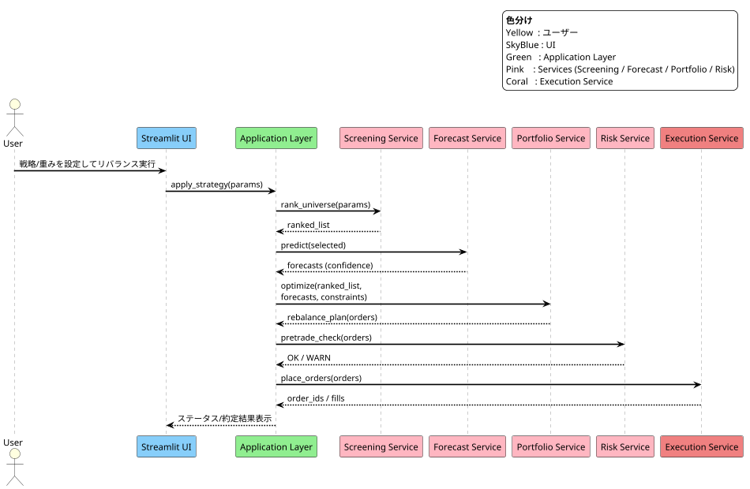
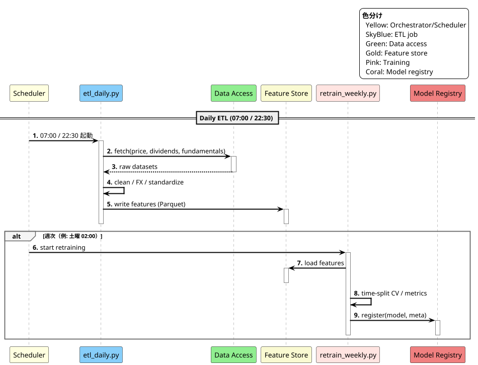
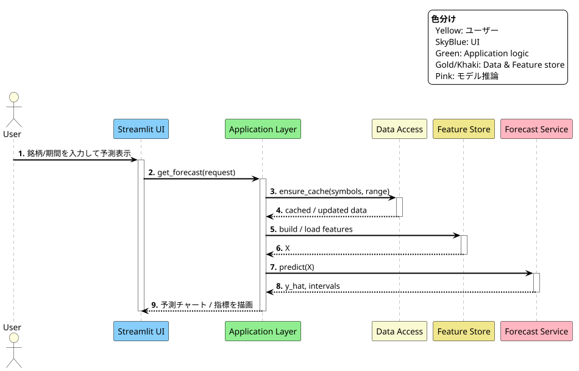
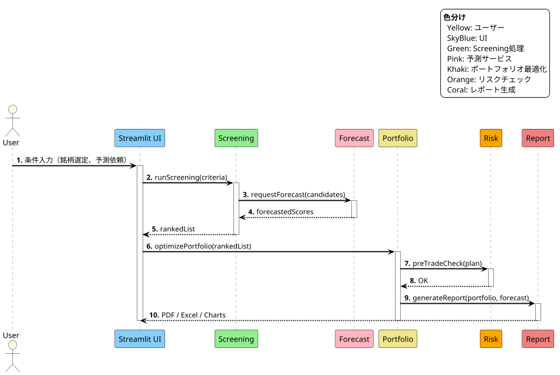

# 03\_Functional\_design

#### [BACK TO README](../README.md)

> 本ドキュメントは「01\_Define\_requirements」および「02\_System\_design」に基づき、要素ごとの具体的な機能仕様を示します。

---

## 0. Scope & Assumptions

* 対象市場：日本株・米国株・ETF・高配当銘柄（高配当は日本株に限定しない）、安定成長型投資信託。
* 投資対象は現物中心、信用取引は将来的拡張。
* 対象機能：銘柄予測、ランキング、市場予測、ポートフォリオ最適化、リスク分析、レポート出力。
* デプロイはローカル実行（Python + Streamlit）を基本、クラウドやコンテナ実行も可能。
* 非対象：仮想通貨、先物・オプション、超低レイテンシHFT。

---

## 1. Market Data Ingestion

* 価格（日足・分足）、配当履歴・増配履歴、ファンダメンタル（EPS、ROE、自己資本比率等）を取得。
* 対応市場：日本株、米国株、ETF、安定成長型投資信託。
* 欠損値補完、通貨換算、銘柄コード統一。
* データソース：yfinance、pandas\_datareader、その他低コストAPI。

---

## 2. Screening & Ranking Engine

* 配当利回り、成長率、自己資本比率、PER、リスクスコアなどによるスコアリング。
* 重み付け変更、フィルタリング、ランキング生成。
* 対象：高配当株（国内外）と安定成長型投資信託。

---

## 3. Forecast Engine

* 株価・配当の回帰／分類予測（scikit-learn, XGBoost, Prophet, PyTorch）。
* 不確実性指標（予測区間、信頼度）の出力。
* 日経平均・TOPIXなどの市場指数予測もサポート。

---

## 4. Portfolio Management

* 平均分散最適化（PyPortfolioOpt / cvxpy）、銘柄数・比率・通貨制約対応。
* 為替建玉（USD/JPY）と現地/円貨評価。
* 自動リバランス案生成（最小取引単位考慮）。

---

## 5. Execution Service

* 発注種別：成行、指値、逆指値、IOC。
* 発注単位：単元株、端株（対応ブローカのみ）。
* 再送・部分約定処理。

---

## 6. Risk Analysis Service

* 経済指標・ニューススコア集計によるリスク評価。
* リスクヒートマップ生成。
* 短期売買規制（日米）、配当落ち日リスクの事前チェック。

---

## 7. Backtesting & Simulation

* 株価・配当・手数料・配当再投資を考慮。
* 複数市場混在ポートフォリオ対応。
* 指標：CAGR、最大DD、シャープ、ソルティノ、配当利回り推移。

---

## 8. Reporting & Analytics

* PDF・Excel出力、ダッシュボード（Streamlitベース）。
* 配当推移・利回りグラフ、セクター別配分、パフォーマンスKPI。
* エクスポート：CSV、PDF、PNG/SVG。

---

## 9. Notification & Workflow

* Email、Slack/Teams通知、配当落ち日前リマインド。
* データ取り込み失敗、約定、リスク警告をイベント通知。
* 発注前承認（オプション）。

---

## 10. User Interfaces (Streamlit & API)

* StreamlitベースのWebUI（ローカル実行前提）。
* 検索・条件入力、ランキング表示、チャート、レポートDL。
* APIはPython内部インターフェースとして提供（DataAccess, Screener, Forecaster等）。

---

## 11. Authentication & Authorization

* ローカル利用時は簡易認証、クラウド利用時はOIDC（Azure AD/Google）対応。
* 権限：Admin/Trader/Analyst/Viewer。
* 監査ログ保存。

---

## 12. Configuration Management

* config.ymlでデータ期間、指数、通貨、重み、学習パラメータを設定。
* .envにAPIキーやパスワード。

---

## 13. Observability

* INFO/DEBUGログ、処理時間、エラー率、モデル指標を記録。
* ローカルメトリクス出力（CSV/JSON）。

---

## 14. Scheduler & Job Orchestration

* Windows Task Scheduler/cronでバッチ実行（ETL、再学習）。
* ingestion→screening→forecast→portfolio→reportの依存制御。

---

## 15. Non-Functional Requirements

* ローカル実行で主要分析5秒以内（キャッシュ利用時）。
* バッチETL（100〜300銘柄/1年分）：3〜10分。
* UI操作→結果：5秒以内。
* 配当落ち日前通知、配当再投資対応。

---

## 16. Sequence Diagrams (PlantUML)

### 16.1 Rebalance & Execution

### 16.2 Batch ETL (Daily) & Weekly Retrain

### 16.3 On-demand Inference (UI)

---

### 16.4 Sequence Example (PlantUML)

---

## 17. Traceability Matrix

| Requirement ID | 要件/根拠        | 対応機能                            |
| -------------- | ------------ | ------------------------------- |
| REQ-01         | 高配当投資支援（国内外） | Screening, Forecast, Reporting  |
| REQ-02         | 安定成長型投信対応    | Screening, Forecast, Portfolio  |
| REQ-03         | 市場予測         | Forecast, Reporting             |
| REQ-04         | 自動リバランス      | Portfolio, Scheduler, Execution |
| REQ-05         | リスク分析        | Risk Analysis, Notification     |
| REQ-06         | レポート         | Reporting, Dashboard            |

---

## 18. Acceptance Criteria

* 戦略設定からランキング生成まで5秒以内（キャッシュ利用）。
* 市場指数予測を含むレポートをPDF/Excelで出力可能。
* 配当落ち日前営業日に通知が送信される。
* バックテストで複数市場混在ポートフォリオが配当再投資込みで正しく評価される。

---