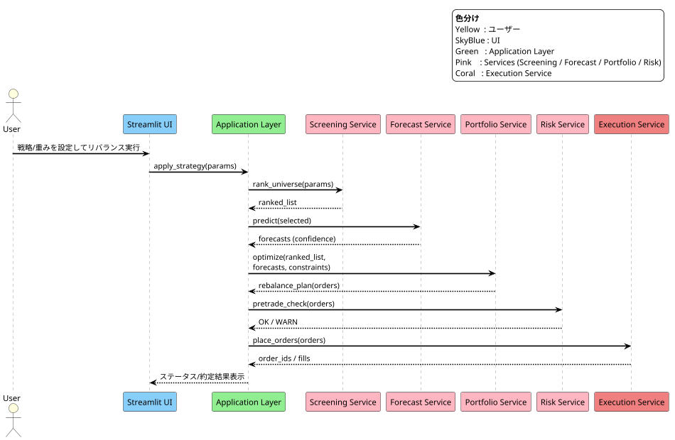
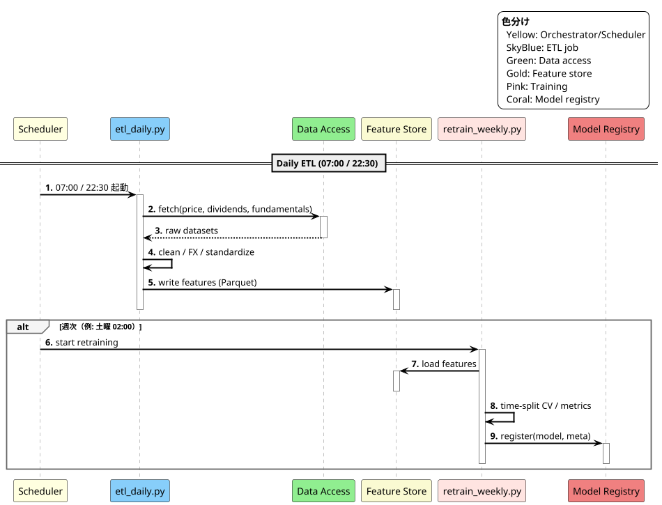
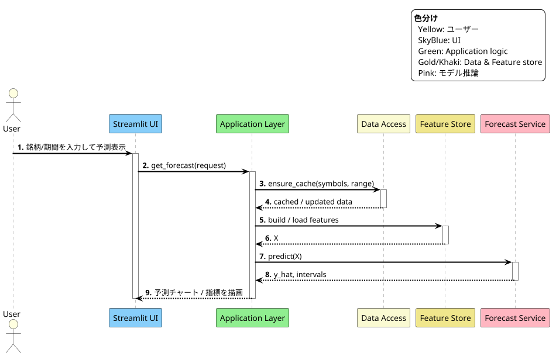
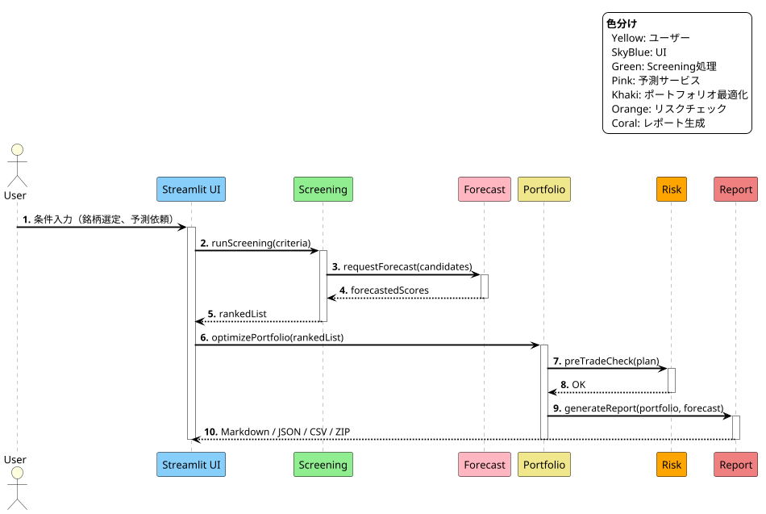

# 03\_Functional\_design

#### [BACK TO README](../README.md)

## Functional Role Clarification / 機能役割の整理

Smart Market AI は投資判断補助ツールであり、売買を指示するアプリではありません。主要機能の役割は以下のように分けます。

| Function | Primary Role | Not Intended To Be |
| --- | --- | --- |
| Ranking | 候補探索・スクリーニングのための画面。複数銘柄を条件で絞り、比較対象を見つける入口。 | 上位銘柄の購入推奨、売買判断の確定 |
| Symbol Cockpit | 1銘柄を深掘りし、価格、特徴量、Forecast、Risk、Investment Score、Research Evidence を確認する画面。 | 単独で売買判断を完結させる画面 |
| Rebalance Cockpit | 保有資産と目標配分の差分を確認し、配分見直しを支援するシミュレーション画面。 | 実際の売買指示、注文執行 |
| Decision Report | ある時点の判断材料、スコア、根拠、不確実性、確認ポイントを保存・説明するレポート。 | 投資推奨書、注文指示書 |
| Research Summary / Research Evidence | 価格データだけでは見えない補足情報を提示する根拠レイヤー。資料名、日付、抜粋、根拠数、信頼度を確認する。 | スコアの絶対的な正しさや将来成果の保証 |
| Investment Score | Screening、Direction Signal、Forecast、Risk、Data Quality など複数観点を統合した比較・分析用スコア。 | Buy / Sell の直接判断 |
| Direction Signal | 上昇気配、下降警戒、予測エッジ、モデル別方向エッジ、価格モメンタム、トレンド確認を整理した深掘り用シグナル。予測変化率はボラティリティ調整し、モデル重みと予測のばらつきも反映する。 | 上がる/下がる銘柄の断定 |
| Data Quality / Database Fit / Metadata Confidence | 評価に使えるデータの充実度・信頼度を示す補助指標。 | 投資魅力度そのもの |

この役割整理に反する表示、導線、文言が見つかった場合は、実装修正の前に [96_Manual_UX_Review_Checklist.md](./96_Manual_UX_Review_Checklist.md) と [97_Functional_Spec_Issues.md](./97_Functional_Spec_Issues.md) に記録します。

## 実装状態との同期メモ（2026-05-18）

現在の機能実装は次の状態です。

| 領域 | 実装状態 | メモ |
| --- | --- | --- |
| MarketData | 実装済み | `mock` / `csv` / opt-in `yahoo` 経路 |
| Feature Snapshot | 実装済み | momentum、volatility、drawdown、completeness など |
| Screening Score | 実装済み | sub-score、reason、forecast agreement 互換 |
| Forecast | 実装済み | naive / moving average / momentum baseline、consensus、direction signal |
| Investment Score | 実装済み | screening / direction signal / forecast agreement 互換 / data quality / risk signal の統合 |
| Portfolio / Risk | 実装済み | no-solver rebalance proposal と pre-trade risk check |
| Streamlit UI | 実装済み | 銘柄コックピット、ランキング、Rebalance Cockpit。最終 browser smoke は推奨確認 |
| Symbol Universe | implementation complete; source updates are operational maintenance | `symbol_universe.csv`、metadata schema、source import、opt-in refresh、SBI policy columns / default exclusion helper |
| Research RAG | planned | local document ingestion から開始予定 |
| Execution | deferred | broker order 送信は現在の重点外 |
| Decision Report | planned | cockpit / ranking / rebalance context を再利用予定 |

現時点では、UI と API の両方で「投資判断補助」であることを明示し、単独の売買推奨として扱わない方針です。
以下の旧来構想セクションには future scope も含まれるため、現在の実装状態は上の同期メモとコードを優先します。

## 次期機能設計: Multi-Model Investment Intelligence

次期機能は、外部データ、特徴量、スクリーニング、複数モデル予測、投資判断補助スコア、可視化を一つの流れとして扱います。

### External Data Ingestion

- 入力: provider 名、銘柄、期間、必要なデータ種別。
- 出力: 既存契約に正規化された `Bar`、`Quote`、`FxRate`。
- 例外: provider unavailable、timeout、rate limit、schema mismatch。
- 制約: live provider は明示 opt-in の場合だけ利用する。

### Security Universe / Ranking Universe Policy

- 入力: local curated CSV、JPX / SBI / FSA / IMAJ などの source CSV、明示 opt-in metadata refresh。
- 出力: ranking 前に使える `symbol_universe.csv` と metadata validation result。
- 初期前提: SBI証券で取り扱いがあり、現物・NISA・長期投資で検討しやすい商品を優先する。
- MVP対象: 国内株式、米国株式、国内ETF、米国ETF/海外ETF。
- MVP除外: 投資信託、ADR、REIT、FX、CFD、先物・オプション、暗号資産、債券、外貨建MMF、貴金属、レバレッジ、インバース、非tradable、非SBI対応。
- 実装状態: `symbol_universe.csv` / `symbol_metadata_schema.py` に broker / tradability / NISA / 積立対応 / leveraged / inverse metadata を追加し、ranking candidate extraction の前に policy helper を適用済み。`tradability=unknown` は初期 seed として通す。
- 取得方針: SBI / JPX / NISA 一覧などを local source CSV 化して import する。Ranking / Screening は外部 source を直接参照しない。投信協会 / 投信CSV / 基準価額は Future Phase とする。
- 制約: SBI証券へのログインやスクレイピングは初期対象外。通常 tests は network 非依存にする。

### Feature Store Lite

- 入力: 正規化済み market data。
- 出力: 銘柄ごとの feature snapshot。
- 主な項目: return、volatility、momentum、ADV、drawdown、data completeness、provider metadata。
- 制約: as-of date と feature version を保持し、未来情報を混入させない。

### Screening Service

- 入力: 候補銘柄、feature snapshot、screening 設定。
- 出力: ranking、総合 screening score、sub score、除外理由。
- 役割: 予測モデルに渡す前の候補銘柄整理と、説明可能な初期スコア付け。

### Forecast Service

- 入力: 銘柄、horizon、feature snapshot、model list。
- 出力: model ごとの予測値、信頼度、評価指標、model metadata。
- 役割: 複数モデルの結果を同じ形式で比較できるようにする。
- 初期モデル: naive、moving average、momentum baseline。

### Multi-Model Summary

- 入力: 複数 forecast result。
- 出力: ensemble forecast、median forecast、model agreement、model disagreement、不確実性。
- 役割: 単一モデルに依存せず、モデル間の見解差を判断材料として表示する。

### Research RAG Service

- 入力: 銘柄、query、資料種別、as-of date、登録済みIR/決算/有報/ニュース資料。
- 出力: Research Evidence、企業分析サマリ、Research Score、資料鮮度、データ品質警告。
- 役割: 価格や予測モデルだけでは拾いにくい長期材料、株主還元方針、事業リスク、開示品質を根拠付きで整理する。
- 初期実装: ローカルPDF/Markdown/Textの登録、chunk化、keyword search、テンプレート要約。
- 将来拡張: vector / hybrid search、EDINET / TDnet / IR RSS / News adapter、optional LLM summary。
- 制約: RAG単体で売買推奨を行わず、根拠と注意点を Decision Report / Assistant / Investment Score に渡す。
- News RAG: 初期は `銘柄コックピット` の選択銘柄に限り、title / URL / source / published_at / summary / investment_viewpoint / sentiment_for_investment / freshness_status を表示する補助情報として扱う。市場全体の `投資ニュース` 画面、News Score 化は後続候補。ニュース単独で ranking order を変更しない。

### Investment Score Service

- 入力: screening score、forecast summary、risk result、data quality、optional research score。
- 出力: 総合 investment score、score breakdown、主な加点・減点理由。
- 役割: ユーザーが銘柄候補を比較しやすいよう、複数の判断材料を一つの説明可能なスコアへ統合する。

### Visualization Cockpit

- ranking table
- score breakdown chart
- forecast horizon chart
- model comparison view
- data quality / risk warning display

### Decision Report

- 出力形式: Markdown、JSON、CSV、ZIP。
- 内容: 銘柄ランキング、スコア内訳、予測結果、モデル間の一致・不一致、Research Evidence、リスク要因、注意点。
- 制約: 投資助言ではなく判断補助として記述する。

> 本ドキュメントは「01\_Define\_requirements」および「02\_System\_design」に基づき、要素ごとの具体的な機能仕様を示します。

---

## 0. Scope & Assumptions

* 対象市場：SBI証券で取り扱いがあることを初期前提にした日本株・米国株・ETF。REIT・投資信託は Future Phase。
* 投資対象は現物中心、信用取引は将来的拡張。
* 対象機能：銘柄予測、ランキング、市場予測、ポートフォリオ最適化、リスク分析、レポート出力。
* デプロイはローカル実行（Python + Streamlit）を基本、クラウドやコンテナ実行も可能。
* 非対象：FX、CFD、仮想通貨、先物・オプション、債券、外貨建MMF、貴金属、レバレッジ・インバース、超低レイテンシHFT。

---

## 1. Market Data Ingestion

* 価格（日足・分足）、配当履歴・増配履歴、ファンダメンタル（EPS、ROE、自己資本比率等）を取得。
* 対応市場：日本株、米国株、ETF。投資信託は Future Phase。
* 欠損値補完、通貨換算、銘柄コード統一。
* データソース：yfinance、pandas\_datareader、その他低コストAPI。

---

## 2. Screening & Ranking Engine

* 配当利回り、成長率、自己資本比率、PER、リスクスコアなどによるスコアリング。
* 重み付け変更、フィルタリング、ランキング生成。
* 対象：国内外の株式・ETF。

---

## 3. Forecast Engine

* 株価・配当の回帰／分類予測（現状は deterministic baseline。scikit-learn, XGBoost, Prophet, PyTorch などは future optional adapter）。
* 不確実性指標（予測区間、信頼度）の出力。
* 日経平均・TOPIXなどの市場指数予測もサポート。

---

## 4. Portfolio Management

* 現状は no-solver rebalance proposal。PyPortfolioOpt / cvxpy による平均分散最適化は future scope。
* 為替建玉（USD/JPY）と現地/円貨評価。
* 自動リバランス案生成（最小取引単位考慮）。

---

## 5. Execution Service

* 発注種別：成行、指値、逆指値、IOC。
* 発注単位：単元株、端株（対応ブローカのみ）。
* 再送・部分約定処理。

---

## 6. Risk Analysis Service

* 経済指標・ニューススコア集計によるリスク評価。
* リスクヒートマップ生成。
* 短期売買規制（日米）、配当落ち日リスクの事前チェック。

---

## 7. Research RAG Service

* IR資料、有価証券報告書、決算資料、中期経営計画、統合報告書、ニュース、ユーザーメモを銘柄に紐づけて管理する。
* 資料本文を chunk 化し、資料名・公開日・ページ番号・資料種別・信頼度を保持する。
* 銘柄と自然文 query から evidence を検索し、長期成長性、株主還元、財務安全性、事業リスク、開示品質を整理する。
* Research Score は Investment Score の optional input とし、Research情報が無い場合も既存スコアは動作する。
* 初期は deterministic な keyword/template ベースで実装し、embedding・LLM・外部取得は opt-in adapter として追加する。

## 7. Backtesting & Simulation

* 株価・配当・手数料・配当再投資を考慮。
* 複数市場混在ポートフォリオ対応。
* 指標：CAGR、最大DD、シャープ、ソルティノ、配当利回り推移。

---

## 8. Reporting & Analytics

* PDF・Excel出力、ダッシュボード（Streamlitベース）。
* 配当推移・利回りグラフ、セクター別配分、パフォーマンスKPI。
* エクスポート：CSV、PDF、PNG/SVG。

---

## 9. Notification & Workflow

* Email、Slack/Teams通知、配当落ち日前リマインド。
* データ取り込み失敗、約定、リスク警告をイベント通知。
* 発注前承認（オプション）。

---

## 10. User Interfaces (Streamlit & API)

* StreamlitベースのWebUI（ローカル実行前提）。
* 検索・条件入力、ランキング表示、チャート、レポートDL。
* APIはPython内部インターフェースとして提供（DataAccess, Screener, Forecaster等）。

---

## 11. Authentication & Authorization

* ローカル利用時は簡易認証、クラウド利用時はOIDC（Azure AD/Google）対応。
* 権限：Admin/Trader/Analyst/Viewer。
* 監査ログ保存。

---

## 12. Configuration Management

* config.ymlでデータ期間、指数、通貨、重み、学習パラメータを設定。
* .envにAPIキーやパスワード。

---

## 13. Observability

* INFO/DEBUGログ、処理時間、エラー率、モデル指標を記録。
* ローカルメトリクス出力（CSV/JSON）。

---

## 14. Scheduler & Job Orchestration

* Windows Task Scheduler/cronでバッチ実行（ETL、再学習）。
* ingestion→screening→forecast→portfolio→reportの依存制御。

---

## 15. Non-Functional Requirements

* ローカル実行で主要分析5秒以内（キャッシュ利用時）。
* バッチETL（100〜300銘柄/1年分）：3〜10分。
* UI操作→結果：5秒以内。
* 配当落ち日前通知、配当再投資対応。

---

## 16. Sequence Diagrams (PlantUML)

### 16.1 Rebalance & Execution

```plantuml
@startuml
' 図全体の設定
scale 950 width
skinparam backgroundColor #FFFFFF
skinparam participant {
  FontSize 14
  BackgroundColor #F3F3F3
  BorderColor Black
}
skinparam sequence {
  ArrowColor Black
  ArrowThickness 2
  LifeLineBorderColor Gray
  LifeLineBackgroundColor White
}

' 参加者定義（色分け）
actor User #LightYellow
participant UI as "Streamlit UI" #LightSkyBlue
participant App as "Application Layer" #LightGreen
participant Screener as "Screening Service" #LightPink
participant Forecaster as "Forecast Service" #LightPink
participant Portfolio as "Portfolio Service" #LightPink
participant Risk as "Risk Service" #LightPink
participant Exec as "Execution Service" #LightCoral

' シーケンス
User -> UI: 戦略/重みを設定してリバランス実行
UI -> App: apply_strategy(params)
App -> Screener: rank_universe(params)
Screener --> App: ranked_list
App -> Forecaster: predict(selected)
Forecaster --> App: forecasts (confidence)
App -> Portfolio: optimize(ranked_list,\nforecasts, constraints)
Portfolio --> App: rebalance_plan(orders)
App -> Risk: pretrade_check(orders)
Risk --> App: OK / WARN
App -> Exec: place_orders(orders)
Exec --> App: order_ids / fills
App --> UI: ステータス/約定結果表示

' --- 凡例（シンプル版） ---
legend top right
<b>色分け</b>
Yellow  : ユーザー
SkyBlue : UI
Green   : Application Layer
Pink    : Services (Screening / Forecast / Portfolio / Risk)
Coral   : Execution Service
endlegend
@enduml
```

### 16.2 Batch ETL (Daily) & Weekly Retrain

```plantuml
@startuml
' --- レイアウト＆見やすさ設定 ---
scale 950 width
skinparam backgroundColor #FFFFFF
skinparam sequence {
  ArrowColor Black
  ArrowThickness 2
  LifeLineBorderColor Gray
  LifeLineBackgroundColor White
  GroupBorderColor #666666
  GroupBackgroundColor #F5F5F5
}
skinparam participant {
  FontSize 14
  BorderColor Black
}
autonumber "<b>0</b>."

' --- 参加者（役割で色分け） ---
participant Scheduler #LightYellow
participant ETL as "etl_daily.py" #LightSkyBlue
participant DAO as "Data Access" #LightGreen
participant FStore as "Feature Store" #LightGoldenRodYellow
participant Trainer as "retrain_weekly.py" #MistyRose
participant MReg as "Model Registry" #LightCoral

' ====================== 日次ETL ======================
== Daily ETL (07:00 / 22:30) ==
Scheduler -> ETL: 07:00 / 22:30 起動
activate ETL
ETL -> DAO: fetch(price, dividends, fundamentals)
activate DAO
DAO --> ETL: raw datasets
deactivate DAO

ETL -> ETL: clean / FX / standardize
ETL -> FStore: write features (Parquet)
activate FStore
deactivate FStore
deactivate ETL

' ====================== 週次再学習 ======================
alt 週次（例: 土曜 02:00）
  Scheduler -> Trainer: start retraining
  activate Trainer
  Trainer -> FStore: load features
  activate FStore
  deactivate FStore

  Trainer -> Trainer: time-split CV / metrics
  Trainer -> MReg: register(model, meta)
  activate MReg
  deactivate MReg
  deactivate Trainer
end

' 任意：凡例
legend top right
<b>色分け</b>
  Yellow: Orchestrator/Scheduler
  SkyBlue: ETL job
  Green: Data access
  Gold: Feature store
  Pink: Training
  Coral: Model registry
endlegend
@enduml
```

### 16.3 On-demand Inference (UI)

```plantuml
@startuml
' --- レイアウト設定 ---
scale 950 width
skinparam backgroundColor #FFFFFF
skinparam sequence {
  ArrowColor Black
  ArrowThickness 2
  LifeLineBorderColor Gray
  LifeLineBackgroundColor White
}
skinparam participant {
  FontSize 14
  BorderColor Black
}
autonumber "<b>0</b>."

' --- 参加者（役割で色分け） ---
actor User #LightYellow
participant UI as "Streamlit UI" #LightSkyBlue
participant App as "Application Layer" #LightGreen
participant DAO as "Data Access" #LightGoldenRodYellow
participant FStore as "Feature Store" #Khaki
participant Forecaster as "Forecast Service" #LightPink

' --- フロー ---
User -> UI: 銘柄/期間を入力して予測表示
activate UI
UI -> App: get_forecast(request)
activate App
App -> DAO: ensure_cache(symbols, range)
activate DAO
DAO --> App: cached / updated data
deactivate DAO

App -> FStore: build / load features
activate FStore
FStore --> App: X
deactivate FStore

App -> Forecaster: predict(X)
activate Forecaster
Forecaster --> App: y_hat, intervals
deactivate Forecaster

App --> UI: 予測チャート / 指標を描画
deactivate App
deactivate UI

' --- 凡例 ---
legend top right
<b>色分け</b>
  Yellow: ユーザー
  SkyBlue: UI
  Green: Application logic
  Gold/Khaki: Data & Feature store
  Pink: モデル推論
endlegend
@enduml
```

---

### 16.4 Sequence Example (PlantUML)

```plantuml
@startuml
' --- レイアウト設定 ---
scale 950 width
skinparam backgroundColor #FFFFFF
skinparam sequence {
  ArrowColor Black
  ArrowThickness 2
  LifeLineBorderColor Gray
  LifeLineBackgroundColor White
}
skinparam participant {
  FontSize 14
  BorderColor Black
}
autonumber "<b>0</b>."

' --- 参加者（役割で色分け） ---
actor User #LightYellow
participant UI as "Streamlit UI" #LightSkyBlue
participant Screening #LightGreen
participant Forecast #LightPink
participant Portfolio #Khaki
participant Risk #Orange
participant Report #LightCoral

' --- フロー ---
User -> UI: 条件入力（銘柄選定、予測依頼）
activate UI
UI -> Screening: runScreening(criteria)
activate Screening
Screening -> Forecast: requestForecast(candidates)
activate Forecast
Forecast --> Screening: forecastedScores
deactivate Forecast

Screening --> UI: rankedList
deactivate Screening

UI -> Portfolio: optimizePortfolio(rankedList)
activate Portfolio
Portfolio -> Risk: preTradeCheck(plan)
activate Risk
Risk --> Portfolio: OK
deactivate Risk

Portfolio -> Report: generateReport(portfolio, forecast)
activate Report
Report --> UI: Markdown / JSON / CSV / ZIP
deactivate Report
deactivate Portfolio
deactivate UI

' --- 凡例 ---
legend top right
<b>色分け</b>
  Yellow: ユーザー
  SkyBlue: UI
  Green: Screening処理
  Pink: 予測サービス
  Khaki: ポートフォリオ最適化
  Orange: リスクチェック
  Coral: レポート生成
endlegend
@enduml
```

---

## 17. Traceability Matrix

| Requirement ID | 要件/根拠        | 対応機能                            |
| -------------- | ------------ | ------------------------------- |
| REQ-01         | 高配当投資支援（国内外） | Screening, Forecast, Reporting  |
| REQ-02         | ETF / NISA向け候補整理 | Screening, Forecast, Portfolio  |
| REQ-03         | 市場予測         | Forecast, Reporting             |
| REQ-04         | 自動リバランス      | Portfolio, Scheduler, Execution |
| REQ-05         | リスク分析        | Risk Analysis, Notification     |
| REQ-06         | レポート         | Reporting, Dashboard            |

---

## 18. Acceptance Criteria

* 戦略設定からランキング生成まで5秒以内（キャッシュ利用）。
* 初期レポートは Markdown / JSON / CSV / ZIP を優先し、PDF / Excel は future scope。
* 配当落ち日前営業日に通知が送信される。
* バックテストで複数市場混在ポートフォリオが配当再投資込みで正しく評価される。

---
