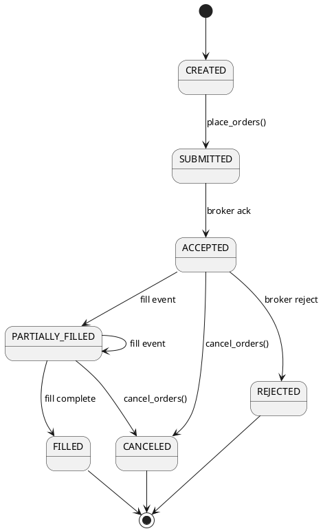

# 04-3\_Onepager\_Execution

#### [BACK TO README](../../README.md)

## 1) Purpose & Scope

* **Purpose**: 発注リクエストをブローカAPIへ安全に橋渡しし、**冪等**・**署名検証**・**部分約定集計**までを一貫して提供する。
* **Scope**: 単一/バスケット注文、キャンセル/置換、Webhookでの約定イベント取り込み、状態管理、通知。JP/US 市場の株式現物を対象。
* **Out of Scope**: 信用/先物/オプション、発注アルゴ（VWAP等）の詳細、資金繰りやポジション集約（Portfolio側）。

### 1.1 アーキテクチャ概要

```
Client -> Execution.place_orders -> BrokerAdapter(REST) -> Broker
           ^                       \
           |                        +-- Retry/Backoff
           |
           +-- ExecReceipt <-------- Idempotency Store

Broker -> Webhook(POST /exec/fill) -> InBox(verify HMAC) -> Dedupe -> StateMachine -> Orders/Exec DB -> Notify
```

## 2) Public Interfaces (Python想定)

```python
class ExecutionService:
    def place_orders(self, orders: list[Order], idempotency_key: str, account_id: str,
                     tif: Literal['DAY','IOC','GTC']='DAY',
                     dry_run: bool=False) -> ExecReceipt: ...

    def cancel_orders(self, order_ids: list[str], idempotency_key: str) -> CancelReceipt: ...

    def replace_order(self, order_id: str, new_params: ReplaceParams, idempotency_key: str) -> ReplaceReceipt: ...

    def get_status(self, order_id: str) -> OrderStatus: ...

    def list_open_orders(self, account_id: str) -> list[OrderSummary]: ...

    # Webhook endpoint handler
    def on_fill_webhook(self, payload: dict, signature: str, ts: str) -> None: ...
```

* 例外: `ValidationError`, `RiskBlockedError`, `RateLimitError`, `BrokerError`, `DuplicateRequestError`, `SecurityError`, `TimeoutError`
* 非機能I/F: `healthcheck()`, `metrics()`, `replay(event_id)`

## 3) Data Contracts (Pydantic)

```python
class Order(BaseModel):
    client_order_id: str                 # クライアント生成ID（任意）
    symbol: str                          # 例: 7203.T / AAPL
    side: Literal['BUY','SELL']
    qty: Decimal                         # 最小取引単位に整合
    type: Literal['MKT','LMT','STP','IOC']
    limit_price: Decimal | None = None
    tif: Literal['DAY','IOC','GTC'] = 'DAY'
    currency: Literal['JPY','USD']
    allow_fractional: bool = False       # USの一部ブローカで対応

class ExecReceipt(BaseModel):
    batch_id: str
    accepted_at: datetime
    broker_order_ids: list[str]
    idempotency_key: str

class ReplaceParams(BaseModel):
    limit_price: Decimal | None = None
    qty: Decimal | None = None

class Fill(BaseModel):
    event_id: str
    broker_order_id: str
    qty: Decimal
    price: Decimal
    ts: datetime                         # 充当時刻（UTC）
    liquidity: Literal['ADD','REMOVE'] | None = None

class OrderStatus(BaseModel):
    order_id: str
    state: Literal['CREATED','SUBMITTED','ACCEPTED','PARTIALLY_FILLED','FILLED','CANCELED','REJECTED']
    filled_qty: Decimal
    avg_price: Decimal | None
    last_update: datetime

class WebhookEnvelope(BaseModel):
    provider: str
    payload: dict
    signature: str
    sent_at: datetime
```

## 4) Algorithms & Rules

* **前処理/検証**:

  * `symbol` 正規化、`qty` を最小取引単位へ丸め（JPは単元株、USは1株/ブローカ依存）。
  * `type='LMT'` のとき `limit_price>0`、`IOC` は部分約定のみ許容。
  * 通貨は `symbol` の市場通貨が原則（US=USD, JP=JPY）。
* **リスク最小チェック（軽量）**:

  * 発注金額上限（config）、1銘柄集中度、取引時間帯チェック。厳密なルールはRiskコンポーネント側で実施。
* **バッチング**:

  * ブローカ/口座単位に分割し、`max_batch=100` を上限。並列送信は `concurrency=4` まで。
* **冪等化**:

  * `idempotency_key` を**必須**。同一キー＋同一リクエスト内容⇒保存済み `ExecReceipt` を返却。
  * ハッシュ（body+headers）で**内容差分**を比較、差分があれば `DuplicateRequestError`。
  * TTL=24h（設定変更可）。
* **Webhook整合**:

  * HMAC署名検証、時刻偏差±5分、`event_id` で重複排除。
  * **順不同**到着に備えて `versioned order state`（イベントソーシング）で集計。
  * 最終状態は `state machine` で遷移（CREATED→SUBMITTED→ACCEPTED→{PARTIALLY\_FILLED, FILLED, CANCELED, REJECTED}）。
* **キャンセル/置換**:

  * `ACCEPTED` 以降はブローカ仕様に従い可能範囲で実行。置換は `cancel+new` のセマンティクスを抽象化。

## 5) Error Handling & Retries

* 分類: `4xx`(検証/Risk), `429`(レート), `5xx/ネットワーク`, `Broker特有`。
* 再試行: `429/5xx` は指数バックオフ（0.5→1→2s, max 3）。`POST` は冪等キーで重複防止。
* DLQ: Webhook受信時の**検証失敗**は隔離保管（再処理UIを用意）。
* タイムアウト: `connect=1s / read=5s`（設定可能）。

## 6) Security

* Webhook: `X-Signature` を HMAC-SHA256 で検証、`X-Sent-At` との偏差±5分、`X-Provider` の許可リスト。
* Outbound: APIキー/シークレットはSecret管理、**ローテーション**手順を `security.md` に記載。
* RBAC: `place_orders` 等は `role=TRADER` のみ可。すべての呼び出しに `corr_id` 必須。
* 監査: 重要フィールドの**改ざん検知**（ハッシュ）と**監査ログ**を保持（90日）。

## 7) Performance Budget（03のSLO準拠）

* 1バッチ≤100注文、**送信P95<1.5s**。
* ステータス反映レイテンシ **P95≤1s**（Webhook受領→状態更新）。
* 受信WebhookのACK応答 **P99<200ms**。

## 8) Observability

* 構造化ログ: `corr_id, idempotency_key, broker_order_id, state, latency_ms, http_status`。
* メトリクス: `orders_submitted_total`, `fills_total`, `retry_count`, `duplicate_dropped_total`, `webhook_latency_ms_pXX`。
* トレース: `place_orders`〜`Broker` までをSpan、Webhook処理も別Spanで関連。

## 9) Config Knobs（config.yml）

```yaml
execution:
  max_batch: 100
  concurrency: 4
  retry:
    max_attempts: 3
    backoff_seconds: [0.5, 1, 2]
  timeout_ms:
    connect: 1000
    read: 5000
  webhook:
    secret: "<HMAC_SECRET>"
    allowed_skew_minutes: 5
    ip_allow_list: ["1.2.3.4/32"]
  idempotency:
    ttl_hours: 24
    storage: redis|db
  features:
    allow_fractional_us: false
```

## 10) Storage Schema（論理）

* `orders`(order\_id, account\_id, symbol, side, qty, type, limit\_price, tif, state, created\_at, updated\_at)
* `executions`(event\_id, order\_id, qty, price, ts, provider)
* `idempotency`(idem\_key, request\_hash, response, created\_at, ttl)
* `webhooks_inbox`(event\_id, provider, payload\_raw, verified, reason, received\_at)

## 11) Test Plan (pytest準拠)

* **Unit (pytest)**: 丸め/最小単位、価格・TIF検証、冪等キー重複、HMAC検証、状態遷移。
* **Integration (pytest)**: モックBrokerで `429/5xx`、部分約定（順不同）→集計、`replace/cancel` のセマンティクス検証。
* **E2E (pytest)**: サンドボックスで ①大量バスケット ②部分約定→最終一致 ③重複Webhook→単一集計。
* **Property-based (pytest + hypothesis)**: 乱数オーダ列で状態機械の不変条件（`filled_qty<=qty` 等）確認。

## 12) Migration/Compatibility

* `BrokerAdapter` をインタフェース化（`submit`, `cancel`, `replace`, `normalize_event`）。
* イベントは `v1` スキーマ。破壊的変更は `v2` を並走し互換期間を設ける。

## 13) Open Questions（TBD）

* 初期対応ブローカ（JP/US）とAPI仕様差異（TIF/IOC対応、fractionalの可否）。
* JP市場の**単元株/端株**の扱いとUIでの丸め方針。
* キャンセル/置換の**タイムウィンドウ**（ブローカ依存）と抽象化ルール。
* Webhook**再送ポリシー**（ブローカ側）と`event_id`の一意性担保。

---

## 14) Broker候補とTIF差異（たたき台）

> ※ベンダ固有仕様は接続時に確定します。ここでは抽象I/Fに合わせた整合性チェックを定義します。

| 地域 | 代表市場        | 典型TIF                | 端株        | 備考                                               |
| -- | ----------- | -------------------- | --------- | ------------------------------------------------ |
| JP | TSE         | DAY / IOC（GTCは一部非対応） | 基本不可（単元株） | 立会時間: 09:00-11:30, 12:30-15:00 JST。PTS/夜間はブローカ依存 |
| US | NYSE/NASDAQ | DAY / IOC / GTC      | ブローカ依存で可  | プレ/アフター時間帯の可否はブローカ依存                             |

* `ExecutionService` は `tif: 'DAY'|'IOC'|'GTC'` を受け付け、ブローカが非対応の場合は `BrokerError(UNSUPPORTED_TIF)` を返す。
* 端株（fractional）は `features.allow_fractional_us` で制御。JPは常に `False`。

## 15) 状態遷移図（State Machine）



## 16) Webhook検証（擬似コード）

```python
def on_fill_webhook(payload: dict, signature: str, ts: str):
    # 1. HMAC検証
    if not verify_hmac(payload, signature, secret=WEBHOOK_SECRET):
        log.error("Invalid signature")
        raise SecurityError("Invalid signature")

    # 2. 時刻検証
    sent_at = parse_ts(ts)
    if abs(now_utc() - sent_at) > timedelta(minutes=5):
        log.warn("Webhook skew exceeded")
        raise SecurityError("Timestamp skew")

    # 3. event_id重複排除
    event_id = payload.get("event_id")
    if seen_before(event_id):
        log.info("Duplicate event dropped")
        return

    # 4. 正規化→状態遷移
    norm = normalize_event(payload)
    update_order_state(norm)

    # 5. ACK
    return {"status": "ok"}
```
