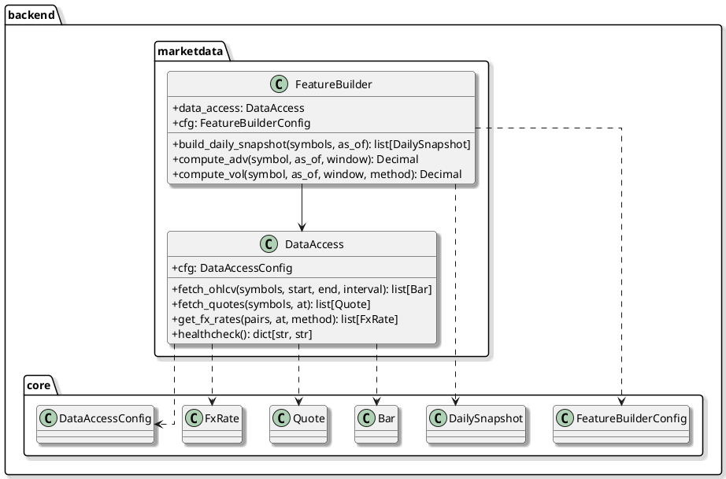
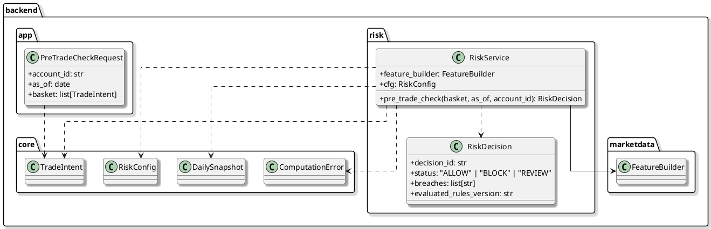

# 04-7_Implementation_Class_Diagram

#### [BACK TO DETAIL DESIGN README](./04_Detail_Design_README.md)

## 1. Purpose

このドキュメントは、実装済みまたは直近で実装予定の主要クラスを横断的に整理するためのクラス図集です。
各コンポーネントの詳細な振る舞いは、個別の Onepager に記載します。

運用方針:
- 実装済みクラスはこの文書へ反映する。
- 次フェーズで実装予定のクラスは、必要に応じて点線または注記で示す。
- 詳細なシーケンス図は該当コンポーネントの Onepager に置く。

## 2. Current Scope

現在の対象:
- Core Foundation: 実装済み
- MarketData MVP: 実装済み（mock provider）
- Risk MVP: initial `RiskService`, `RiskDecision`, and pre-trade API implemented

## 3. Core Foundation Class Diagram

```plantuml
@startuml
top to bottom direction
skinparam shadowing true
skinparam roundcorner 8
skinparam classAttributeIconSize 0
skinparam linetype ortho

package "backend.core.data_contracts" {
  class StrictBaseModel

  class Symbol {
    +raw: str
    +exchange: str
    +code: str
    +currency: Currency
  }

  class FxRate {
    +pair: "USDJPY"
    +rate: Decimal
    +ts: datetime
    +source: str
  }

  class TradeIntent {
    +symbol: str
    +side: Side
    +qty: Decimal
    +price_hint: Decimal | None
    +currency: Currency
  }

  class Position {
    +symbol: str
    +qty: Decimal
    +avg_price: Decimal
    +currency: Currency
  }

  class Bar {
    +symbol: Symbol
    +ts: datetime
    +open: Decimal
    +high: Decimal
    +low: Decimal
    +close: Decimal
    +volume: Decimal
    +interval: Interval
    +provider: str
  }

  class Quote {
    +symbol: Symbol
    +bid: Decimal | None
    +ask: Decimal | None
    +last: Decimal | None
    +ts: datetime
  }

  class DailySnapshot {
    +symbol: str
    +as_of: date
    +last: Decimal | None
    +close_1d: Decimal | None
    +adv_20d: Decimal | None
    +vol_20d: Decimal | None
    +dividend_yield: Decimal | None
    +market_cap_jpy: Decimal | None
    +missing: dict[str, bool]
  }

  StrictBaseModel <|-- Symbol
  StrictBaseModel <|-- FxRate
  StrictBaseModel <|-- TradeIntent
  StrictBaseModel <|-- Position
  StrictBaseModel <|-- Bar
  StrictBaseModel <|-- Quote
  StrictBaseModel <|-- DailySnapshot
}

package "backend.core.config" {
  class StrictConfigModel
  class Settings
  class AppConfig
  class DataAccessConfig
  class CacheConfig
  class TimeoutConfig
  class FeatureBuilderConfig
  class RiskConfig
  class RiskThresholdsConfig
  class PortfolioConfig
  class PortfolioSolverConfig
  class ExecutionConfig
  class ExecutionWebhookConfig
  class ExecutionIdempotencyConfig

  StrictConfigModel <|-- Settings
  StrictConfigModel <|-- AppConfig
  StrictConfigModel <|-- DataAccessConfig
  StrictConfigModel <|-- CacheConfig
  StrictConfigModel <|-- TimeoutConfig
  StrictConfigModel <|-- FeatureBuilderConfig
  StrictConfigModel <|-- RiskConfig
  StrictConfigModel <|-- RiskThresholdsConfig
  StrictConfigModel <|-- PortfolioConfig
  StrictConfigModel <|-- PortfolioSolverConfig
  StrictConfigModel <|-- ExecutionConfig
  StrictConfigModel <|-- ExecutionWebhookConfig
  StrictConfigModel <|-- ExecutionIdempotencyConfig

  Settings *-- AppConfig
  Settings *-- DataAccessConfig
  Settings *-- FeatureBuilderConfig
  Settings *-- RiskConfig
  Settings *-- PortfolioConfig
  Settings *-- ExecutionConfig
  DataAccessConfig *-- CacheConfig
  DataAccessConfig *-- TimeoutConfig
  RiskConfig *-- RiskThresholdsConfig
  PortfolioConfig *-- PortfolioSolverConfig
  ExecutionConfig *-- ExecutionWebhookConfig
  ExecutionConfig *-- ExecutionIdempotencyConfig
}

package "backend.core.errors" {
  class AppError {
    +code: str
    +http_status: HTTPStatus
    +message: str
    +details: dict[str, object]
    +to_dict(): dict[str, object]
  }

  class ValidationAppError
  class DataSourceError
  class RateLimitError
  class ComputationError
  class BrokerError
  class UnsupportedTifError
  class SecurityError
  class SchemaMismatchError

  AppError <|-- ValidationAppError
  AppError <|-- DataSourceError
  AppError <|-- ComputationError
  DataSourceError <|-- RateLimitError
  AppError <|-- BrokerError
  BrokerError <|-- UnsupportedTifError
  AppError <|-- SecurityError
  AppError <|-- SchemaMismatchError
}
@enduml
```

## 4. MarketData MVP Relationships

`backend.marketdata` は、外部 API に依存しない mock provider と、最小の特徴量計算から開始する。

## 5. Risk MVP Relationships

`backend.risk` currently provides a deterministic MVP pre-trade service backed by `FeatureBuilder`.

## 6. Component-Specific Diagram Links

- MarketData / DataAccess: [04-2_Onepager_marketdata_dataaccess.md](./04-2_Onepager_marketdata_dataaccess.md)
- Execution: [04-3_Onepager_Execution.md](./04-3_Onepager_Execution.md)
- Risk: [04-4_Onepager_Risk.md](./04-4_Onepager_Risk.md)
- Feature Builder: [04-5_Onepager_Feature_Builder.md](./04-5_Onepager_Feature_Builder.md)
- Portfolio: [04-6_Onepager_Portfolio.md](./04-6_Onepager_Portfolio.md)
