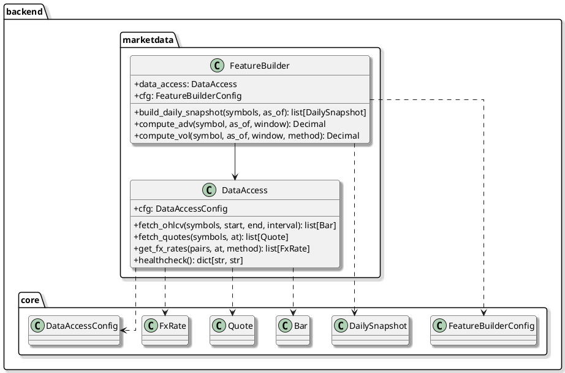
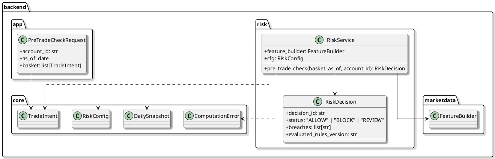
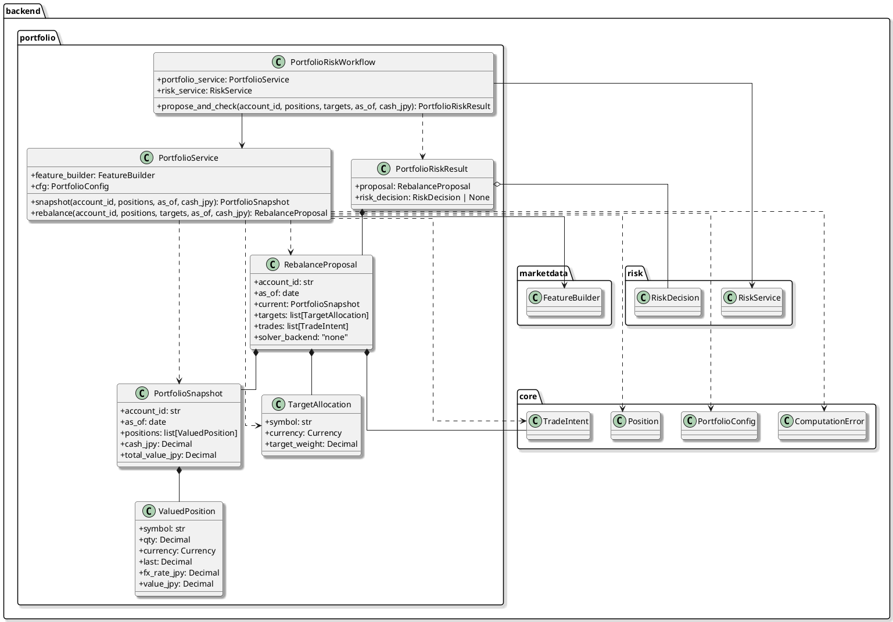
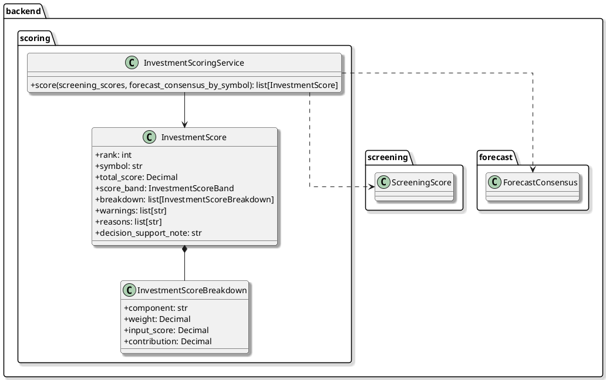

# 04-7_Implementation_Class_Diagram

#### [BACK TO DETAIL DESIGN README](./04_Detail_Design_README.md)

## 0. Current Sync Status

This diagram document is a reference snapshot synced at document level on 2026-05-28.
The source of truth remains actual code in `backend/`, `ui/`, and `tests/`.

Current implementation notes:

- Core / MarketData / FeatureBuilder / Risk / Portfolio / Screening / Forecast / Scoring are implemented.
- Research RAG local evidence foundation, advanced extraction, Research Score first slice, and TDnet / Yahoo Finance external fetch first slice are implemented.
- ResearchBriefBuilder and the first ResearchFactSummary slice are implemented as the local readability / fact layer. EDINET / company IR adapters, ranking-order integration, and Assistant integration are future/planned unless explicitly assigned.
- Execution is deferred; only config placeholders and `TradeIntent` exist in current code.
- Portfolio solver is currently `none`; optimizer backends are not implemented.

## 1. Purpose

このドキュメントは、実装済みまたは直近で実装予定の主要クラスを横断的に整理するためのクラス図集です。
各コンポーネントの詳細な振る舞いは、個別の Onepager に記載します。

運用方針:
- 実装済みクラスはこの文書へ反映する。
- 次フェーズで実装予定のクラスは、必要に応じて点線または注記で示す。
- 詳細なシーケンス図は該当コンポーネントの Onepager に置く。

## 2. Current Scope

現在の対象:
- Core Foundation: 実装済み
- MarketData MVP: 実装済み（mock / csv / opt-in yahoo path）
- Feature Store Lite: 実装済み（Feature Snapshot）
- Risk MVP: `RiskService`, `RiskDecision`, and pre-trade API implemented
- Portfolio MVP: `PortfolioService`, snapshots, no-solver rebalance proposals, and Portfolio-to-Risk workflow implemented
- Forecast: baseline models, model registry lite, evaluation, consensus implemented
- Screening: `ScreeningService` and reason labels implemented
- Scoring: `InvestmentScoringService` and `InvestmentScore` contract implemented
- Streamlit UI: cockpit / ranking / rebalance cockpit helpers implemented
- Research RAG: local document ingestion, evidence search, grounded summary, optional vector/hybrid foundation, Research Score, Stock News RAG, and TDnet / Yahoo Finance external fetch first slice implemented

## 3. Core Foundation Class Diagram

```plantuml
@startuml
top to bottom direction
skinparam shadowing true
skinparam roundcorner 8
skinparam classAttributeIconSize 0
skinparam linetype ortho

package "backend.core.data_contracts" {
  class StrictBaseModel

  class Symbol {
    +raw: str
    +exchange: str
    +code: str
    +currency: Currency
  }

  class FxRate {
    +pair: "USDJPY"
    +rate: Decimal
    +ts: datetime
    +source: str
  }

  class TradeIntent {
    +symbol: str
    +side: Side
    +qty: Decimal
    +price_hint: Decimal | None
    +currency: Currency
  }

  class Position {
    +symbol: str
    +qty: Decimal
    +avg_price: Decimal
    +currency: Currency
  }

  class Bar {
    +symbol: Symbol
    +ts: datetime
    +open: Decimal
    +high: Decimal
    +low: Decimal
    +close: Decimal
    +volume: Decimal
    +interval: Interval
    +provider: str
  }

  class Quote {
    +symbol: Symbol
    +bid: Decimal | None
    +ask: Decimal | None
    +last: Decimal | None
    +ts: datetime
  }

  class DailySnapshot {
    +symbol: str
    +as_of: date
    +last: Decimal | None
    +close_1d: Decimal | None
    +adv_20d: Decimal | None
    +vol_20d: Decimal | None
    +dividend_yield: Decimal | None
    +market_cap_jpy: Decimal | None
    +missing: dict[str, bool]
  }

  StrictBaseModel <|-- Symbol
  StrictBaseModel <|-- FxRate
  StrictBaseModel <|-- TradeIntent
  StrictBaseModel <|-- Position
  StrictBaseModel <|-- Bar
  StrictBaseModel <|-- Quote
  StrictBaseModel <|-- DailySnapshot
}

package "backend.core.config" {
  class StrictConfigModel
  class Settings
  class AppConfig
  class DataAccessConfig
  class CacheConfig
  class TimeoutConfig
  class FeatureBuilderConfig
  class RiskConfig
  class RiskThresholdsConfig
  class PortfolioConfig
  class PortfolioSolverConfig
  class ExecutionConfig
  class ExecutionWebhookConfig
  class ExecutionIdempotencyConfig

  StrictConfigModel <|-- Settings
  StrictConfigModel <|-- AppConfig
  StrictConfigModel <|-- DataAccessConfig
  StrictConfigModel <|-- CacheConfig
  StrictConfigModel <|-- TimeoutConfig
  StrictConfigModel <|-- FeatureBuilderConfig
  StrictConfigModel <|-- RiskConfig
  StrictConfigModel <|-- RiskThresholdsConfig
  StrictConfigModel <|-- PortfolioConfig
  StrictConfigModel <|-- PortfolioSolverConfig
  StrictConfigModel <|-- ExecutionConfig
  StrictConfigModel <|-- ExecutionWebhookConfig
  StrictConfigModel <|-- ExecutionIdempotencyConfig

  Settings *-- AppConfig
  Settings *-- DataAccessConfig
  Settings *-- FeatureBuilderConfig
  Settings *-- RiskConfig
  Settings *-- PortfolioConfig
  Settings *-- ExecutionConfig
  DataAccessConfig *-- CacheConfig
  DataAccessConfig *-- TimeoutConfig
  RiskConfig *-- RiskThresholdsConfig
  PortfolioConfig *-- PortfolioSolverConfig
  ExecutionConfig *-- ExecutionWebhookConfig
  ExecutionConfig *-- ExecutionIdempotencyConfig
}

package "backend.core.errors" {
  class AppError {
    +code: str
    +http_status: HTTPStatus
    +message: str
    +details: dict[str, object]
    +to_dict(): dict[str, object]
  }

  class ValidationAppError
  class DataSourceError
  class RateLimitError
  class ComputationError
  class BrokerError
  class UnsupportedTifError
  class SecurityError
  class SchemaMismatchError

  AppError <|-- ValidationAppError
  AppError <|-- DataSourceError
  AppError <|-- ComputationError
  DataSourceError <|-- RateLimitError
  AppError <|-- BrokerError
  BrokerError <|-- UnsupportedTifError
  AppError <|-- SecurityError
  AppError <|-- SchemaMismatchError
}
@enduml
```

## 4. MarketData MVP Relationships

`backend.marketdata` は、外部 API に依存しない mock provider と、最小の特徴量計算から開始する。

## 5. Risk MVP Relationships

`backend.risk` currently provides a deterministic MVP pre-trade service backed by `FeatureBuilder`.

## 6. Portfolio MVP Relationships

`backend.portfolio` currently provides deterministic JPY valuation and target-weight rebalance proposals without an optimization solver.

## 7. Research RAG Current / Planned Relationships

現在方針: local ingestion は fixture / archive / fallback として維持し、通常の AI Research 導線では adapter 経由の外部最新 source を優先する。local rule-based `ResearchFactSummary` / `ResearchBriefBuilder` で、取得状態ではなく source-backed fact と読める調査メモを作る。外部LLM要約は future / optional とする。

`backend.research` は、IR資料、ユーザーメモ、外部取得 source payload などの非構造データを扱う実装済み component です。EDINET / 企業IR adapter、Assistant 接続は後続 planned として扱う。
ローカル資料 ingestion は deterministic fixture / archive / fallback として維持し、通常ユーザー導線では外部 source adapter から最新情報を一時取得/参照する。embedding と LLM要約は optional adapter として段階的に追加する。

```plantuml
@startuml
top to bottom direction
skinparam shadowing true
skinparam roundcorner 8
skinparam classAttributeIconSize 0
skinparam linetype ortho

package "backend.research" {
  class ResearchInMemoryStore

  class ResearchIngestionService {
    +register_document(request): ResearchDocument
    +list_documents(symbol): list[ResearchDocument]
  }

  class ResearchIndexService {
    +build_chunks(document_id): list[ResearchChunk]
    +rebuild_index(symbol): ResearchIndexSummary
  }

  class ResearchRetrievalService {
    +search(request): list[ResearchEvidence]
  }

  class ResearchQueryExpansionService
  class ResearchEvidenceReranker
  class ResearchGroundedAnswerService
  class ResearchEmbeddingService
  class ResearchVectorIndexService
  class ResearchHybridScorer
  class HybridResearchRetrievalService
  class ResearchDisabledVectorStore
  class ResearchInMemoryVectorStore
  class ResearchFileVectorStore
  class ResearchScoreService {
    +score_report(report): ResearchScore
  }
  class ResearchBriefBuilder {
    +build(report, news_report): ResearchBrief
  }

  class ExternalResearchFetchService {
    +fetch_and_register(request): ExternalResearchFetchResult
  }

  interface ExternalResearchSourceAdapter
  class TDnetResearchAdapter
  class YahooFinanceResearchAdapter
  class CompositeExternalResearchAdapter
  class DefaultExternalResearchAdapter

  class ResearchAnalysisService {
    +analyze_company(request): CompanyResearchReport
  }

  class StockNewsAnalysisService {
    +analyze_symbol_news(request): StockNewsReport
  }

  class ResearchDocument
  class ResearchChunk
  class ResearchEvidence
  class ResearchIndexSummary
  class ResearchVectorIndexSummary
  class ResearchExtractedClaim
  class ResearchGroundedAnswer
  class ResearchRetrievalQuality
  class ResearchEmbedding
  class ResearchRetrievalCandidate
  class ResearchDataQuality
  class StockNewsEvidence
  class StockNewsReport
  class ExternalResearchFetchRequest
  class ExternalResearchFetchResult
  class ExternalResearchFetchManifestEntry
  class ExternalResearchSourcePayload
  class ResearchScore
  class ResearchBrief
  class ResearchMetric
  class ResearchFactSummary
  class ResearchFactItem
  class CompanyResearchReport
}

package "backend.scoring" {
  class InvestmentScoringService
}

package "backend.reporting" {
  class DecisionReportContext
  class DecisionReportSection
}

package "backend.assistant (future)" {
  class AssistantService <<future>>
}

ResearchInMemoryStore o-- ResearchDocument
ResearchInMemoryStore o-- ResearchChunk
ResearchIngestionService --> ResearchInMemoryStore
ResearchIngestionService ..> ResearchDocument
ResearchIndexService --> ResearchInMemoryStore
ResearchIndexService ..> ResearchDocument
ResearchIndexService ..> ResearchChunk
ResearchIndexService ..> ResearchIndexSummary
ResearchRetrievalService --> ResearchInMemoryStore
ResearchRetrievalService --> ResearchEvidenceReranker
ResearchRetrievalService ..> ResearchChunk
ResearchRetrievalService ..> ResearchEvidence
ResearchAnalysisService --> ResearchIngestionService
ResearchAnalysisService --> ResearchRetrievalService
ResearchAnalysisService --> ResearchQueryExpansionService
ResearchAnalysisService --> ResearchGroundedAnswerService
ResearchAnalysisService --> ResearchEvidenceReranker
ResearchAnalysisService ..> CompanyResearchReport
StockNewsAnalysisService --> ResearchInMemoryStore
StockNewsAnalysisService ..> StockNewsReport
StockNewsReport *-- StockNewsEvidence
CompanyResearchReport *-- ResearchEvidence
CompanyResearchReport *-- ResearchExtractedClaim
CompanyResearchReport *-- ResearchGroundedAnswer
CompanyResearchReport *-- ResearchRetrievalQuality
CompanyResearchReport *-- ResearchDataQuality
ResearchEmbeddingService ..> ResearchEmbedding
ResearchVectorIndexService --> ResearchEmbeddingService
ResearchVectorIndexService ..> ResearchVectorIndexSummary
ResearchHybridScorer ..> ResearchRetrievalCandidate
HybridResearchRetrievalService --> ResearchRetrievalService
HybridResearchRetrievalService --> ResearchHybridScorer
ResearchDisabledVectorStore ..> ResearchRetrievalCandidate
ResearchInMemoryVectorStore o-- ResearchRetrievalCandidate
ResearchFileVectorStore o-- ResearchRetrievalCandidate
ResearchScoreService ..> CompanyResearchReport
ResearchScoreService --> ResearchScore
ResearchBriefBuilder ..> CompanyResearchReport
ResearchBriefBuilder ..> StockNewsReport
ResearchBriefBuilder --> ResearchBrief
ResearchBrief *-- ResearchMetric
ResearchFactSummary *-- ResearchFactItem
ResearchBriefBuilder ..> ResearchFactSummary : fact input
ExternalResearchFetchService --> ResearchIngestionService
ExternalResearchFetchService --> ExternalResearchSourceAdapter
ExternalResearchFetchService ..> ExternalResearchFetchRequest
ExternalResearchFetchService ..> ExternalResearchFetchResult
ExternalResearchFetchResult *-- ExternalResearchFetchManifestEntry
ExternalResearchSourceAdapter ..> ExternalResearchSourcePayload
ExternalResearchSourceAdapter <|.. TDnetResearchAdapter
ExternalResearchSourceAdapter <|.. YahooFinanceResearchAdapter
ExternalResearchSourceAdapter <|.. CompositeExternalResearchAdapter
CompositeExternalResearchAdapter <|-- DefaultExternalResearchAdapter
InvestmentScoringService ..> ResearchScore : optional input
DecisionReportContext ..> CompanyResearchReport
DecisionReportContext *-- DecisionReportSection
AssistantService ..> CompanyResearchReport : future
@enduml
```

## 8. Investment Scoring Relationships

`backend.scoring` currently provides a deterministic Investment Score contract that combines Screening Score, forecast agreement, data quality, and a first risk signal.

## 9. Component-Specific Diagram Links

- MarketData / DataAccess: [04-2_Onepager_marketdata_dataaccess.md](./04-2_Onepager_marketdata_dataaccess.md)
- Execution: [04-3_Onepager_Execution.md](./04-3_Onepager_Execution.md)
- Risk: [04-4_Onepager_Risk.md](./04-4_Onepager_Risk.md)
- Feature Builder: [04-5_Onepager_Feature_Builder.md](./04-5_Onepager_Feature_Builder.md)
- Portfolio: [04-6_Onepager_Portfolio.md](./04-6_Onepager_Portfolio.md)
- Research RAG: [04-8_Onepager_Research_RAG.md](./04-8_Onepager_Research_RAG.md)
