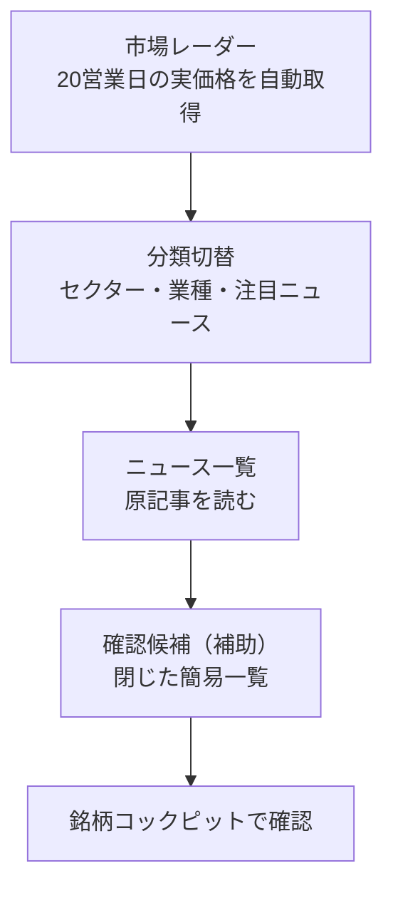

# 投資レーダー UX・可視化強化 要件定義

作成日: 2026-07-13
状態: P0 実装済み / P1 統合市場レーダー・実価格ヒートマップ・根拠経路を実装（後続 UI/UX スプリントの正本）

## 1. この文書の位置付け

本書は、投資レーダーの根拠追跡機能を保ったまま、ニュースから「何を、なぜ、次に確認するか」を短時間で理解できる画面に再構成するための要件定義である。

- 根拠追跡、RAG、AI解釈の安全境界は、[37_Investment_Radar_Enhancement_Sprint_Instructions.md](37_Investment_Radar_Enhancement_Sprint_Instructions.md) を継承する。
- 現行の実装済み範囲と確認結果は、[38_Investment_Radar_Enhancement_Sprint_Report.md](38_Investment_Radar_Enhancement_Sprint_Report.md) を参照する。
- 本書は将来の画面構成、用語、受入条件を定める。実コードと通過テストが異なる場合は実コードを正とし、本書を最小限更新する。
- P0 は、材料種別と方向の分離、候補数の上限と展開、探索条件の統合、到達可能な詳細ダイアログ、レスポンシブ修正として実装済みである。P1 では `今日のレーダー` と `市場ヒートマップ` を `市場レーダー` に統合した。その後の利用評価を受け、独立した `ニュース・根拠` タブは廃止し、`市場レーダー` / `ニュース一覧` の2タブへ絞った。
- 統合ヒートマップはニュースから抽出した最大30銘柄の実価格だけを使う。セクター、業種、注目ニュースの分類を切り替え、面積を選択期間の絶対騰落率、色を符号付き騰落方向、`本文` / `テーマ推測` を抽出方法のラベルとする。由来別件数、最初に確認する候補、Watchlist一致はマップ直前またはタイルへ統合し、価格方向や投資魅力度とは別軸で示す。
- 根拠追跡のcontractは保つが、通常画面では長い候補詳細、RAG状態、探索フィルターを主表示しない。ニュース一覧の最下部に閉じた補助的な候補一覧を置き、必要な確認は銘柄コックピットへ直接つなぐ。テーマタイルから候補キューへの連動、根拠タイムライン／選択対象だけの根拠ルートマップ、前回 snapshot 差分、Decision Trail 連携は後続対象として残す。

## 2. 背景と解くべき問題

現在の投資レーダーには、ニュース根拠、由来別候補、RAG確認、銘柄コックピットへの導線という安全な土台がある。一方、実画面では候補一覧を順番に読まないと、今日どのテーマに材料が集まり、何を先に確認すべきかが分かりにくい。

実画面と現行実装の確認で、次の問題を確認した。

1. **意味の正確性が先に必要である。** `Ａｎｄ Ｄｏ` の「前期経常を一転65％減益に下方修正」という見出しに対し、画面が `好材料を含む` と表示した例がある。現在は `earnings` などの材料種別を一律に好材料へ割り当てる経路があり、記事内容の方向を判定していない。この状態で赤緑や好悪による地図を強めると、誤解を増幅する。
2. **候補一覧が長く、比較軸がない。** 実画面では本文に出た銘柄4件、SMAI推測候補15件、市場確認指標8件が表示対象になり、カードが同じ密度で連続する。live時にはさらに多くの候補になり得る。
3. **PCの master-detail が途中で破綻する。** 左の候補一覧を下へ読むと、右の選択詳細は先に終わり、大きな空白が生じる。選んだ候補の詳細へ戻る操作も直感的ではない。
4. **確認順序が投資スコアのように見える。** `確認優先度 66/100` は、注意書きがあっても期待収益・魅力度・ランキングに見えやすい。実際には鮮度、根拠の広がり、由来、Watchlist一致などから決めた「確認する順番」である。
5. **フィルターと用語が探索を助けていない。** ニュース詳細フィルターと候補フィルターが分かれ、どの表示へ効くのかが分かりにくい。`RAG` のような内部用語や英日混在も、最初にニュースを読みたい利用者の負担になる。
6. **画面幅ごとの導線が連続していない。** iPad幅では一覧と詳細がともに狭く、iPhoneでは選択詳細が候補一覧より先に置かれるため、下の候補を選んだ後に根拠を確認しにくい。

## 3. 体験目標

利用者が投資レーダーを開いたとき、次の三つの問いに、一覧を全件読まなくても答えられることを目標にする。

1. **いま何が起きているか。** — 材料が集まるテーマ、市場背景、前回更新からの変化を把握する。
2. **何を先に確認するか。** — 直接言及、SMAI推測、市場背景を混同せず、確認順に候補を絞り込む。
3. **なぜそう表示されたか、次に何をするか。** — 根拠記事、鮮度、未確認事項をたどり、利用者の明示操作で根拠資料確認または銘柄コックピットへ進む。

画面の役割は売買推奨や銘柄ランキングではなく、根拠をたどる**探索・確認の入口**である。

## 4. 守るべき境界

- `direct_mention`、`inferred_candidate`、`macro_proxy` は固定の三レーンとして扱い、色・文言・操作可否も混同しない。連続値の直接性や旧散布図へ戻さない。
- Ranking、Forecast、Investment Score、Research Score、上向き兆候、候補抽出の決定論的な順序・重みを変更しない。
- 初期描画では市場レーダー用の価格だけを最大30銘柄・日足・既定20営業日に制限して取得できる。外部ニュース更新、RAG、Gateway/LLM、保存、通知は開始しない。
- 可視化の全タイル・候補・経路は、少なくとも一つの既存 evidence ID に戻れること。根拠のない候補を表示しない。
- RAG資料不足、データ欠損、取得失敗、staleは、好悪・優先順位・スコアの暗黙の変換ではなく、`未確認`、`未取得`、`古い`、`確認が必要` として表す。
- Watchlist、選択状態、保存済み表示は `user_id` 境界を維持する。

## 5. 目標情報設計

画面は「市場変動を発見 → ニュース／RAGで理由をたどる → 次に確認する候補を決める」の順に読む。長い候補一覧を最初の画面の主役にしない。

### 5.1 上部タブの表示契約

| タブ | 主な問い | 初期表示する内容 |
| --- | --- | --- |
| `市場レーダー` | 今日、どの分類でどの候補が動いたか | 一定時間で切り替わる市場ニュースヘッドライン、由来別件数、最優先候補、セクター／業種／注目ニュース別の実価格ヒートマップ |
| `ニュース一覧` | 元の記事を一覧で読む | 一定時間で切り替わる市場ニュースヘッドライン、カテゴリ別ニュースレーン、最下部の閉じた確認候補（補助） |

- タブ数は2つに留め、既定タブには探索の入口である `市場レーダー` を置く。
- ヘッドラインは両タブの先頭に同じ上限3件を表示し、複数ページ時は自動で切り替える。各カードは順番に自動ハイライトし、`HEADLINE FLOW`、件数、正確な最新公開時刻を併記する。見た目のライブ感は補助表現であり、リアルタイム配信やニュースの自動更新を意味しない。価格期間と分類軸は市場レーダー内だけで管理する。
- 確認候補はニュース一覧の末尾に閉じた補助枠としてだけ置く。初期画面には探索条件、確認トリアージ、候補ごとのRAG状態、詳細ダイアログを置かない。
- Streamlitの初回表示、15分以上経過後の再表示、および画面を開いている間の15分ごとのサーバー側fragment実行では、価格snapshotだけをboundedに自動更新する。RAG、LLM、ニュース更新は開始しない。

### 5.2 実価格の値動き注目マップ

- 対象はニュース候補のうち個別確認可能な銘柄を最大30件とし、`macro_proxy` は個別銘柄マップから除外する。
- 初期表示では20営業日（約1か月）を既定とし、価格snapshotがない、期間が変わった、または前回取得から15分以上経過した場合にProviderへアクセスする。`今すぐ更新` も残す。
- **面積**は選択期間の絶対騰落率、**色**は符号付き騰落方向とする。極小値も読める最低表示面積を設け、その事実を凡例へ示す。
- 期間は20営業日（約1か月）に固定し、期間選択UIを置かない。終値の実測値だけで算出し、正確な騰落率、方向記号、取得元、価格基準日時を必ず併記する。
- 一つのニュース分類に候補が集中する場合も、固定8件には切り詰めない。分類内の実測タイルが12件以下なら全件を表示し、5〜8件・9〜12件では分類カードの高さを段階的に増やす。13件以上は読みやすさの安全上限として12件を地図へ表示し、`表示12 / 該当N銘柄` と `あとN銘柄を見る` で残りを明示展開する。極端に細い読めないタイルを大量表示しない。
- セクター／業種別で複数の1〜2銘柄分類が同時に出た場合は、元の分類名をヘッダーに併記した `少数セクター`／`少数業種` の一枚へまとめる。候補は増減させず、細切れの小マップを減らして地図として比較できる密度を保つ。注目ニュース別は根拠ニュースカードとの対応を保つため、統合しない。
- 同じ実価格タイルを `セクター`、`業種`、`注目ニュース` の分類軸で再配置する。注目ニュースでは一つの銘柄が複数の根拠カテゴリに属する場合があるため、分類間の重複を許容する。
- `注目ニュース` 分類では、各分類グループの実価格マップ直前に、その分類の既存ニュース根拠から選んだ小さなカードを1件表示する。カードは材料の好悪や価格方向を表さず、見出し・出典・公開日時だけを示す。URLがある場合はカード全体を `元記事を開く` 外部リンクにし、現在の市場レーダー画面を維持する。`セクター` と `業種` にはこのカードを混在させない。
- 各タイルは `本文` / `テーマ推測`、根拠件数、Watchlist一致、確認順の先頭を補助表示し、選択時は同一アプリの銘柄コックピットへ進む。
- 履歴不足、Provider失敗、未取得銘柄に中立色や擬似騰落を割り当てない。取得できたタイルと `価格不足 N銘柄` を分ける。
- 幅1600px以上の広いPC画面では分類グループを3列、通常PCでは2列、タブレットでは1列に配置する。PCとタブレットは分類ごとに同じ実測タイル数（最大12件）を表示する。各グループ内はsquarified treemapを使い、横長の分類領域では短辺から優先して分割する。値動き上位のタイルを横並びに保ち、全幅の細い横帯が縦に連続して読みにくくならないようにする。iPhoneも同じ表示対象を縦カードへ切り替えて情報を省略せず、ページ全体の横スクロールを生じさせない。
- この表示は短期の値動きの大きさを見つける入口であり、時価総額、投資魅力度、期待収益、売買推奨を表さない。

| 現在の主な見え方 | 目標の見え方 | 利用者に生まれる価値 |
| --- | --- | --- |
| 件数カードと全候補カードの縦並び | 今日の概要、テーマ、確認順の順に圧縮 | 最初に「何が変わったか」を把握できる |
| `66/100` と説明文 | 確認順の言葉と理由チップ | 投資評価と誤認しにくい |
| 長い左一覧と短い右詳細 | 上位候補キューと到達可能な詳細 | 選択・比較・根拠確認を往復しやすい |
| ヒートマップと候補一覧が独立 | テーマ選択が候補一覧へ連動 | 市場の材料と候補の関係を追える |

## 6. 機能要件

### 6.1 市場レーダーの確認サマリー

- マップ直前には本文抽出数、テーマ推測数、市場背景数と、最初に確認する1候補だけをコンパクトに表示する。大きな件数カードや独立した今日タブへ戻さない。
- 比較は保存済みの最新・前回 snapshot が両方ある場合だけ行う。基準時刻を JST で示し、前回 snapshot がない場合は `前回比較なし` とする。
- 2世代しかない snapshot から、7日・30日などの長期トレンドを装わない。
- Watchlist一致は星などの補助記号と明示ラベルで示し、保存や更新を自動で行わない。

### 6.2 注目ニュース分類（統合ヒートマップの一表示）

ニュースカテゴリは独立したニュース代理マップにせず、実価格ヒートマップの分類軸として扱う。ニュース根拠と価格方向は同一タイルで読めるが、色と面積は実価格だけに使う。

- グループ見出しはニュースカテゴリ、各タイルはそのカテゴリに根拠を持つ銘柄を表し、企業の投資魅力度を表さない。
- **面積**は実価格の絶対騰落率、**色**は実価格の符号付き騰落方向とし、ニュース根拠量や鮮度を面積・赤緑へ変換しない。
- `本文` / `テーマ推測`、根拠件数、Watchlist一致、最初に確認する候補は、価格色と分離した文字ラベルで表す。
- タイル選択は該当銘柄の `銘柄コックピット` 導線であり、ニュース一覧や確認候補の自動絞り込みは行わない。根拠の深掘りが必要な場合もCockpit側の明示操作へ委ねる。
- 小さいタイルだけになる場合は、等面積表示またはテーブル形式へ切り替えられるようにする。色だけに依存しない。
- 価格未取得の候補には色や面積を割り当てず、`価格不足 N銘柄` として分離する。

### 6.3 確認候補（ニュース一覧の補助枠）

確認候補は主可視化ではなく、ニュース一覧を読んだ後の補助情報とする。既存の `provenance` と evidence の追跡可能性は保つが、`confirmation_priority`、RAG状態、探索条件、トリアージ表は初期画面へ出さない。

- ニュース一覧の最下部に、初期状態で閉じた `確認候補（補助）・N件` を置く。候補がない場合は枠自体を表示しない。
- 展開後も最大6件だけを簡易カードで表示する。カードは企業名、symbol、`本文言及` または `テーマ関連`、根拠件数、Watchlist補助記号だけに絞る。`macro_proxy` はここへ混在させない。
- 各カード全体は同一アプリの `銘柄コックピット` へのリンクにする。ここからRAG実行、AI整理、保存、候補選択状態を発生させない。
- 総件数と表示上限を区別し、残りがあるときは `ほか N件` とだけ示す。全候補を展開する操作は提供しない。
- 由来・根拠件数は価格色や投資評価ではないため、赤緑、スコア、ランキング、売買を示すCTAに使わない。

### 6.4 根拠の深掘りと次の操作

- 市場レーダーの `注目ニュース` 分類では、各マップの直前に根拠ニュースを一件だけ置く。カードは元記事URLがある場合に限り別タブで原記事を開く。
- ニュース一覧のカテゴリ別ニュースレーンは原記事を読む主面とし、関連銘柄の通常のCockpit導線を保つ。
- 候補の根拠資料、資料の状態、AI整理、未確認事項を詳しく見る導線は銘柄コックピット側の明示操作に限定する。既存の fallback・citation・user_id 境界を保つ。
- `RAG` や `ローカルRAG` といった内部語は、ニュース一覧と市場レーダーの初期表示には出さない。

### 6.6 選択対象だけの根拠ルートマップ（P2以降）

記事・テーマ・候補の関係は、初期画面で全候補を結ぶネットワークにしない。選択テーマまたは選択候補でだけ、固定位置の三列表示を用いる。

- 左: 根拠記事、中央: テーマ、右: 本文に出た銘柄 / SMAI推測候補
- `macro_proxy` は個別候補と交差しない独立領域に置く。
- 線の太さは追跡可能な重複除外後の根拠数だけで決め、選択経路だけを強調する。
- 初期上限は上位5テーマ・12候補程度とし、force-directed graph や全候補 Sankey を表示しない。
- 同じ意味を読めるテーブルまたはリスト表示を必ず提供する。

### 6.7 前回更新との差分（P3以降）

- 初期は最新 snapshot と前回 snapshot のみを比較し、新規テーマ、継続テーマ、消えたテーマ、新しい直接言及候補、Watchlist関連の新規根拠を表示する。
- 比較対象の時刻と差分の定義をJSTで明示する。cache破損時は比較を省略し、通常画面を継続する。
- 7日・30日等の履歴表示には、raw記事本文を無制限に保存せず、別の bounded 日次集計 contract と保持期間を設計してから対応する。

## 7. UI文言の要件

| 用途 | 標準文言 | 補足 |
| --- | --- | --- |
| 画面の主目的 | `ニュースから確認する候補` | `おすすめ銘柄`、`有望候補` は使わない |
| 由来 | `本文に出た銘柄` / `SMAI推測候補` / `市場背景の確認` | 推測候補には「記事に銘柄名が出たとは限らない」を近接表示 |
| 優先度 | `先に確認` / `次に確認` / `必要に応じて` | `66/100` を主表示しない |
| 材料 | `材料種別` | 方向が検証済みでない限り `好材料` / `注意材料` にしない |
| RAG操作 | `根拠資料を確認` | 内部語は詳細に限定 |
| 取得状態 | `未実行` / `確認済み` / `未取得` / `古い` / `失敗` | 欠損と失敗を同じ意味にしない |
| 価格・ニュースの関係 | `価格実測` / `ニュース代理` | 代理値は実測のように見せない |

## 8. 非スコープと避ける可視化

- レーダー／蜘蛛の巣チャート。固定軸の多さが投資評価・総合点に見えやすく、比較もしにくい。
- 全候補を一度に結ぶ force-directed graph、巨大な Sankey。スマホと初見利用者で関係が読めず、根拠をたどる目的を損なう。
- 材料種別だけに基づく赤緑の好悪表示、感情分析、News Score、期待収益・売買シグナル。
- Ranking、Forecast、各Score、候補生成順序への統合。
- 自動ニュース更新、外部資料取得、RAG/LLM実行、通知、保存。
- 2 snapshotだけを根拠とする長期トレンドや履歴チャート。

## 9. 実施順序

| 優先度 | 内容 | 既存データだけで可能か | 主な成果 |
| --- | --- | --- | --- |
| P0 | 材料表示の意味修正、候補の上限・展開、探索条件の統合、選択詳細の到達性、レスポンシブ修正 | はい | 誤解を減らし、長大な一覧と空白を解消 |
| P1 | 今日のレーダー、テーマ温度マップ、確認トリアージ、一覧との連動 | はい | 市場概観から候補へ絞り込める |
| P2 | 根拠タイムライン、選択対象だけの根拠ルートマップ | おおむね可 | なぜ候補になったかを視覚的に追える |
| P3 | 前回 snapshot との差分表示 | はい（2世代差分まで） | 変化を正直に把握できる |
| P4 | Decision Trail、保存ビュー、変化通知との明示連携 | 一部設計が必要 | 日々の確認を継続しやすい |

P0完了前にP1以降の派手な可視化を先行させない。特に材料の好悪ラベルの誤表示は、最初に修正する。

## 10. 受入条件と検証

### P0の受入条件

- `前期経常を一転65％減益に下方修正` のような見出しが、材料種別だけを理由に `好材料` と表示されない。
- 1366×768の最初の約1.5画面で、市場テーマ、由来別件数、直接候補、選択候補の次の操作を確認できる。
- 初期表示の候補カードは最大12件を目安とし、残件数と展開操作が明確である。
- 19件およびlive相当の56件で、PC右側に選択詳細後の巨大な空白が生じず、下方の候補を選んでも詳細へ到達できる。
- 375×812、810×1080、1080×810、1366×768で、ページ全体の横スクロールがなく、主要タップ領域は44pxを目安に確保される。
- 初期描画はboundedな価格取得だけを実行できる。フィルター変更、候補選択はニュース更新、Gateway、RAG、保存を実行しない。

### P1以降の受入条件

- マップ・トリアージ・候補行・根拠ルートのすべてが、表示可能な evidence ID または根拠記事へ戻れる。
- direct / inferred / macro は、色だけでなく領域・ラベル・形で区別される。
- ヒートマップの面積・色・抽出方法には常時凡例があり、価格実測とニュース根拠の役割が区別される。
- セクター／業種／注目ニュースを切り替えても、同じ期間・価格snapshot・騰落率を使い、分類変更で数値が変わらない。
- 810×1080のiPad縦向きでは分類グループを1列で表示し、グループ名、騰落率、抽出方法、根拠件数が縦につぶれず読める。
- テーマまたはトリアージセルを選ぶと、候補キューと選択詳細が同じ探索条件を共有する。
- snapshotが2世代だけのとき、長期トレンドを表示しない。
- 可視化と同じ内容を読めるテキストまたは表形式がある。
- user_idをまたぐWatchlist、選択状態、保存状態の共有がない。
- Ranking、Forecast、Investment Score、Research Score、候補由来・順序の契約に回帰がない。

### 必要な回帰確認

- `backend/news/radar_candidates.py` の材料ラベル、provenance、dedupe、tie-break、候補上限、テーマ集計を fixture で network-free に固定する。
- `ui/views/news.py` の2タブ構成、両タブ先頭のヘッドライン、ニュース一覧末尾の閉じた候補補助枠、Cockpit導線、文言を AppTest または既存UIテストで確認する。
- responsive smoke に、両タブのヘッドライン、閉じた候補補助枠、注目ニュースの元記事リンク、サイドバーを閉じた iPhone画面を追加する。
- 色だけで意味が伝わらない状態、長い名称、0件、stale、資料なし、RAG失敗、前回 snapshotなしを確認する。

## 11. 実装対象の目安

実装開始時は、以下を最小対象として確認する。画面表示だけの都合で domain logic を `ui/views/news.py` に増やさない。

- `backend/news/contracts.py` — 可視化用の決定論的集計 contract
- `backend/news/radar_market.py` — 実価格から期間騰落率を作るnetwork-free集計
- `backend/news/radar_candidates.py` — 材料種別と方向の分離、候補・テーマ・トリアージの集計
- `ui/views/news.py` — 2タブの画面構成、ヘッドライン、ニュースレーン、候補補助枠、Cockpit導線
- `ui/styles.py` / 共通UI component — viewport別レイアウトと選択状態
- `tests/test_radar_market.py`、`tests/test_news_dashboard_service.py`、`tests/test_ui_news_view.py`、`tests/test_ui_news_streamlit_page.py`、responsive smoke — 意味・操作・画面幅の回帰
- `Documents/07_UI_Wording_Policy.md`、`docs/responsive_checklist.md` — 実装時の文言・確認観点

## 12. 外部パターンを採用する理由

公開されている公式資料を、機能の写経ではなく情報設計の参考として用いる。

- [TradingView Heatmaps](https://www.tradingview.com/support/solutions/43000766446-tradingview-heatmaps-from-global-trends-to-details/) は、タイル面積と色を別の意味に割り当て、全体から詳細へ進む。SMAIでは面積・色の意味と凡例を明示し、売買評価には使わない。
- [Nielsen Norman Group: Tabs, Used Right](https://www.nngroup.com/articles/tabs-used-right/) は、長い情報を明確なグループへ分ける場合に少数のタブが認知負荷を下げ、既定タブが最も注目されると説明する。SMAIでは2タブに絞り、日々の入口を既定にする。
- Karypidisほかの査読論文 [A 3D Stock Heatmap for Virtual Reality (Data Science Journal, 2025)](https://datascience.codata.org/articles/1800) は、通常の2D株式ヒートマップが面積ともう一つの指標を主に使うことを前提に、多指標化を3Dで検討している。SMAIは2DへRAG・ニュース量・価格・スコアを同時に詰め込まず、価格の二つの視覚符号と根拠詳細を分離する。
- [TradingView News Flow filters](https://www.tradingview.com/support/solutions/43000732560-news-flow-s-filters-overview/) は、Watchlist、銘柄、市場、セクター、企業活動などを組み合わせる。SMAIでは、よく使う探索条件をクイックフィルターにし、詳細条件を一箇所へまとめる。
- [Finviz Map](https://finviz.com/map) は、地図と一覧の表示目的を分ける。SMAIではテーママップと候補キューの選択状態を連動させる。
- [Koyfin Market Dashboards](https://www.koyfin.com/features/market-dashboards/) は、ダッシュボードの部品を連動させる。SMAIでは候補選択を根拠、次の確認、Cockpitへつなぐ。
- [Yahoo Finance Sectors](https://finance.yahoo.com/sectors/) のように、目的別の市場ビューを分ける。SMAIも一つの万能地図ではなく、テーマ概観、確認候補、市場背景を役割で分ける。
- [Seeking Alpha Quant Ratings](https://help.seekingalpha.com/premium/quant-ratings-and-factor-grades-faq) の因子分解は、単一の数字より理由を確認しやすい。SMAIでは数値評価を導入せず、確認順の理由チップと根拠へ分解する。

これらのサービスの投資格付け、外部データ取得、スコア、ランキング、売買判断はSMAIへ持ち込まない。

## 13. 次の実装依頼での注意

次の実装者は、まずP0を完了してからP1へ進む。新しい視覚効果よりも、根拠・由来・材料の意味を正確にし、候補から詳細へ確実に到達できることを優先する。

実装時に本書を変更する必要がある場合は、変更理由、既存contractへの影響、代替案、受入条件の更新を同じ差分に記録する。
