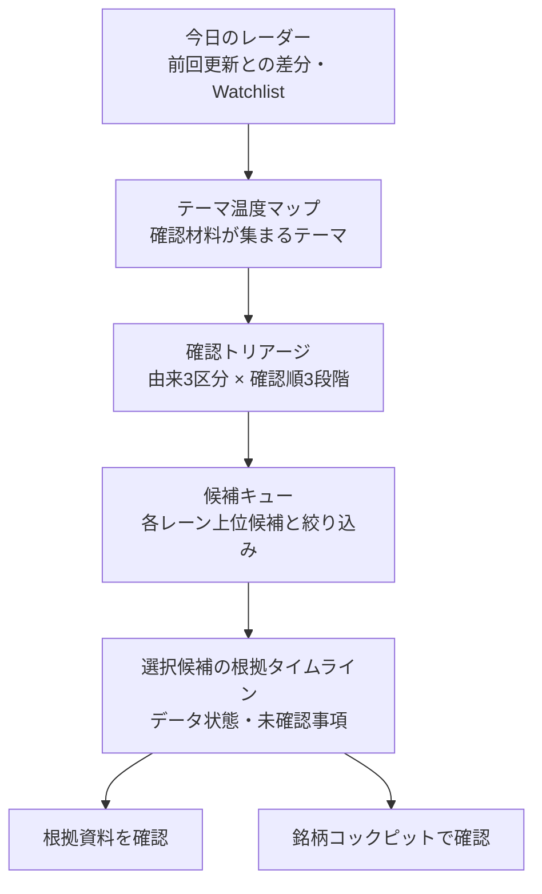

# 投資レーダー UX・可視化強化 要件定義

作成日: 2026-07-13
状態: P0 実装済み / P1 タブ・実価格ヒートマップ・根拠経路を実装（後続 UI/UX スプリントの正本）

## 1. この文書の位置付け

本書は、投資レーダーの根拠追跡機能を保ったまま、ニュースから「何を、なぜ、次に確認するか」を短時間で理解できる画面に再構成するための要件定義である。

- 根拠追跡、RAG、AI解釈の安全境界は、[37_Investment_Radar_Enhancement_Sprint_Instructions.md](37_Investment_Radar_Enhancement_Sprint_Instructions.md) を継承する。
- 現行の実装済み範囲と確認結果は、[38_Investment_Radar_Enhancement_Sprint_Report.md](38_Investment_Radar_Enhancement_Sprint_Report.md) を参照する。
- 本書は将来の画面構成、用語、受入条件を定める。実コードと通過テストが異なる場合は実コードを正とし、本書を最小限更新する。
- P0 は、材料種別と方向の分離、候補数の上限と展開、探索条件の統合、到達可能な詳細ダイアログ、レスポンシブ修正として実装済みである。P1 では上部を `今日のレーダー` / `市場ヒートマップ` / `ニュース・根拠` / `ニュース一覧` の4タブに分け、実価格による `値動き注目マップ` とニュース根拠による `ニューステーマ` を分離した。
- 現行テーママップの contract は、面積を転載・重複を除いた根拠記事数、独立出典数を補助表示、色を鮮度、`本文に出た` / `テーマ関連`を直接性ラベルとする。個別タイルの価格方向は `方向未確認` であり、ニュース代理に赤緑の価格方向・投資魅力度を割り当てない。取得済みのカテゴリ市場データは、個別タイルとは別の見出しだけで表示する。
- 候補詳細には `ニュース根拠 → 本文言及/テーマ推測 → RAG確認状態 → 銘柄コックピット` の経路を実装した。テーマタイルから候補キューへの連動、根拠タイムライン／選択対象だけの根拠ルートマップ、前回 snapshot 差分、Decision Trail 連携は後続対象として残す。

## 2. 背景と解くべき問題

現在の投資レーダーには、ニュース根拠、由来別候補、RAG確認、銘柄コックピットへの導線という安全な土台がある。一方、実画面では候補一覧を順番に読まないと、今日どのテーマに材料が集まり、何を先に確認すべきかが分かりにくい。

実画面と現行実装の確認で、次の問題を確認した。

1. **意味の正確性が先に必要である。** `Ａｎｄ Ｄｏ` の「前期経常を一転65％減益に下方修正」という見出しに対し、画面が `好材料を含む` と表示した例がある。現在は `earnings` などの材料種別を一律に好材料へ割り当てる経路があり、記事内容の方向を判定していない。この状態で赤緑や好悪による地図を強めると、誤解を増幅する。
2. **候補一覧が長く、比較軸がない。** 実画面では本文に出た銘柄4件、SMAI推測候補15件、市場確認指標8件が表示対象になり、カードが同じ密度で連続する。live時にはさらに多くの候補になり得る。
3. **PCの master-detail が途中で破綻する。** 左の候補一覧を下へ読むと、右の選択詳細は先に終わり、大きな空白が生じる。選んだ候補の詳細へ戻る操作も直感的ではない。
4. **確認順序が投資スコアのように見える。** `確認優先度 66/100` は、注意書きがあっても期待収益・魅力度・ランキングに見えやすい。実際には鮮度、根拠の広がり、由来、Watchlist一致などから決めた「確認する順番」である。
5. **フィルターと用語が探索を助けていない。** ニュース詳細フィルターと候補フィルターが分かれ、どの表示へ効くのかが分かりにくい。`RAG` のような内部用語や英日混在も、最初にニュースを読みたい利用者の負担になる。
6. **画面幅ごとの導線が連続していない。** iPad幅では一覧と詳細がともに狭く、iPhoneでは選択詳細が候補一覧より先に置かれるため、下の候補を選んだ後に根拠を確認しにくい。

## 3. 体験目標

利用者が投資レーダーを開いたとき、次の三つの問いに、一覧を全件読まなくても答えられることを目標にする。

1. **いま何が起きているか。** — 材料が集まるテーマ、市場背景、前回更新からの変化を把握する。
2. **何を先に確認するか。** — 直接言及、SMAI推測、市場背景を混同せず、確認順に候補を絞り込む。
3. **なぜそう表示されたか、次に何をするか。** — 根拠記事、鮮度、未確認事項をたどり、利用者の明示操作で根拠資料確認または銘柄コックピットへ進む。

画面の役割は売買推奨や銘柄ランキングではなく、根拠をたどる**探索・確認の入口**である。

## 4. 守るべき境界

- `direct_mention`、`inferred_candidate`、`macro_proxy` は固定の三レーンとして扱い、色・文言・操作可否も混同しない。連続値の直接性や旧散布図へ戻さない。
- Ranking、Forecast、Investment Score、Research Score、上向き兆候、候補抽出の決定論的な順序・重みを変更しない。
- 初期描画、候補選択、フィルター変更、Cockpit遷移だけで、外部ニュース更新、価格取得、RAG、Gateway/LLM、保存、通知を開始しない。
- 可視化の全タイル・候補・経路は、少なくとも一つの既存 evidence ID に戻れること。根拠のない候補を表示しない。
- RAG資料不足、データ欠損、取得失敗、staleは、好悪・優先順位・スコアの暗黙の変換ではなく、`未確認`、`未取得`、`古い`、`確認が必要` として表す。
- Watchlist、選択状態、保存済み表示は `user_id` 境界を維持する。

## 5. 目標情報設計

画面は「市場変動を発見 → ニュース／RAGで理由をたどる → 次に確認する候補を決める」の順に読む。長い候補一覧を最初の画面の主役にしない。

### 5.1 上部タブの表示契約

| タブ | 主な問い | 初期表示する内容 |
| --- | --- | --- |
| `今日のレーダー` | 今日、何から確認するか | 由来別件数、最優先の確認候補、コンパクトなニューステーマ |
| `市場ヒートマップ` | 実価格でどの候補が大きく動いたか | 明示取得した1/5/20営業日の値動き注目マップ |
| `ニュース・根拠` | なぜ候補として表示されたか | 探索条件、確認トリアージ、候補キュー、RAG確認経路 |
| `ニュース一覧` | 元の記事を一覧で読む | 重要ニュース、カテゴリ別ニュースレーン |

- タブ数は4つに留め、既定タブには最も重要な `今日のレーダー` を置く。
- フィルターは `ニュース・根拠` に集約し、`ニュース一覧` は同じ条件を共有する。価格期間は市場ヒートマップ内だけで管理する。
- Streamlitの再実行、ユーザー切替、タブ移動だけで外部価格、RAG、LLMを開始しない。

### 5.2 実価格の値動き注目マップ

- 対象はニュース候補のうち個別確認可能な銘柄を最大24件とし、`macro_proxy` は個別銘柄マップから除外する。
- `価格マップを更新` の明示操作でだけProviderへアクセスする。初期表示、期間変更、タブ切替では取得しない。
- **面積**は選択期間の絶対騰落率、**色**は符号付き騰落方向とする。極小値も読める最低表示面積を設け、その事実を凡例へ示す。
- 期間は1・5・20営業日とし、終値の実測値だけで算出する。正確な騰落率、方向記号、取得元、価格基準日時を必ず併記する。
- 履歴不足、Provider失敗、未取得銘柄に中立色や擬似騰落を割り当てない。取得できたタイルと `価格不足 N銘柄` を分ける。
- PC・タブレットはsquarified treemap、iPhoneは同じ順序と数値を保つ縦カードへ切り替え、ページ全体の横スクロールを生じさせない。
- この表示は短期の値動きの大きさを見つける入口であり、時価総額、投資魅力度、期待収益、売買推奨を表さない。

| 現在の主な見え方 | 目標の見え方 | 利用者に生まれる価値 |
| --- | --- | --- |
| 件数カードと全候補カードの縦並び | 今日の概要、テーマ、確認順の順に圧縮 | 最初に「何が変わったか」を把握できる |
| `66/100` と説明文 | 確認順の言葉と理由チップ | 投資評価と誤認しにくい |
| 長い左一覧と短い右詳細 | 上位候補キューと到達可能な詳細 | 選択・比較・根拠確認を往復しやすい |
| ヒートマップと候補一覧が独立 | テーマ選択が候補一覧へ連動 | 市場の材料と候補の関係を追える |

## 6. 機能要件

### 6.1 今日のレーダー（最上段の要約）

- 最上段には、新しく増えた直接言及候補、根拠が増えたテーマまたは候補、再確認が必要な候補、市場背景として確認するテーマまたは指標を、過度な点数化をせず表示する。
- 比較は保存済みの最新・前回 snapshot が両方ある場合だけ行う。基準時刻を JST で示し、前回 snapshot がない場合は `前回比較なし` とする。
- 2世代しかない snapshot から、7日・30日などの長期トレンドを装わない。
- Watchlist一致は星などの補助記号と明示ラベルで示し、保存や更新を自動で行わない。

### 6.2 テーマ温度マップ（市場概観）

既存の投資ヒートマップを削除せず、最初に読めるコンパクトな市場概観として再構成する。全量の詳細ヒートマップは下段または明示的な詳細表示に置き、モバイルの初期画面を押し下げない。

- タイルはニュースカテゴリ、テーマ、または市場コンテキストを表し、企業の投資魅力度を表さない。
- 初期表示は最大3テーマ・各最大3タイルとし、残るテーマは `ほか Nテーマを見る` の明示操作で表示する。PCでは候補キュー直前に3テーマを横並びで比較でき、iPad縦は読みやすい1列へ切り替える。
- **面積**は、転載・重複を除いた根拠記事数とする。独立出典数は補助情報として併記し、この contract を凡例へ明記する。
- **色**は V1 では鮮度または確認状態を表す。材料種別だけから好材料・注意材料を推定して、赤緑の方向色にしてはならない。
- `本文に出た` / `テーマ関連`、直接言及候補数、Watchlist一致、未確認は、色だけでなく数値・ラベル・アイコンでも表す。
- P1後半では、タイル選択を下段の候補キューと確認トリアージへ同じテーマのフィルターとして連動させる。現行のタイル選択は該当銘柄の `銘柄コックピット` 導線であり、候補一覧の自動絞り込みは行わない。
- 小さいタイルだけになる場合は、等面積表示またはテーブル形式へ切り替えられるようにする。色だけに依存しない。
- `価格実測` と `ニュース代理` は常に別ラベルにし、ニュース代理を価格変動や出来高の実測値のように表示しない。

### 6.3 確認トリアージ（候補を絞る地図）

確認トリアージは、旧散布図の代替となる主可視化である。既存の `provenance`、`confirmation_priority`、`watchlist_match` を用い、RankingやScoreを導入せずに実装できる。

| 行: 候補由来 | 列: 確認の順番 | セルに表示するもの |
| --- | --- | --- |
| 本文に出た銘柄 | 先に確認 / 次に確認 / 必要に応じて | 件数、代表2件までの銘柄、Watchlist一致、根拠数 |
| SMAI推測候補 | 先に確認 / 次に確認 / 必要に応じて | `記事に銘柄名が出たとは限らない` という由来説明を常時表示 |
| 市場背景の確認 | 先に確認 / 次に確認 / 必要に応じて | 個別銘柄候補ではないこと、確認対象の市場・指標 |

- セルの選択は候補キューの絞り込みとして機能する。選択中の条件は常に表示し、1操作で解除できる。
- `確認優先度` の内部数値があっても、通常表示は `先に確認`、`次に確認`、`必要に応じて` と理由チップにする。100点満点・ランキング表現を主表示にしない。
- 由来は行・見出し・アイコン・形で表し、色だけに依存しない。`macro_proxy` は個別銘柄への推奨に見える CTA を表示しない。
- 各セルは候補数の上限を持ち、代表候補以外は `あと N 件を見る` で展開する。

### 6.4 候補キュー（一覧・比較）

- 初期表示は各レーン3〜4件、全体で最大12件を目安とする。`macro_proxy` は既定で簡潔にし、個別候補と同じ重さで並べない。
- 残りは `あと N 件を見る` で明示展開する。展開中件数と総件数を区別し、隠れている市場背景件数を通常の候補件数として誤認させない。
- 各行の主表示は企業名、補助表示は symbol とする。記号間の不自然な空白、名称とsymbolの重複、英日表記の揺れを共通整形で抑える。
- 比較に必要な情報だけを、一貫したチップとして表示する。材料種別、鮮度、独立出典数、資料・価格などの確認状態、Myウォッチリスト一致を表示する。
- `好材料を含む`、`注意材料を含む`、`混在` は、記事・根拠の方向を別 contract で検証できるようになるまで、材料種別から自動表示しない。
- 同一symbolが直接言及と推測の両方に現れる場合は、由来を消して1件に併合しない。必要なら同じsymbolの経路を近くに表示する。
- 選択状態は枠線・チェック・見出しで表し、投資推奨に見える強い primary ボタン色を使わない。主 CTA は詳細内の明示操作に限定する。
- 常時見えるクイックフィルターは `本文に出た銘柄`、`Myウォッチリスト`、`資料未確認` とする。市場、資産種別、由来、テーマ、鮮度などの詳細条件は一つの `探索条件` にまとめる。
- フィルター対象、適用中条件、表示中件数、全解除を近接して示す。ニュース一覧だけへ効く条件と候補マップへ効く条件を曖昧に混在させない。

### 6.5 選択候補の根拠タイムラインと次の操作

選択した候補の詳細は、説明文の塊ではなく、次の順で読む。

1. **なぜ表示されたか** — 由来、テーマ、根拠記事数、Watchlist関連
2. **根拠タイムライン** — 見出し、出典、公開日時、取得日時、鮮度、重複除外後の独立性
3. **データの状態** — 銘柄DB、価格、根拠資料、AI整理を `未実行` / `確認済み` / `未取得` / `古い` / `失敗` と区別
4. **次に確認すること** — 根拠資料、未確認事項、銘柄コックピットへの明示導線

- 主操作の名称は `根拠資料を確認` とする。`RAG` や `ローカルRAG` は技術詳細を開いたときだけ表示する。
- ステップは `ニュース根拠 → 根拠資料を確認 → 銘柄コックピットで確認` として見せる。AI整理は根拠資料がある場合の任意補助操作に留める。
- 根拠資料確認、AI整理、外部資料、保存、Cockpitでの取得はすべて明示操作とする。操作結果は既存の fallback・citation・user_id 境界を保つ。
- PC（十分な横幅）では詳細を sticky または選択ドロワーとして利用可能にする。候補一覧だけが長いときに右半分を空白のまま残さない。
- タブレットでは一覧と詳細を狭い2列に固定しない。iPhoneでは選択された候補カードの直後またはダイアログに詳細を出し、候補より先に固定表示しない。

### 6.6 選択対象だけの根拠ルートマップ（P2以降）

記事・テーマ・候補の関係は、初期画面で全候補を結ぶネットワークにしない。選択テーマまたは選択候補でだけ、固定位置の三列表示を用いる。

- 左: 根拠記事、中央: テーマ、右: 本文に出た銘柄 / SMAI推測候補
- `macro_proxy` は個別候補と交差しない独立領域に置く。
- 線の太さは追跡可能な重複除外後の根拠数だけで決め、選択経路だけを強調する。
- 初期上限は上位5テーマ・12候補程度とし、force-directed graph や全候補 Sankey を表示しない。
- 同じ意味を読めるテーブルまたはリスト表示を必ず提供する。

### 6.7 前回更新との差分（P3以降）

- 初期は最新 snapshot と前回 snapshot のみを比較し、新規テーマ、継続テーマ、消えたテーマ、新しい直接言及候補、Watchlist関連の新規根拠を表示する。
- 比較対象の時刻と差分の定義をJSTで明示する。cache破損時は比較を省略し、通常画面を継続する。
- 7日・30日等の履歴表示には、raw記事本文を無制限に保存せず、別の bounded 日次集計 contract と保持期間を設計してから対応する。

## 7. UI文言の要件

| 用途 | 標準文言 | 補足 |
| --- | --- | --- |
| 画面の主目的 | `ニュースから確認する候補` | `おすすめ銘柄`、`有望候補` は使わない |
| 由来 | `本文に出た銘柄` / `SMAI推測候補` / `市場背景の確認` | 推測候補には「記事に銘柄名が出たとは限らない」を近接表示 |
| 優先度 | `先に確認` / `次に確認` / `必要に応じて` | `66/100` を主表示しない |
| 材料 | `材料種別` | 方向が検証済みでない限り `好材料` / `注意材料` にしない |
| RAG操作 | `根拠資料を確認` | 内部語は詳細に限定 |
| 取得状態 | `未実行` / `確認済み` / `未取得` / `古い` / `失敗` | 欠損と失敗を同じ意味にしない |
| 価格・ニュースの関係 | `価格実測` / `ニュース代理` | 代理値は実測のように見せない |

## 8. 非スコープと避ける可視化

- レーダー／蜘蛛の巣チャート。固定軸の多さが投資評価・総合点に見えやすく、比較もしにくい。
- 全候補を一度に結ぶ force-directed graph、巨大な Sankey。スマホと初見利用者で関係が読めず、根拠をたどる目的を損なう。
- 材料種別だけに基づく赤緑の好悪表示、感情分析、News Score、期待収益・売買シグナル。
- Ranking、Forecast、各Score、候補生成順序への統合。
- 自動ニュース更新、外部資料取得、RAG/LLM実行、通知、保存。
- 2 snapshotだけを根拠とする長期トレンドや履歴チャート。

## 9. 実施順序

| 優先度 | 内容 | 既存データだけで可能か | 主な成果 |
| --- | --- | --- | --- |
| P0 | 材料表示の意味修正、候補の上限・展開、探索条件の統合、選択詳細の到達性、レスポンシブ修正 | はい | 誤解を減らし、長大な一覧と空白を解消 |
| P1 | 今日のレーダー、テーマ温度マップ、確認トリアージ、一覧との連動 | はい | 市場概観から候補へ絞り込める |
| P2 | 根拠タイムライン、選択対象だけの根拠ルートマップ | おおむね可 | なぜ候補になったかを視覚的に追える |
| P3 | 前回 snapshot との差分表示 | はい（2世代差分まで） | 変化を正直に把握できる |
| P4 | Decision Trail、保存ビュー、変化通知との明示連携 | 一部設計が必要 | 日々の確認を継続しやすい |

P0完了前にP1以降の派手な可視化を先行させない。特に材料の好悪ラベルの誤表示は、最初に修正する。

## 10. 受入条件と検証

### P0の受入条件

- `前期経常を一転65％減益に下方修正` のような見出しが、材料種別だけを理由に `好材料` と表示されない。
- 1366×768の最初の約1.5画面で、市場テーマ、由来別件数、直接候補、選択候補の次の操作を確認できる。
- 初期表示の候補カードは最大12件を目安とし、残件数と展開操作が明確である。
- 19件およびlive相当の56件で、PC右側に選択詳細後の巨大な空白が生じず、下方の候補を選んでも詳細へ到達できる。
- 375×812、810×1080、1080×810、1366×768で、ページ全体の横スクロールがなく、主要タップ領域は44pxを目安に確保される。
- 初期描画、フィルター変更、候補選択は network、Gateway、RAG、保存を実行しない。

### P1以降の受入条件

- マップ・トリアージ・候補行・根拠ルートのすべてが、表示可能な evidence ID または根拠記事へ戻れる。
- direct / inferred / macro は、色だけでなく領域・ラベル・形で区別される。
- テーマタイルの面積・色・補助記号には常時凡例があり、価格実測とニュース代理の意味が区別される。
- 初期テーママップは3テーマ × 各最大3タイルで比較でき、残るテーマの件数と展開操作が明確である。タイルは根拠記事数、鮮度、直接性を色だけに頼らず読める。
- 810×1080のiPad縦向きではテーマ枠を1列で表示し、テーマ名、直接性ラベル、根拠件数が縦につぶれず読める。
- テーマまたはトリアージセルを選ぶと、候補キューと選択詳細が同じ探索条件を共有する。
- snapshotが2世代だけのとき、長期トレンドを表示しない。
- 可視化と同じ内容を読めるテキストまたは表形式がある。
- user_idをまたぐWatchlist、選択状態、保存状態の共有がない。
- Ranking、Forecast、Investment Score、Research Score、候補由来・順序の契約に回帰がない。

### 必要な回帰確認

- `backend/news/radar_candidates.py` の材料ラベル、provenance、dedupe、tie-break、候補上限、テーマ集計を fixture で network-free に固定する。
- `ui/views/news.py` のフィルター連動、展開、選択状態、下方候補からの詳細到達、文言を AppTest または既存UIテストで確認する。
- responsive smoke に、候補の展開、フィルター解除、詳細の到達、テーマ/トリアージ選択、サイドバーを閉じた iPhone画面を追加する。
- 色だけで意味が伝わらない状態、長い名称、0件、stale、資料なし、RAG失敗、前回 snapshotなしを確認する。

## 11. 実装対象の目安

実装開始時は、以下を最小対象として確認する。画面表示だけの都合で domain logic を `ui/views/news.py` に増やさない。

- `backend/news/contracts.py` — 可視化用の決定論的集計 contract
- `backend/news/radar_market.py` — 実価格から期間騰落率を作るnetwork-free集計
- `backend/news/radar_candidates.py` — 材料種別と方向の分離、候補・テーマ・トリアージの集計
- `ui/views/news.py` — 画面構成、共有フィルター、候補キュー、詳細導線
- `ui/styles.py` / 共通UI component — viewport別レイアウトと選択状態
- `tests/test_radar_market.py`、`tests/test_news_dashboard_service.py`、`tests/test_ui_news_view.py`、`tests/test_ui_news_streamlit_page.py`、responsive smoke — 意味・操作・画面幅の回帰
- `Documents/07_UI_Wording_Policy.md`、`docs/responsive_checklist.md` — 実装時の文言・確認観点

## 12. 外部パターンを採用する理由

公開されている公式資料を、機能の写経ではなく情報設計の参考として用いる。

- [TradingView Heatmaps](https://www.tradingview.com/support/solutions/43000766446-tradingview-heatmaps-from-global-trends-to-details/) は、タイル面積と色を別の意味に割り当て、全体から詳細へ進む。SMAIでは面積・色の意味と凡例を明示し、売買評価には使わない。
- [Nielsen Norman Group: Tabs, Used Right](https://www.nngroup.com/articles/tabs-used-right/) は、長い情報を明確なグループへ分ける場合に少数のタブが認知負荷を下げ、既定タブが最も注目されると説明する。SMAIでは4タブに留め、日々の入口を既定にする。
- Karypidisほかの査読論文 [A 3D Stock Heatmap for Virtual Reality (Data Science Journal, 2025)](https://datascience.codata.org/articles/1800) は、通常の2D株式ヒートマップが面積ともう一つの指標を主に使うことを前提に、多指標化を3Dで検討している。SMAIは2DへRAG・ニュース量・価格・スコアを同時に詰め込まず、価格の二つの視覚符号と根拠詳細を分離する。
- [TradingView News Flow filters](https://www.tradingview.com/support/solutions/43000732560-news-flow-s-filters-overview/) は、Watchlist、銘柄、市場、セクター、企業活動などを組み合わせる。SMAIでは、よく使う探索条件をクイックフィルターにし、詳細条件を一箇所へまとめる。
- [Finviz Map](https://finviz.com/map) は、地図と一覧の表示目的を分ける。SMAIではテーママップと候補キューの選択状態を連動させる。
- [Koyfin Market Dashboards](https://www.koyfin.com/features/market-dashboards/) は、ダッシュボードの部品を連動させる。SMAIでは候補選択を根拠、次の確認、Cockpitへつなぐ。
- [Yahoo Finance Sectors](https://finance.yahoo.com/sectors/) のように、目的別の市場ビューを分ける。SMAIも一つの万能地図ではなく、テーマ概観、確認候補、市場背景を役割で分ける。
- [Seeking Alpha Quant Ratings](https://help.seekingalpha.com/premium/quant-ratings-and-factor-grades-faq) の因子分解は、単一の数字より理由を確認しやすい。SMAIでは数値評価を導入せず、確認順の理由チップと根拠へ分解する。

これらのサービスの投資格付け、外部データ取得、スコア、ランキング、売買判断はSMAIへ持ち込まない。

## 13. 次の実装依頼での注意

次の実装者は、まずP0を完了してからP1へ進む。新しい視覚効果よりも、根拠・由来・材料の意味を正確にし、候補から詳細へ確実に到達できることを優先する。

実装時に本書を変更する必要がある場合は、変更理由、既存contractへの影響、代替案、受入条件の更新を同じ差分に記録する。
