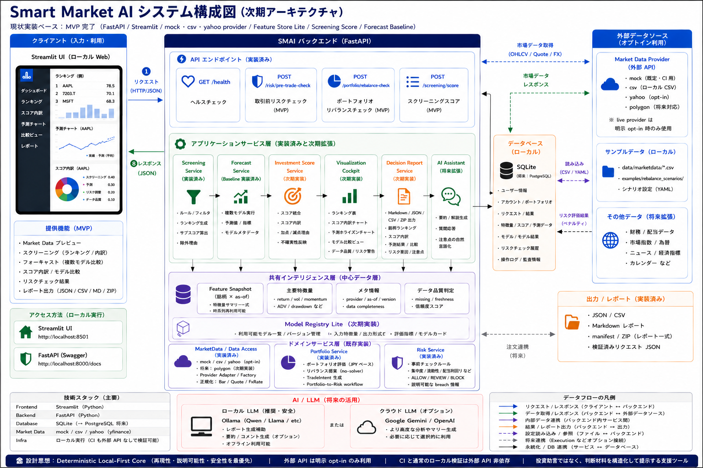

# Smart Market AI


Smart Market AI（SMAI）は、投資判断に必要な情報を整理・可視化し、
市場データ取得、特徴量生成、スクリーニング、複数モデル予測、Investment Score、ポートフォリオ評価、Research RAG による外部最新情報・根拠整理を通じて、
「売買を自動化する」のではなく「判断材料を説明可能にする」ためのローカルファーストな投資分析プラットフォームです。

SMAI は以下の思想を重視しています。

- deterministic（再現可能）な分析基盤
- explainable（説明可能）なスコアリング
- local-first な実行環境
- optional な外部 API 連携
- モジュール分離された拡張可能アーキテクチャ
- 売買推奨ではなく、根拠・不確実性・注意点を含む投資判断補助



## 現在の MVP / 実装状況

実装済み:

- FastAPI backend
  - `GET /health`
  - `POST /risk/pre-trade-check`
  - `POST /portfolio/rebalance-check`
  - `POST /screening/score`
  - `POST /forecast/evaluate`
  - `POST /scoring/investment-score`
- Pydantic v2 の共通データ契約、設定モデル、ドメインエラー
- 既定の MarketData provider: `yahoo` live data
- テスト / オフライン確認用の deterministic provider: `mock` / `csv`
- `polygon` provider の capability metadata / 将来予約
- 日次 snapshot、ADV、volatility、momentum、drawdown、data completeness の feature building
- Feature Snapshot を使った Screening Score
- naive / moving-average / momentum baseline による Forecast Evaluation
- Forecast Summary / model agreement / forecast range / best RMSE model の表示補助
- Screening、Forecast agreement、Data Quality、Risk signal を統合する Investment Score
- configurable `scoring.weights`
- deterministic な Risk pre-trade check
- Portfolio 評価と solver なしの rebalance proposal
- Portfolio-to-Risk workflow
- Decision Report context v1
  - cockpit / ranking / rebalance の判断材料を Markdown / JSON / manifest / ZIP として保存
  - data confidence、symbol metadata、decision checkpoints、Research Evidence / Research Score section の標準 builder
- Research RAG Phase 20 local evidence foundation
  - local UTF-8 Markdown / Text / CSV の登録、hash dedupe、chunking、keyword evidence search
  - deterministic Research Summary、data-quality warning、Cockpit / Ranking modal / Decision Report 連携
- Research RAG external fresh-source fetch first UI slice
  - TDnet 適時開示 + Yahoo Finance profile / news の first slice を `AI調査を更新` の標準処理へ統合済み
  - 方針として、取得本文は保持せず session-local に一時参照する。画面とDecision Reportには source URL / provider / fetched_at / published_at / freshness warning / 要約を表示する
- Performance Profile first slice
  - `SMAI_PERFORMANCE_PROFILE=notebook|workstation` で実行環境に応じた外部取得の並列数・timeoutを切り替える
  - Research RAG の外部取得では source別 summary、HTTP取得の retry / backoff、provider名とprofile source keyのmappingを持つ
  - `per_source_workers` は Research source別 limiter の入口まで整備済み。adapter内部のURL/page単位並列制御、News / MarketData / Symbol refresh への共通適用は後続範囲
- Research Summary local readability first slice
  - 外部LLMはいったん使わず、RAG evidence / provider profile / news / TDnet trace を表示専用 `ResearchBrief` に変換する
  - AI整理メモ、定量評価サマリー、企業概要、良材料候補、注意材料候補、不足根拠、次に確認すべき資料、出典カードの順に読める調査メモへ整理する
- Research Score first slices
  - `ResearchScoreService`、optional Investment Score input、disabled-by-default `scoring.weights.research`
  - Cockpit / Ranking Research Summary の Research Score 参考表示
  - Ranking selected-candidate breakdown の Research Score 確認材料表示
  - Cockpit Decision Report の Research Score section
- Investment News / News cache backend foundation
  - `backend/news` の dashboard snapshot / status contracts、latest snapshot cache、1世代 backup、atomic save、cleanup、TTL / retry / failure fallback、rotating log
  - 通常 tests は fake snapshot / fixture で network-free に維持
- Symbol Database background refresh foundation
  - `backend/symbols` の freshness 判定、priority queue、atomic queue/status persistence、latest-only normalized symbol cache、startup background worker
  - Streamlit 起動時に画面表示をブロックせず、local `symbol_universe.csv` から missing / stale 銘柄を順次更新
- Low-cost Assistant backend first slice
  - `backend/assistant` の `AssistantRequest` / `AssistantResponse` / `TemplateAssistantService`
  - LLM / network なしで Decision Report context から理由、注意点、次の確認観点を deterministic に返し、売買指示質問は助言境界として扱う
- LLM expansion direction
  - SMAI plans to use LLMs as an interpretation and reasoning support layer.
  - The LLM layer will first power SMAI Copilot, context-aware explanations, news/material summaries, and Decision Report drafting.
  - It will not directly change scores, rankings, forecasts, or investment decisions in the early phases.
  - Validated LLM-derived factors may later be tested and gradually integrated into ranking or forecast models.
  - SMAI では LLM を判断主体ではなく、解釈・理由付け・材料整理を支援する layer として扱う。
  - 初期段階の LLM は Copilot、画面文脈に沿った説明、ニュース / 材料要約、Decision Report 草案、LLM Factor 候補生成に使い、スコア、順位、予測値、投資判断は直接変更しない。
  - LLM 由来の特徴量を Ranking / Forecast に統合する場合は、backtest、leakage check、baseline 比較などの検証後に段階的に扱う。
- LLM Factor live generation Phase 27-A / 27-B
  - `smai-ai-gateway` の `/api/v1/llm-factor/generate` で 1銘柄の構造化材料を生成する opt-in MVP を実装済み
  - SMAI親側は Cockpit の Research / News / IR 出典を compact context に圧縮し、`llm_factor.v1` validation、context hash cache、deterministic fallback を通して `AI材料分析` に参考表示する
  - Phase 27-B で live smoke 設定例、Gateway / Ollama 手順、Playwright panel smoke、fallback reason 標準化、stale / contradiction / version mismatch / overlong output の validation warning を追加
  - Ranking、Forecast、AI総合、Investment Score、Research Score、売買判断、execution には反映しない
- Cockpit LLM interpretation Phase 28-A
  - `銘柄コックピット` の価格、予測、Investment Score、Research Evidence、AI材料分析を `context-answer` 経由で読み解く `AI解釈メモ` MVP を実装済み
  - 既定は disabled。Gateway unavailable / validation error 時は deterministic fallback。通常 tests は network-free
  - Ranking、Forecast、AI総合、Investment Score、Research Score、売買判断、Assistant自動外部取得には反映しない
- Streamlit UI
  - left side menu for `銘柄コックピット` / `銘柄ランキング` / `投資レーダー` / `SMAIアシスタント` / `リバランス` / `設定 / データ情報`
  - 銘柄コックピット: 価格・予測チャート、AI予測インサイト、Investment Score、投資判断メモ、Research Evidence、Decision Report、銘柄データ modal、warnings、downloads
  - 銘柄ランキング: curated symbol metadata、候補条件 modal、ランキング preset、今回のランキング条件カード、AI総合 / 予測・上昇気配 / 下振れ警戒説明、AI総合の重み 30/30/25/10/5、`安定成長` を含む評価方針メタデータ、AI予測インサイト込みの並べ替え理由と深掘り候補、行クリックで開く銘柄データ modal、AI Research tab、Decision Report
  - 投資レーダー: network-free demo snapshot と手動更新時の Google News RSS Standard Mode による市場ニュースヘッドライン、企業名主表示＋シンボル補助タグのクリック可能な株式ヒートマップ風投資ヒートマップ、3列カテゴリ別ニュースカード、銘柄名付き関連銘柄から銘柄コックピットへの導線
  - Rebalance Cockpit: summary flow、percentage target、allocation comparison chart、risk breach confirmation points、Decision Report
- symbol universe metadata schema、source import、opt-in metadata refresh、SBI ranking universe policy columns / default exclusion helper
- JPX / SBI / NISA / IMAJ / REIT source builders and import profiles
- JSON / CSV / Markdown / manifest / ZIP export
- file-backed rebalance scenarios
- Windows 環境向け single-process Black check helper

未実装または将来範囲:

- `polygon` など追加 live provider adapter 本体
- 追加 provider / fund metadata source adapter
- 投信 metadata / 基準価額 / ranking 対応
- `投資レーダー` dashboard の外部ニュースsource接続、詳細フィルタ、Watchlist連動、通知
- EDINET / company IR site など追加 Research RAG external source adapter の拡張、vector / hybrid search の運用UI
- Research Score の ranking order 統合は現時点では見送り。必要性が再確認された場合のみ opt-in 後続機能として扱う
- Assistant API / Streamlit 質問パネル、optional LLM provider
- 銘柄DB freshness badge / live provider refresh wiring の visible UI 接続
- Execution / broker への注文送信
- PDF / Excel export

ユーザー向けのデータ取得は API / Streamlit とも `yahoo` live data を既定にします。`mock` / `csv` はテスト、オフライン確認、fixture 用として明示設定した場合に使います。通常確認は引き続き `tests/fixtures/config/local.yaml` や `config/csv_example.yaml` でネットワーク不要に保ちます。

## 現在のロードマップ上の位置

- Phase 1〜15: implementation complete
- Phase 16: UI / Visualization Cockpit implementation complete。銘柄データ modal、コックピット投資判断メモ、ランキング行クリック詳細表示まで実装済み。最終 Streamlit browser smoke は推奨確認
- Phase 16S: Stabilization / final Streamlit smoke に加え、Manual UX Review と Functional Spec Issues による成熟性レビューを実施
- Phase 17: UI Polish / ランキング条件 UI 再設計は implementation complete
- Phase 18: symbol universe / metadata refresh / source import / SBI ranking universe policy は implementation complete。継続的な NISA / ETF / stock metadata source 更新は運用タスクとして扱う
- Phase 19: Decision Report Context MVP は implementation complete
- Phase 20: Research RAG Evidence Layer は local evidence foundation が implementation complete
- Phase 21: 高度Research RAG / Stock News RAG / external fresh-source fetch の first slices は implementation complete。追加 provider と運用UIは後続
- Phase 22: Research Score / Cockpit deep-dive は first UI slices 実装済み。Phase 22.x `投資レーダー` (Investment News dashboard) は初期MVP実装済み、Phase 22.y news cache と Phase 22.z symbol DB background refresh は backend foundation 実装済み
- Phase 23: Optional Adapter / 高度分析を先に進める。Advanced Forecast は `advanced_linear` / `advanced_tree_sklearn` / `advanced_gbdt_sklearn` / `advanced_quantile` の registry、forecast service / API adapter selection、Cockpit `AI予測インサイト` chart/card/detail、Ranking auxiliary 表示、上昇気配 / 下降警戒への控えめブレンド、AI総合の `予測・上昇気配30%` / `リスク・下振れ警戒25%` グループへの統合、Ranking理由表示 / 深掘り候補 / Decision Report 連携まで実装済み。Cockpit の AI予測インサイト初期表示は、結論、中心予測（高度予測モデルの統合結果）、下振れ / 上振れケース、予測価格、予測レンジ、信頼度、モデル合意度、予測ばらつき、注意点に整理し、個別高度モデルカードは常時表示、RMSE / 方向一致率 / 単純予測比較は折りたたみ配下で確認する
- Phase 24-25: Template Assistant backend slice、SMAI Copilot floating UI、専用 Copilot workspace、Gateway schema / client / deterministic fallback、`smai-ai-gateway/` scaffold、`SMAIアシスタント` 画面からの既定 LLM Gateway 接続、Gateway側のLLM構造化JSON応答、親SMAI側の opt-in live smoke test path は実装済み
- Phase 24A: `SMAI LLM Factor` の schema、deterministic fake / cache、Cockpit / Ranking 参考表示、validation foundation は実装済み
- Phase 27-A / 27-B: LLM Factor live generation MVP と確認導線は実装済み。Gateway endpoint、親SMAI context builder / HTTP adapter / validation / fallback、Cockpit `AI材料分析` 参考表示、live smoke 設定例、Playwright panel smoke、validation深化を追加。モデル統合可否判断は後続
- Phase 28-A: Cockpit LLM Interpretation MVP は実装済み。Phase 28-B以降で Ranking / Radar / News / Decision Report への LLM 解釈展開、Decision Report草案、LLM Factor validation and gradual model integration を段階的に扱う
- Phase 30-A: SMAI Assistant Tool Plan MVP は実装済み。現在画面 context、Action Catalog、deterministic Tool Plan、Plan Validation、`次にできること` 表示を追加し、外部取得・ランキング作成・確認レポート作成は確認前提の提案に留める
- Phase 31: advanced export、Execution gate の順に整理
- Execution / broker order: Decision Report と risk/audit 境界が固まるまで低優先度

次の重点は Phase 30-B 以降の Assistant confirmable navigation / safe action 接続、または Phase 28-B 以降の LLM 解釈拡張を、既存の Assistant / LLM Factor / Decision Report 境界を壊さずに段階化することです。Phase 30-A の Tool Plan は提案表示であり、外部取得・ランキング作成・確認レポート作成を自動実行しません。早期段階では LLM が Ranking score、AI総合、Forecast、Investment Score、投資判断を直接変更しません。通常 checks は引き続き fake adapter / fixture で network 非依存を維持します。実 Gateway / Ollama smoke は明示 opt-in で分離します。
詳細は [実装ロードマップ](./Documents/05_Implementation_Roadmap.md) を参照してください。

## ドキュメント

- [プロジェクト現在地](./PROJECT_CONTEXT.md)
- [実装ロードマップ](./Documents/05_Implementation_Roadmap.md)
- [MVP 運用ガイド](./Documents/06_MVP_Operations_Guide.md)
- [Phase 27-B LLM Factor Live Smoke](./Documents/27B_LLM_Factor_Live_Smoke.md)
- [Phase 28-A Cockpit LLM Interpretation](./Documents/28A_Cockpit_LLM_Interpretation.md)
- [Phase 30 Assistant Agent Roadmap](./Documents/30_Assistant_Agent_Roadmap.md)
- [UI 文言ポリシー](./Documents/07_UI_Wording_Policy.md)
- [Phase 16 UI 改善計画](./Documents/08_Phase16_UI_Improvement_Plan.md)
- [SBI 銘柄ユニバース方針](./Documents/09_SBI_Symbol_Universe_Policy.md)
- [手動 UX レビューチェックリスト](./Documents/96_Manual_UX_Review_Checklist.md)
- [機能仕様 issue 台帳](./Documents/97_Functional_Spec_Issues.md)
- [Research RAG 詳細設計](./Documents/04_Detail_Design/04-8_Onepager_Research_RAG.md)
- [Investment Scoring / UI 詳細設計](./Documents/04_Detail_Design/04-9_Onepager_Investment_Scoring_UI.md)
- [Codex タスクテンプレート](./Documents/98_Codex_Task_Template.md)
- [作業ログ](./Documents/99_Work_Log.md)

設計背景:

- [要件定義](./Documents/01_Define_requirements.md)
- [システム設計](./Documents/02_System_design.md)
- [機能設計](./Documents/03_Functional_design.md)
- [詳細設計](./Documents/04_Detail_Design/04_Detail_Design_README.md)

## セットアップ

`setup\setup.bat` は Python 3.11 または 3.12 を使って仮想環境を作成します。
Python 3.11 / 3.12 以外の環境では、下の手動インストール手順で `venv_SMAI` を作成してください。

リポジトリ直下で実行します。

```powershell
.\setup\setup.bat
```

このセットアップでは、Streamlit の実画面 smoke 用に Playwright + Chromium も dev 依存として導入します。

既存の仮想環境を使う場合は、依存関係を直接インストールします。

```powershell
.\venv_SMAI\Scripts\python.exe -m pip install -r setup\requirements.txt -r setup\requirements-dev.txt
.\venv_SMAI\Scripts\python.exe -m playwright install chromium
```

Playwright / Chromium は Streamlit の実画面 smoke 用の dev 依存です。通常の local checks は引き続きブラウザ起動に依存しません。

## Performance Profile

外部情報取得の並列数とtimeoutは、`SMAI_PERFORMANCE_PROFILE` で切り替えます。未指定時はノートPC向けの `notebook` です。

```powershell
$env:SMAI_PERFORMANCE_PROFILE = "workstation"
.\venv_SMAI\Scripts\python.exe -m streamlit run .\ui\app.py
```

- `notebook`: 通常開発・ノートPC向け。Research外部取得はprofile上限4 workers、timeout 12秒
- `workstation`: 余力のあるPC向け。Research外部取得はprofile上限10 workers、timeout 15秒

実行時の worker 数は、profile 上限と実際の external source adapter 数の小さい方に抑えます。

Research外部取得では、Google News RSS / TDnet / EDINET / 企業IRサイトのHTTP取得に限定して `retry_count` / `retry_backoff_sec` を使います。HTTP 5xx、timeout、一時的な接続失敗はretry対象ですが、404などのHTTP 4xx、データなし、parse errorはretryしません。設定画面の `直近のAI調査 外部取得` で source別の `success / failed / timeout / no_result / cache_hit`、elapsed、retry回数、result数を折りたたみ確認できます。

この profile は `SMAI_LLM_PROFILE` とは別です。`SMAI_LLM_PROFILE` はLLMモデル選択、`SMAI_PERFORMANCE_PROFILE` はSMAI親アプリ側の並列度・timeout・Research外部取得retryの設定として扱います。通常の local checks / CI は引き続き network-free です。

## API の起動

```powershell
.\venv_SMAI\Scripts\python.exe -m uvicorn backend.app.main:app --reload
```

ローカル確認用 URL:

```text
http://127.0.0.1:8000/health
http://127.0.0.1:8000/docs
http://127.0.0.1:8000/openapi.json
```

## Streamlit UI の起動

```powershell
.\venv_SMAI\Scripts\python.exe -m streamlit run .\ui\app.py
```

現在の UI は左サイドメニューで画面を切り替えます。
`銘柄コックピット` では 1 銘柄を深掘りし、`銘柄ランキング` では複数銘柄を比較します。
`リバランス` では、現在資産、目標配分、配分差分、見直し候補、Risk 判定を順に確認します。
`設定 / データ情報` では、実行環境とローカルの銘柄候補を確認できます。

## CSV MarketData で起動

設定上のデフォルト provider は `yahoo` です。
Streamlit の Market Data 画面、Ranking、銘柄コックピット、API の通常データ取得は live data を主導線として扱います。ローカル CSV サンプルデータを使う場合は、次のように明示設定します。

```powershell
$env:SMAI_CONFIG_FILE = ".\config\csv_example.yaml"
.\venv_SMAI\Scripts\python.exe -m uvicorn backend.app.main:app --reload
```

同じ設定は Streamlit UI でも使えます。

```powershell
$env:SMAI_CONFIG_FILE = ".\config\csv_example.yaml"
.\venv_SMAI\Scripts\python.exe -m streamlit run .\ui\app.py
```

## 手動 Smoke Check

サーバーを起動せずに rebalance-check flow を確認できます。

```powershell
.\venv_SMAI\Scripts\python.exe .\tools\run_rebalance_check_demo.py
```

期待される結果:

- `AAPL` の `BUY` proposal が 1 件出る
- `risk_decision.status` が `BLOCK` になる
- breach に dividend-yield data 欠損と concentration が含まれる

## Rebalance Scenario

Streamlit UI の sample は次のディレクトリの JSON から読み込みます。

```text
examples/rebalance_scenarios/
```

新しい sample を追加する場合は、同じ形式の JSON を追加します。
`description` を書くと、UI の Sample 選択欄の下にシナリオ説明として表示されます。

別のローカルディレクトリから sample を読み込む場合は、`SMAI_REBALANCE_SCENARIO_DIR` を指定します。

```powershell
$env:SMAI_REBALANCE_SCENARIO_DIR = ".\my_rebalance_scenarios"
.\venv_SMAI\Scripts\python.exe -m streamlit run .\ui\app.py
```

## 検証

まずローカル MVP の基本確認をまとめて実行します。

```powershell
.\venv_SMAI\Scripts\python.exe .\tools\run_local_checks.py
```

個別に実行する場合:

```powershell
.\venv_SMAI\Scripts\python.exe -m pytest tests -q
.\venv_SMAI\Scripts\python.exe -m ruff check . --no-cache
.\venv_SMAI\Scripts\python.exe -m mypy .
.\venv_SMAI\Scripts\python.exe .\tools\run_black_check.py
```

この Windows 環境では、直接の multi-file `python -m black --check .` が worker process を残す場合があるため、通常は `tools/run_black_check.py` を使います。

Streamlit の実画面確認を行う場合は、Playwright の Chromium が入っていることを確認します。

```powershell
.\venv_SMAI\Scripts\python.exe -m playwright --version
.\venv_SMAI\Scripts\python.exe -m playwright install chromium
```
