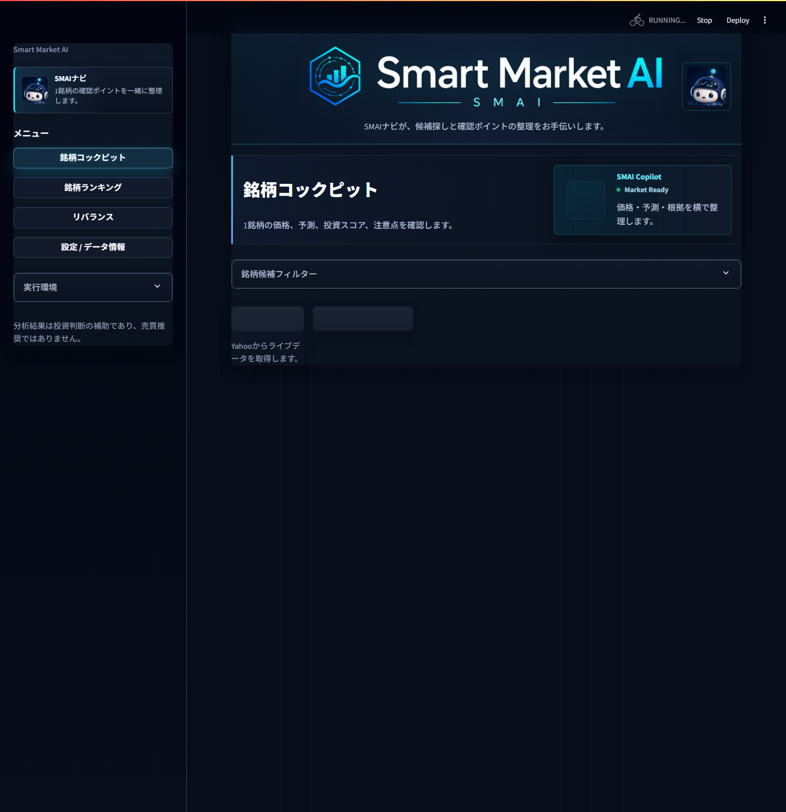
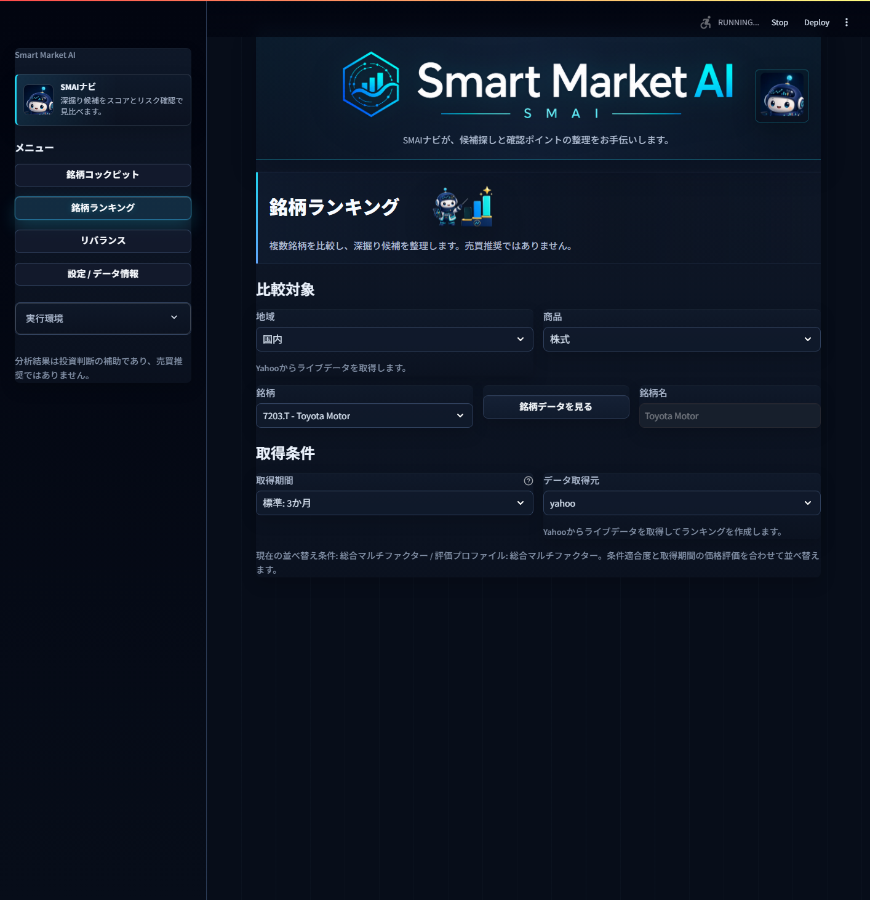
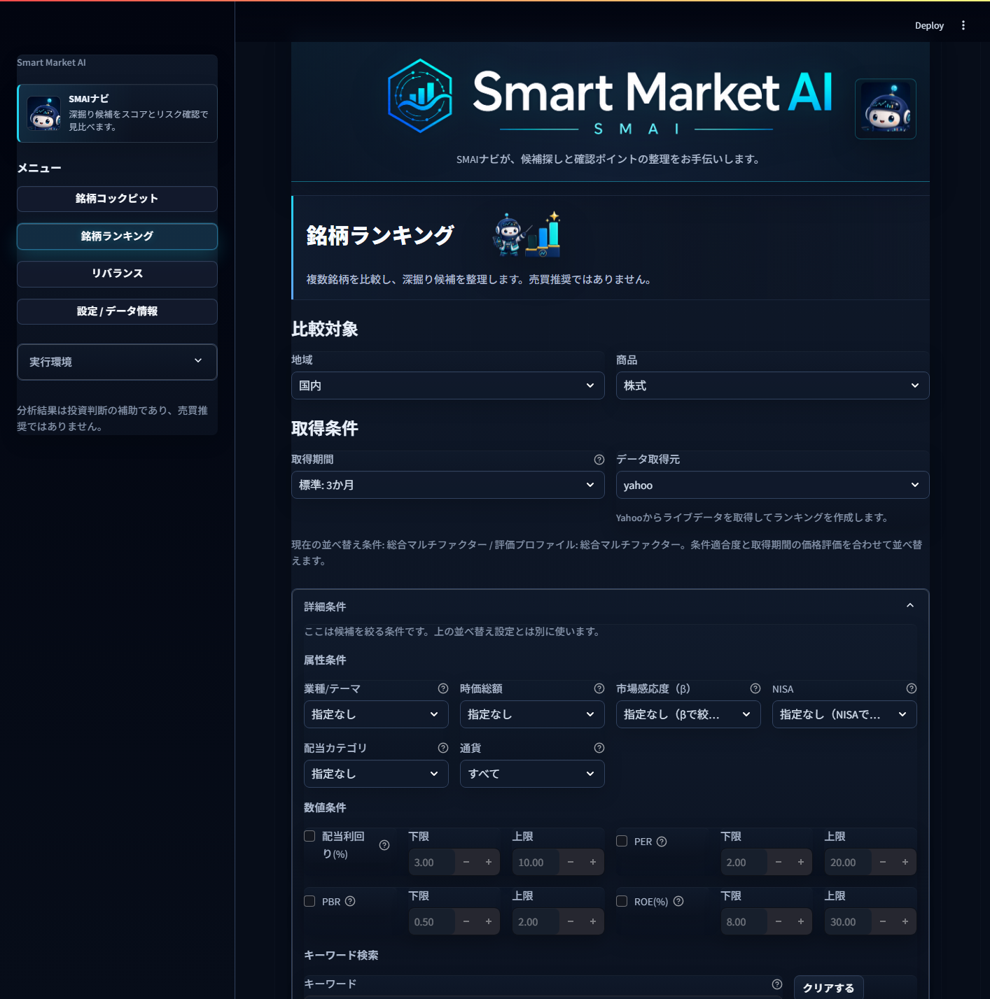

# Smart Market AI 使い方マニュアル

対象画面: 銘柄ランキング / 銘柄コックピット
主な使い方: 銘柄ランキングで気になる銘柄を絞り込み、銘柄コックピットで1銘柄ずつ深掘りします。

> SMAIの分析結果は、投資判断を整理するための補助情報です。売買推奨ではありません。

## 1. まず見る画面

SMAIを起動すると、左側のメニューから画面を切り替えられます。

よく使う画面は次の2つです。

| 画面 | 役割 | 使うタイミング |
| --- | --- | --- |
| 銘柄ランキング | 複数銘柄を条件で絞り、スコアで比較する | 最初に候補を探すとき |
| 銘柄コックピット | 1銘柄の価格、予測、スコア、注意点を詳しく見る | 候補を深掘りするとき |

基本の流れは、先に「銘柄ランキング」を開き、気になる銘柄を見つけてから「銘柄コックピット」で確認します。

## 2. 銘柄ランキングで候補を絞る

左メニューの「銘柄ランキング」を押します。

最初に決めるのは、比較対象と取得条件です。

| 入力項目 | 何を決めるか | 迷ったとき |
| --- | --- | --- |
| 地域 | 国内、米国など、探す市場 | まずは国内 |
| 商品 | 株式、ETFなど | 個別株を見るなら株式 |
| 銘柄 | 比較する代表銘柄 | 初期値のままで開始してよい |
| 取得期間 | 価格データを見る期間 | 標準: 3か月 |
| データ取得元 | 価格データの取得元 | 通常は画面の初期値を使う |

「現在の並べ替え条件」には、ランキングが何を重視して並べるかが表示されます。標準では「総合マルチファクター」で、価格評価、条件適合度、データ品質、リスク確認などをまとめて比較します。

## 3. 詳細条件で探したい銘柄に近づける

ランキング画面の「詳細条件」を開くと、さらに条件を絞れます。

ここでは、候補を減らすための条件を設定します。並べ替え条件とは役割が違います。

| 条件 | 使い方 |
| --- | --- |
| 業種 / テーマ | 業種やテーマで探す |
| 時価総額 | 大型株、小型株などの傾向を絞る |
| 市場感応度（β） | 値動きが市場より大きいか、小さいかを見る |
| NISA | NISA対象だけを見たいときに使う |
| 配当カテゴリ / 配当利回り | インカム候補を探すときに使う |
| PER / PBR / ROE | 割安さや収益性の条件を加えたいときに使う |
| キーワード検索 | 銘柄名、タグ、テーマで探す |

条件を入れすぎると候補が少なくなります。最初は「地域」「商品」「取得期間」だけで作成し、結果が多すぎるときに詳細条件を足すと扱いやすいです。

## 4. ランキング結果の見方

ランキングを作成したら、上位銘柄を次の順で見ます。

1. 総合スコアを見る
   候補同士を比較するための総合点です。高いほど深掘り候補になりやすいですが、買うべき銘柄という意味ではありません。

2. 注意点を見る
   データ品質、価格変動、リスク、割高感など、確認が必要な点が出ます。注意点がある銘柄は、コックピットで必ず中身を確認します。

3. 補足メモを見る
   なぜ上位に来たのか、次に何を確認すべきかが文章で整理されます。

4. 気になる行を開く
   行をクリックすると、銘柄データの詳細を確認できます。必要に応じてAI Researchタブで根拠資料も確認します。

5. 深掘りしたい銘柄をコックピットへ渡す
   ランキングは候補を並べる場所です。判断材料を詳しく見るときは、銘柄コックピットへ進みます。

## 5. 銘柄コックピットで深掘りする

銘柄コックピットでは、1つの銘柄について確認します。

主に見るポイントは次の通りです。

| 見る場所 | 確認すること |
| --- | --- |
| 価格・予測チャート | 直近価格と予測の方向感 |
| Investment Score | 複数材料をまとめた比較用スコア |
| 投資判断メモ | 強み、注意点、次に確認すること |
| 銘柄データ | PER、PBR、ROE、配当、NISA、分類など |
| Research Evidence | 企業情報、IR、ニュースなどの根拠 |
| Decision Report | その時点の確認内容をレポートとして保存 |

コックピットでは、スコアだけで判断せず、チャート、注意点、根拠情報を横に並べて確認します。

## 6. おすすめの操作手順

1. 左メニューで「銘柄ランキング」を開く。
2. 地域と商品を選ぶ。
3. 取得期間を「標準: 3か月」にする。
4. 必要なら詳細条件でテーマ、配当、PER/PBR/ROEなどを絞る。
5. ランキングを作成する。
6. 上位銘柄の総合スコア、注意点、補足メモを見る。
7. 気になる銘柄の行を開き、銘柄データを確認する。
8. 深掘りしたい銘柄を銘柄コックピットで開く。
9. 価格・予測、Investment Score、投資判断メモ、Research Evidenceを確認する。
10. 必要ならDecision Reportを作成し、判断材料として残す。

## 7. 読み間違えやすいポイント

| 表示 | 正しい見方 |
| --- | --- |
| 総合スコアが高い | 深掘り候補として優先度が高い。買い推奨ではない |
| 上昇気配 | 価格や予測材料から見た確認用シグナル。将来の上昇保証ではない |
| 下降警戒 | 下振れやリスクを確認するためのシグナル |
| Data Quality | 価格データや計算材料のそろい具合 |
| 条件適合度 | 自分が入れた条件にどれくらい合っているか |
| DB信頼度 | ローカル銘柄マスタの情報がどれくらい埋まっているか |
| Research Score | 根拠資料の充実度や新しさの参考情報。ランキング順位を直接変えるものではない |

## 8. 迷ったときの使い分け

候補が多すぎるときは、ランキングの詳細条件で絞ります。
候補の理由を知りたいときは、ランキング行の銘柄データを開きます。
1銘柄を詳しく見たいときは、銘柄コックピットへ進みます。
判断材料を残したいときは、Decision Reportを作成します。

最初は「ランキングで3から5銘柄に絞る」「コックピットで1銘柄ずつ確認する」という使い方がおすすめです。
