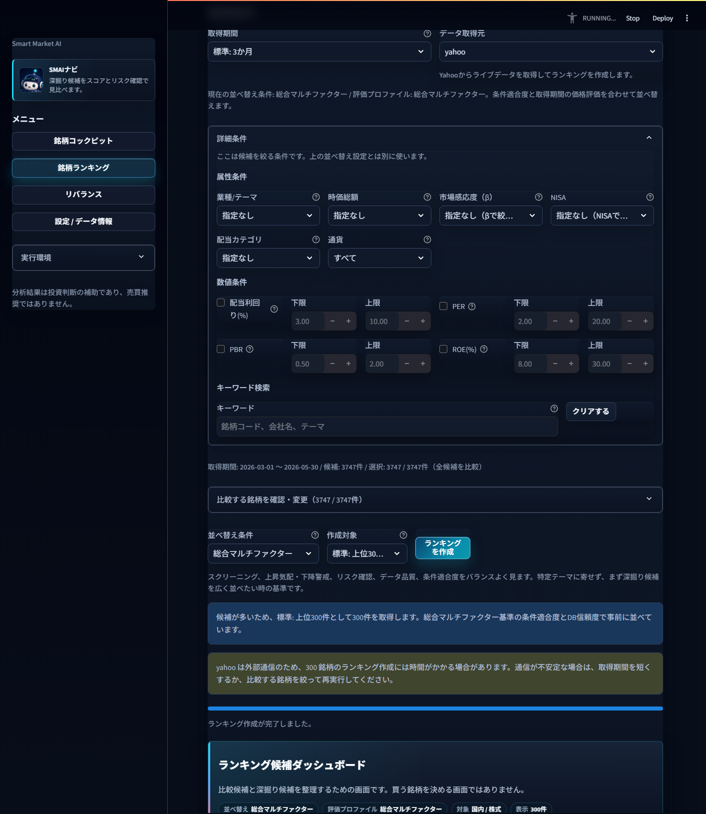
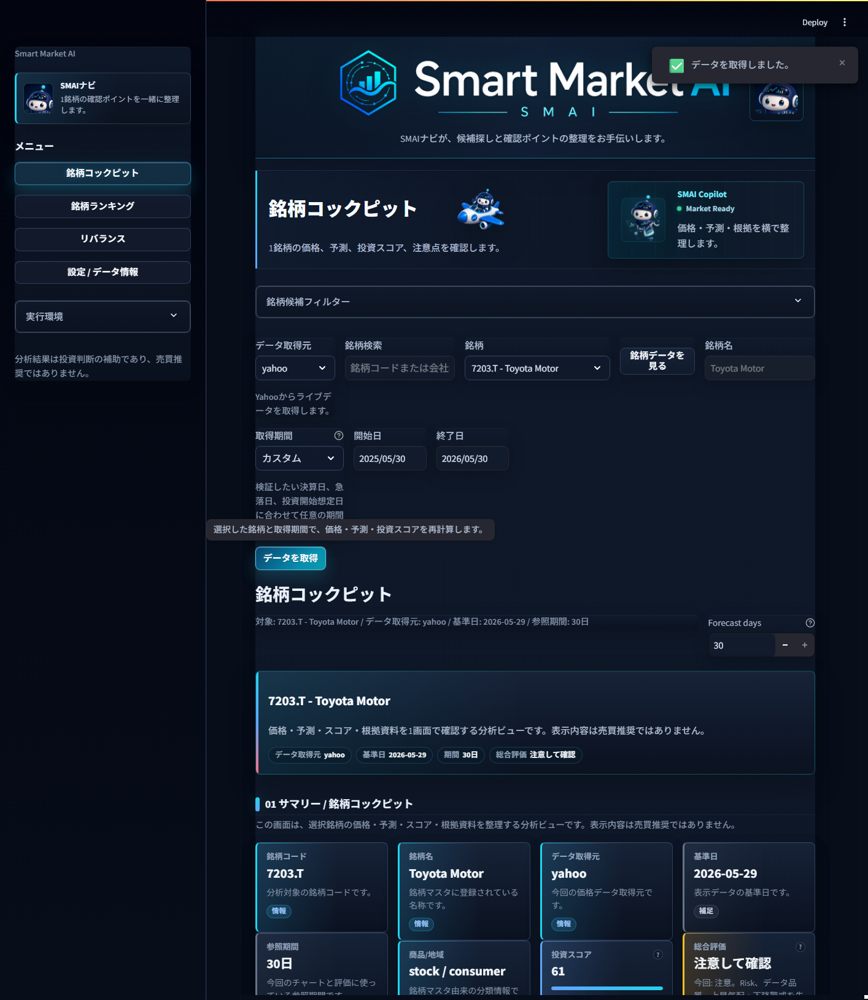
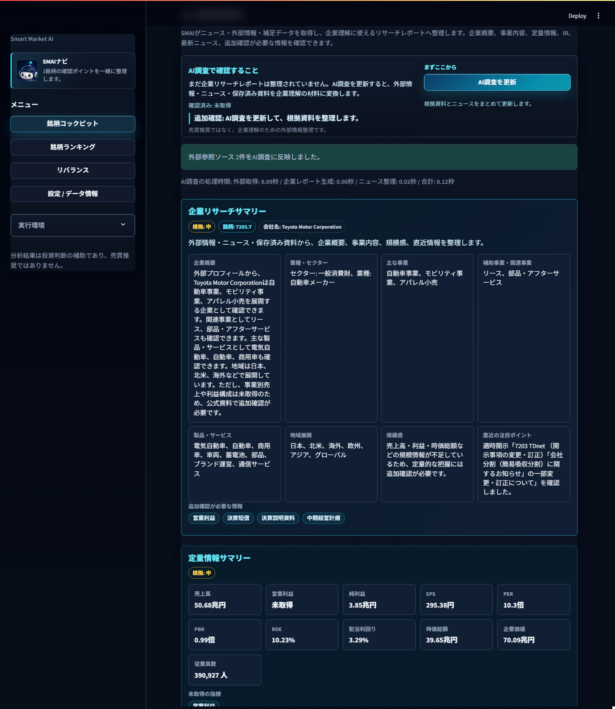
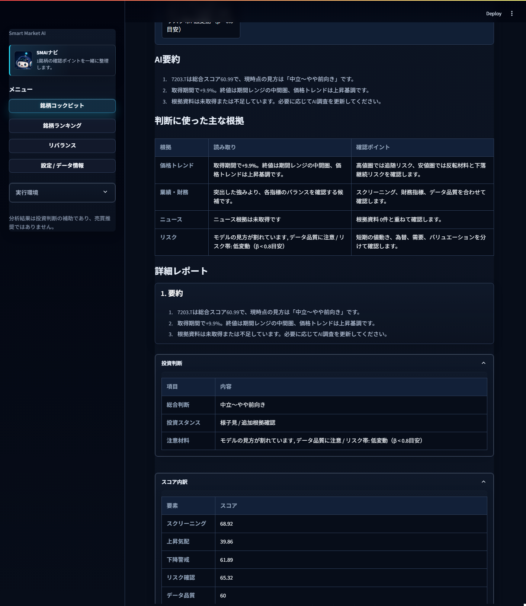
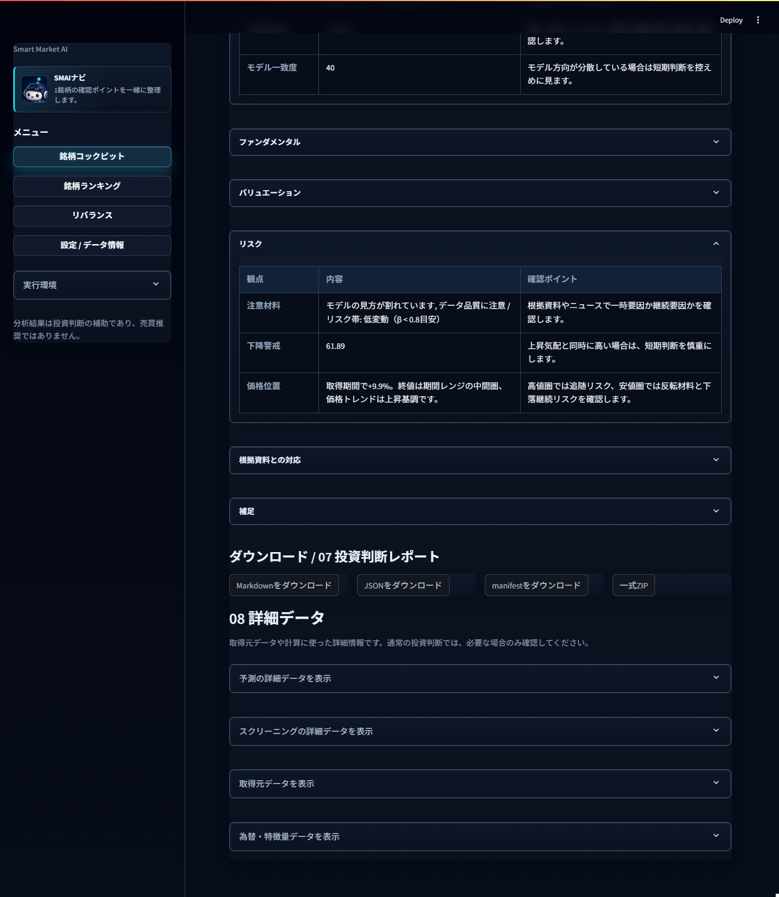

# Smart Market AI 使い方マニュアル

対象画面: 銘柄ランキング / 銘柄コックピット

このマニュアルでは、SMAIの主な使い方である「銘柄ランキングで候補を絞り、銘柄コックピットで深掘りする」流れを、実際の画面に沿って説明します。

> SMAIの分析結果は、投資判断を整理するための補助情報です。売買推奨ではありません。

## 1. 画面の切り替え

SMAIを起動すると、左側のメニューから画面を切り替えられます。

<figure>
  
  <figcaption>図1: 左メニューから「銘柄ランキング」「銘柄コックピット」を切り替えます。</figcaption>
</figure>

画像の見るポイント:
- 左メニューで画面を切り替えます。
- 「銘柄ランキング」で候補を探し、「銘柄コックピット」で1銘柄を確認します。
- 画面下の注意書きは、SMAIが売買推奨ではなく判断補助であることを示しています。

主に使う画面は次の2つです。

| 画面 | 役割 | 使うタイミング |
| --- | --- | --- |
| 銘柄ランキング | 複数銘柄を条件で絞り、スコアで比較する | 最初に候補を探すとき |
| 銘柄コックピット | 1銘柄の価格、予測、スコア、根拠資料を詳しく見る | 候補を深掘りするとき |

## 2. 銘柄ランキングで候補を探す

左メニューの「銘柄ランキング」を開きます。

<figure>
  
  <figcaption>図2: ランキング作成前に、地域、商品、取得期間、データ取得元を選びます。</figcaption>
</figure>

画像の見るポイント:
- 「比較対象」で地域と商品を選びます。
- 「取得条件」で期間とデータ取得元を選びます。
- Yahooを選ぶと、外部通信でライブデータを取得します。

最初に、比較対象と取得条件を決めます。

| 項目 | 見ること | 迷ったとき |
| --- | --- | --- |
| 地域 | 国内、米国など、探す市場 | まずは国内 |
| 商品 | 株式、ETFなど | 個別株を見るなら株式 |
| 取得期間 | 価格データを見る期間 | 標準: 3か月 |
| データ取得元 | 価格データの取得元 | live確認では yahoo |
| 並べ替え条件 | 何を重視して順位を作るか | 総合マルチファクター |

Yahooを選ぶと外部通信でライブデータを取得します。候補数が多い場合は時間がかかるため、最初は「作成対象」を小さめにして試すと扱いやすいです。

## 3. 詳細条件で候補を絞る

「詳細条件」を開くと、ランキング作成前に候補リストを絞れます。

<figure>
  
  <figcaption>図3: 詳細条件は、ランキング作成前に候補数を絞るための入力欄です。</figcaption>
</figure>

画像の見るポイント:
- 業種、時価総額、NISA、配当、PER/PBR/ROEなどで候補を絞ります。
- 詳細条件は候補リストを絞る設定で、順位付けそのものとは役割が違います。
- 条件を入れすぎると候補が減りすぎるため、最初は少なめにします。

| 条件 | 使い方 |
| --- | --- |
| 業種 / テーマ | 業種やテーマで探す |
| 時価総額 | 大型株、小型株などの傾向を絞る |
| 市場感応度（β） | 値動きの大きさで絞る |
| NISA | NISA対象だけを見たいときに使う |
| 配当カテゴリ / 配当利回り | インカム候補を探す |
| PER / PBR / ROE | 割安さや収益性の条件を加える |
| キーワード検索 | 銘柄名、銘柄コード、テーマで探す |

条件を入れすぎると候補が少なくなります。最初は地域、商品、取得期間だけで作成し、結果が多すぎるときに詳細条件を足すのがおすすめです。

## 4. ランキングを作成した後の画面

「ランキングを作成」を押すと、SMAIが外部データを取得し、候補をスコアで整理します。

<figure>
  
  <figcaption>図4: ランキング作成後は、条件、取得件数、候補ダッシュボードを確認します。</figcaption>
</figure>

画像の見るポイント:
- 「ランキング作成が完了しました」と表示されていれば取得完了です。
- 作成対象や取得件数を確認し、広すぎる場合は条件を絞ります。
- 下に続くランキング候補ダッシュボードで上位候補を確認します。

ランキング作成後は、次の順で確認します。

| 見る場所 | 確認すること |
| --- | --- |
| ランキング候補ダッシュボード | どの条件で何件を比較したか |
| 上位候補カード | 深掘り候補の概要 |
| スコア | 総合スコア、上昇気配、下降警戒、リスク確認 |
| 注意点 | データ品質、リスク、割高感、モデルのばらつき |
| 深掘り候補の選択 | コックピットで見る銘柄を選ぶ |

総合スコアが高い銘柄は、深掘り候補として優先度が高いという意味です。買い推奨ではないため、注意点と根拠を必ず確認します。

## 5. 銘柄コックピットでチャートを取得する

ランキングで気になる銘柄を見つけたら、左メニューの「銘柄コックピット」を開きます。銘柄、取得期間、データ取得元を確認し、「データを取得」を押します。

<figure>
  
  <figcaption>図5: データ取得後は、サマリー、主要KPI、価格・予測、スコアが表示されます。</figcaption>
</figure>

画像の見るポイント:
- 対象銘柄、データ取得元、基準日、参照期間を確認します。
- 投資スコアだけでなく、下降警戒、データ信頼度、総合評価も合わせて見ます。
- 取得直後は画面上部に完了通知が出ることがあります。

データ取得後は、次の情報がまとまって表示されます。

| 見る場所 | 確認すること |
| --- | --- |
| サマリー | 対象銘柄、取得元、基準日、参照期間 |
| 主要KPI | 投資スコア、上昇気配、下降警戒、データ信頼度 |
| 価格・予測 | 実線の価格推移と、点線の予測レンジ |
| 評価内訳 | スコアがどの要素で構成されているか |
| 投資判断メモ | 強み、注意点、次に確認すること |

ここでは、まずスコアの高低を見るよりも、「なぜその評価になったか」を確認します。特に、下降警戒やデータ信頼度が気になる場合は、取得期間や根拠資料を変えて再確認します。

## 6. AI調査を更新する

コックピット下部のAI調査エリアでは、企業理解に使う外部情報、ニュース、保存済み資料を整理できます。「AI調査を更新」を押すと、外部参照ソースを取得し、企業リサーチサマリーに反映します。

<figure>
  
  <figcaption>図6: AI調査後は、外部参照ソースと企業リサーチサマリーが表示されます。</figcaption>
</figure>

画像の見るポイント:
- 「外部参照ソースをAI調査に反映しました」と表示されれば更新完了です。
- 企業概要、主な事業、地域展開、規模感を確認します。
- 「追加確認が必要な情報」は、公式資料などで後から確認する項目です。

AI調査後は、次の観点で読みます。

| 見る場所 | 確認すること |
| --- | --- |
| 企業リサーチサマリー | 企業概要、事業内容、地域展開、規模感 |
| 定量情報サマリー | 売上高、利益、EPS、PER、PBR、ROE、配当など |
| 最新ニュース / 開示 | TDnet、ニュース、外部プロフィールなど |
| 追加確認が必要な情報 | 未取得の指標、公式資料で確認したい点 |
| 出典カード | 情報元、公開日、URL、鮮度 |

AI調査は投資判断を代行するものではありません。企業を理解するための材料を整理し、未確認の情報を見つけるために使います。

## 7. 投資判断レポートを読む

データ取得後、コックピットには「07 投資判断レポート」が表示されます。取得済みデータ、価格トレンド、スコア、根拠資料を後から見返せる分析メモとして整理したものです。

<figure>
  
  <figcaption>図7: 詳細レポートでは、AI要約、主な根拠、判断に使った材料を確認します。</figcaption>
</figure>

画像の見るポイント:
- AI要約は、確認結果を短くまとめた入口です。
- 「判断に使った主な根拠」で、価格、業績、ニュース、リスクの見方を確認します。
- 展開パネルを開くと、スコア内訳やリスクなどを詳しく確認できます。

レポートでは、次の順に確認します。

| 見る場所 | 確認すること |
| --- | --- |
| AI要約 | その銘柄をどう見るべきかの短い整理 |
| 判断に使った主な根拠 | 価格、業績、ニュース、リスクの確認ポイント |
| 詳細レポート | 投資判断、スコア内訳、ファンダメンタル、リスク |
| 根拠資料との対応 | AI調査で取得した資料とのつながり |

レポートは「今の判断材料を保存する」機能です。買う/売るを決める指示書ではありません。

## 8. レポートをダウンロードする

レポート下部には、ダウンロードボタンがあります。

<figure>
  
  <figcaption>図8: レポート下部から、Markdown、JSON、manifest、ZIPを保存できます。</figcaption>
</figure>

画像の見るポイント:
- Markdownは人が読む分析メモとして残すときに使います。
- JSONは再分析や他ツール連携に向いています。
- ZIPは関連ファイルをまとめて保管するときに使います。

| ボタン | 用途 |
| --- | --- |
| Markdownをダウンロード | 人が読む分析メモとして保存 |
| JSONをダウンロード | 他ツールや再処理用の構造化データとして保存 |
| manifestをダウンロード | レポートの構成や出力情報を確認 |
| 一式ZIP | 関連ファイルをまとめて保存 |

後から見返す場合はMarkdown、データ連携や再分析に使う場合はJSON、まとめて保管する場合はZIPを使います。

## 9. おすすめの一連の使い方

1. 銘柄ランキングを開く。
2. 地域、商品、取得期間、データ取得元を選ぶ。
3. 必要なら詳細条件で候補を絞る。
4. ランキングを作成する。
5. 上位候補のスコア、注意点、補足メモを見る。
6. 気になる銘柄を銘柄コックピットで開く。
7. データを取得して、価格・予測・スコアを確認する。
8. AI調査を更新して、企業リサーチサマリーと出典を確認する。
9. 投資判断レポートを読み、必要ならMarkdown / JSON / ZIPで保存する。

最初は「ランキングで3から5銘柄に絞る」「コックピットで1銘柄ずつ確認する」という使い方がおすすめです。

## 10. 読み間違えやすい表示

| 表示 | 正しい見方 |
| --- | --- |
| 総合スコアが高い | 深掘り候補として優先度が高い。買い推奨ではない |
| 上昇気配 | 価格や予測材料から見た確認用シグナル。将来の上昇保証ではない |
| 下降警戒 | 下振れやリスクを確認するためのシグナル |
| Data Quality | 価格データや計算材料のそろい具合 |
| 条件適合度 | 入力した条件にどれくらい合っているか |
| DB信頼度 | ローカル銘柄マスタの情報がどれくらい埋まっているか |
| Research Score | 根拠資料の充実度や新しさの参考情報 |
| 投資判断レポート | 分析メモ。売買推奨や注文指示ではない |
