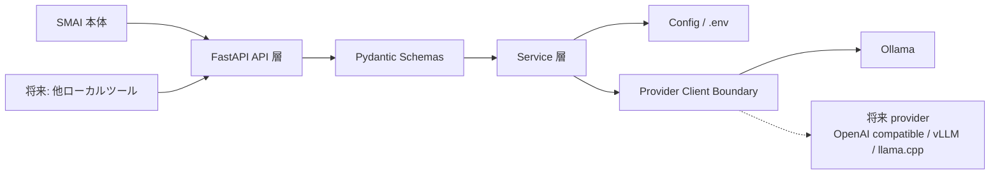

# smai-ai-gateway Project Specification

Last updated: 2026-06-16

## 1. 文書の目的

本書は `smai-ai-gateway` の現在仕様、システム構成、外部インターフェース、実装状況、確認状況を横断的に整理する仕様書です。

一時的な作業ログではなく、レビュー、引き継ぎ、AI 支援開発、将来の独立リポジトリ / Git submodule 化で参照する現在仕様を記載します。起動手順は [SETUP.md](SETUP.md)、API 例は [docs/api_spec.md](docs/api_spec.md)、設計詳細は [docs/architecture.md](docs/architecture.md) を参照します。

## 2. プロジェクト概要

### 2.1 背景

Smart Market AI は、銘柄コックピット、ランキング、投資レーダー、Decision Report などで多くの判断材料を扱います。LLM を導入する場合、provider 固有の実装、prompt 実行、timeout、error handling、model switching を SMAI 本体へ密結合させると、SMAI の予測・ランキング・RAG・UI の境界が曖昧になります。

`smai-ai-gateway` は、LLM 通信を SMAI 本体から切り離し、将来ほかのローカルツールにも展開できる汎用 AI Gateway 境界として整備します。現時点の主利用元は SMAI 本体です。

### 2.2 目的

- SMAI 本体に LLM provider 固有実装を持ち込まない。
- Ollama を初期 provider とし、将来 OpenAI compatible API、vLLM、llama.cpp server へ差し替えやすくする。
- 汎用 chat / summarize API を提供し、SMAI 専用 naming や SMAI Python module import を避ける。
- 現在の Assistant / context-answer 用途では、LLM の役割を説明、要約、確認観点の整理に限定する。
- 将来の `SMAI LLM Factor` 用途では、LLM を最終予測器ではなく、出典付き定性材料を構造化 JSON 特徴量へ変換する provider として扱う。
- 数値予測の最終値、ランキング順位、売買判断、ポートフォリオ配分の決定主体にはしない。

### 2.3 対象システム

- `smai-ai-gateway`: FastAPI ベースのローカル AI Gateway。
- LLM provider: 初期はローカル Ollama。
- 利用元: SMAI 本体。将来の利用候補として、他ローカルツールや PWA / Mobile / Cloud client を想定する。

### 2.4 想定利用者

- SMAI 開発者 / 保守担当者。
- Gateway を利用する他ツールの開発者。
- LLM provider 差し替えや運用機能を追加する開発者。
- 仕様レビューや引き継ぎを行う AI / 人間のレビュアー。

## 3. システム構成



| 要素 | 配置 / 分類 | 役割 |
| --- | --- | --- |
| SMAI 本体 | 親プロジェクト / 主利用元 | Assistant context、Decision Report context、画面文脈を HTTP request として渡す。Gateway から SMAI は import しない。 |
| 将来の他ローカルツール | 将来利用候補 | SMAI 以外へ展開する場合の汎用 HTTP client。現時点では具体アプリ仕様を Gateway に持ち込まない。 |
| FastAPI API 層 | Gateway | `/health`、`/api/v1/chat`、`/api/v1/summarize`、`/api/v1/context-answer` を公開する。 |
| Pydantic Schemas | Gateway | request / response を検証し、SMAI 固有 field 混入を防ぐ。 |
| Service 層 | Gateway | API handler から prompt 生成と provider 呼び出しを分離する。 |
| Config | Gateway | `.env` / environment variables から provider URL、default model、timeout を読み込む。 |
| Provider Client Boundary | Gateway | provider 呼び出し、elapsed time、error normalization を集約する。 |
| Ollama | 外部 provider | 初期のローカル LLM provider。 |
| 将来 provider | 外部 provider | Gateway 内の client 境界で差し替える候補。SMAI 側の変更を最小化する。 |

## 4. 機能一覧

| 機能 | 状態 | 目的 | 主な内容 | 関連資料 |
| --- | --- | --- | --- | --- |
| Health / readiness check | 実装済み | Gateway 起動・Ollama/model疎通確認 | `GET /health` が service 名と status を返し、`GET /health/ready` と `GET /models` が Ollama 接続、設定中 model、導入済み model、install hint を返す | [docs/api_spec.md](docs/api_spec.md) |
| Generic chat API | 実装済み | 汎用チャット実行 | message、system_prompt、model を受け取り、Ollama chat API を呼ぶ | [docs/api_spec.md](docs/api_spec.md) |
| Generic summarize API | 実装済み | 汎用要約実行 | text、purpose、model を受け取り、保守的な要約 prompt を生成する | [docs/api_spec.md](docs/api_spec.md) |
| Context answer API | 実装済み | 画面 / レポート文脈に基づく構造化回答 | context bundle と質問を受け取り、answer、materials、cautions、next_checkpoints、referenced_sections を返す | [docs/api_spec.md](docs/api_spec.md) |
| Ollama client boundary | 実装済み | provider 詳細の隠蔽 | base URL、timeout、model selection、elapsed_ms、error normalization を扱う | [docs/architecture.md](docs/architecture.md) |
| Provider error detail | 実装済み | 利用者が原因を判断しやすくする | `code`、`provider`、`retryable` を含む error detail を返す | [docs/api_spec.md](docs/api_spec.md) |
| Network-free tests | 実装済み | 通常 CI を deterministic に保つ | schema、health、provider error mapping を Ollama なしで確認する | [SETUP.md](SETUP.md) |
| Opt-in live Ollama smoke | 実装済み | 実 provider 接続確認 | `SMAI_AI_GATEWAY_LIVE_SMOKE=1` のときだけ実行する | [SETUP.md](SETUP.md) |
| SMAI real Gateway connection | 親側実装済み | SMAI 本体から実 Gateway を呼ぶ | SMAI 側 `HttpAssistantGatewayClient`、`assistant.gateway` 設定、fallback、schema validation。Gateway 側に SMAI import は追加しない | 親側 roadmap |
| SMAIアシスタント workspace | 親側実装済み | 画面横断の相談 UI | SMAI 側サイドメニューに専用 workspace を追加済み。SMAIナビ header、参照材料 chips、6つの相談カード、限定自由入力、session-local 履歴、チャット幅の `新しい会話` action、擬似ストリーミング、Markdown memo を持ち、Gateway は `/api/v1/context-answer` の汎用境界として使う | 親側 roadmap |
| SMAI Assistant Command Center / Research Mode | 親側初期スライス実装済み | 承認付き調査司令塔 | 親SMAI側で `normal_chat` / `soft_research_suggestion` / `research_plan` 判定、Tool Planカード、approve / cached-only / cancel action を扱う。Gateway はSMAI機能実行を担当せず、承認後に集約されたcontextを `context-answer` で回答整理する境界を維持する | [docs/roadmap.md](docs/roadmap.md) / 親側 roadmap |
| SMAI LLM Factor structured extraction support | 将来範囲 | RAG / News / IR 由来の定性材料を構造化特徴量へ変換する補助 | SMAI 本体側の `LLMFactorResult` schema / fake service / file-backed cache / deterministic backtest evaluator / broader historical fixture / validation report / Cockpit 参考表示 / Ranking 参考表示は実装済み。Gateway は今後も provider / prompt 境界に留め、cache policy expansion、UI 統合は SMAI 本体側で扱う | 親側 roadmap / [docs/prompt_policy.md](docs/prompt_policy.md) |
| 認証 / API key / rate limit | 未着手 | 運用時の保護 | local-first MVP 後の運用機能 | [docs/roadmap.md](docs/roadmap.md) |

## 5. 設定と入力資産

| 資産 | 役割 | 仕様上の扱い |
| --- | --- | --- |
| `.env` | 実行時設定 | `APP_NAME`、`APP_ENV`、`SMAI_OLLAMA_BASE_URL`、`SMAI_LLM_PROFILE`、`SMAI_OLLAMA_MODEL`、`REQUEST_TIMEOUT_SECONDS`、`ENABLE_DEBUG_LOG` を読み込む。legacy alias として `OLLAMA_BASE_URL`、`DEFAULT_LLM_MODEL` も受け付ける。存在しない場合は既定値で動く。 |
| `.env.example` | 設定テンプレート | local setup の標準値を示す。secret は含めない。 |
| SMAI `assistant.gateway` config | 親SMAI側の接続設定 | 既定は `enabled=false`。有効化時のみ `base_url`、`context_answer_path`、`timeout_seconds`、任意 `model` で `/api/v1/context-answer` を呼ぶ。 |
| Chat request | chat API 入力 | `message` は必須。`system_prompt`、`model` は任意。未知 field は拒否する。 |
| Summarize request | summarize API 入力 | `text` は必須。`purpose`、`model` は任意。未知 field は拒否する。 |
| Ollama model | LLM 実行資産 | request model が指定されれば優先し、未指定なら `SMAI_LLM_PROFILE` / `SMAI_OLLAMA_MODEL` を使う。既定は `notebook_dev` / `qwen3:1.7b`。 |
| Prompt templates | provider 入力の組み立て | 現時点では `PromptService` 内の最小実装。将来外部化しやすい service 境界に置く。 |

## 6. 実装構成

### 6.1 ディレクトリ構成

```text
smai-ai-gateway/
  README.md
  Project_Specification.md
  SETUP.md
  .env.example
  pyproject.toml
  run_server.bat
  docs/
    architecture.md
    api_spec.md
    prompt_policy.md
    roadmap.md
  app/
    main.py
    config.py
    clients/
      ollama_client.py
    schemas/
      common.py
      chat.py
      summarize.py
      context_answer.py
    services/
      chat_service.py
      summarize_service.py
      prompt_service.py
      context_answer_service.py
      model_router.py
  tests/
    test_health.py
    test_chat_schema.py
    test_context_answer_schema.py
    test_context_answer_service.py
    test_provider_errors.py
    test_live_ollama_smoke.py
```

### 6.2 主要モジュール

| Python ファイル / モジュール | 主なクラス / 関数 | 役割 |
| --- | --- | --- |
| `app/main.py` | `app`, `health`, `readiness`, `models`, `chat`, `summarize`, `context_answer`, `provider_error_to_http_exception` | FastAPI app と endpoint wiring。domain logic は service / client に委譲する。 |
| `app/config.py` | `GatewaySettings`, `get_settings` | `.env` と environment variables から runtime settings を作る。 |
| `app/clients/ollama_client.py` | `OllamaClient`, `OllamaClientError` | Ollama API 呼び出しと provider error normalization を担当する。 |
| `app/schemas/common.py` | `GatewayBaseModel`, `HealthResponse`, `ErrorDetail`, `LlmMessage`, `LlmProviderResult` | 共通 schema と strict validation。 |
| `app/schemas/chat.py` | `ChatRequest`, `ChatResponse` | 汎用 chat API contract。 |
| `app/schemas/summarize.py` | `SummarizeRequest`, `SummarizeResponse` | 汎用 summarize API contract。 |
| `app/schemas/context_answer.py` | `ContextAnswerRequest`, `ContextAnswerResponse` | context bundle に基づく構造化回答 API contract。 |
| `app/services/prompt_service.py` | `PromptService` | API request から provider message を組み立てる。 |
| `app/services/model_router.py` | `resolve_model_route`, `model_profile_for_name` | task_type / execution_mode / environment_profile / profile / request model から provider、model、timeout、token budget を解決する。 |
| `app/services/chat_service.py` | `ChatService` | chat request を provider 呼び出しへ変換する。 |
| `app/services/summarize_service.py` | `SummarizeService` | summarize request を要約 prompt と provider 呼び出しへ変換する。 |
| `app/services/context_answer_service.py` | `ContextAnswerService` | LLM answer を context 由来の materials / cautions / next_checkpoints と一緒に返す。 |

## 7. 外部インターフェース仕様

### 7.1 外部インターフェース利用方針

- 利用元アプリは Gateway を HTTP API として呼び出す。
- Gateway は provider client boundary から LLM provider を呼び出す。
- Gateway から SMAI 本体の Python module を import しない。
- provider 変更は Gateway 内の client 境界で行い、SMAI 側は request / response contract を保つ。

### 7.2 公開 API

| API | 入力 | 出力 | 確認観点 |
| --- | --- | --- | --- |
| `GET /health` | なし | `{ "status": "ok", "service": "smai-ai-gateway" }` | Gateway process が起動していること。 |
| `GET /health/ready` | なし | Gateway / Ollama / model readiness と error detail | Gateway は起動しているが Ollama 未接続、model 未取得、base URL 誤りを切り分けられること。 |
| `POST /api/v1/chat` | `message`, 任意 `system_prompt`, 任意 `model` | `answer`, `model`, `provider`, `elapsed_ms` | SMAI 専用 field を要求しないこと。model 指定が任意であること。 |
| `POST /api/v1/summarize` | `text`, 任意 `purpose`, 任意 `model` | `answer`, `model`, `provider`, `elapsed_ms` | 入力テキストの要点整理として汎用利用でき、特定アプリ専用 field を要求しないこと。 |
| `POST /api/v1/context-answer` | `user_question`, `context`, 任意 `constraints`, 任意 `model` | `answer`, `materials`, `cautions`, `next_checkpoints`, `referenced_sections`, `confidence`, `provider`, `model`, `elapsed_ms` | LLM がスコアや順位を変更せず、渡された context から説明補助だけを返すこと。 |

### 7.3 Provider interface

| Interface | 状態 | プロジェクト上の扱い |
| --- | --- | --- |
| Ollama `/api/chat` | 実装済み | 初期 provider。`SMAI_OLLAMA_BASE_URL`、`SMAI_LLM_PROFILE`、`SMAI_OLLAMA_MODEL` で接続先と model を変える。 |
| OpenAI compatible API | 未着手 | 将来 provider 候補。SMAI 側ではなく Gateway client 境界で追加する。 |
| vLLM | 未着手 | 将来 provider 候補。 |
| llama.cpp server | 未着手 | 将来 provider 候補。 |

### 7.4 Error handling

| Error code | HTTP status | retryable | 意味 |
| --- | --- | --- | --- |
| `provider_unreachable` | 502 | true | Ollama 未起動、URL 誤り、接続失敗。 |
| `provider_timeout` | 504 | true | provider 呼び出しが timeout。 |
| `model_not_found` | 502 | false | 指定 model が Ollama に存在しない。`ollama pull <model>` が必要。 |
| `provider_http_error` | 502 | status による | provider が HTTP error を返した。 |
| `invalid_provider_response` | 502 | false | provider response が JSON として読めない。 |
| `empty_provider_response` | 502 | false | provider response に回答本文がない。 |

## 8. テストと確認状況

### 8.1 テスト方針

- 通常確認は Ollama / network に依存しない。
- API schema、strict validation、health、provider error mapping を deterministic に確認する。
- `/health/ready` は fake Ollama client で deterministic に確認し、通常CIでは実Ollamaへ接続しない。
- 実 provider 接続は opt-in live smoke として分離する。
- SMAI 本体からの実接続 client は親側で実装済みだが、通常確認は `httpx.MockTransport` を使う network-free tests を基準にする。

### 8.2 テスト実行方法

Gateway 単体:

```powershell
cd smai-ai-gateway
..\.venv_SMAI\Scripts\python.exe -m pytest tests -q
```

Ollama live smoke:

```powershell
cd smai-ai-gateway
$env:SMAI_AI_GATEWAY_LIVE_SMOKE = "1"
..\.venv_SMAI\Scripts\python.exe -m pytest tests/test_live_ollama_smoke.py -q
Remove-Item Env:SMAI_AI_GATEWAY_LIVE_SMOKE
```

### 8.3 確認済み内容

| 確認日 | 内容 | 環境 | 結果 |
| --- | --- | --- | --- |
| 2026-06-11 | Markdown UTF-8 read / `git diff --check` | SMAI repo root / Windows | PASS。CRLF 変換 warning のみ。 |
| 2026-06-11 | Gateway tests | `smai-ai-gateway` / `venv_SMAI` | PASS。11 passed / 1 skipped。pytest cache permission warning のみ。 |
| 2026-06-12 | SMAI parent Gateway client targeted tests | SMAI repo root / Windows | PASS。`tests/test_assistant_gateway_client.py` / `tests/test_core_config.py` / `tests/test_ui_assistant_component.py` 30 passed。pytest cache permission warning のみ。 |
| 2026-06-12 | SMAI parent Copilot workspace checks | SMAI repo root / Windows | PASS。targeted Assistant / Copilot tests 30 passed、`tools/run_local_checks.py` 1391 passed、`mypy .` 220 source files passed。 |
| 2026-06-16 | Gateway default model switch and readiness checks | Windows / Ollama / `qwen3:1.7b` | PASS。`ollama list` に `qwen3:1.7b` のみ、`/models` と `/health/ready` が `configured_model_installed=true`、parent Assistant live smoke passed。 |
| 2026-06-16 | SMAIアシスタント layout checks | SMAI repo root / Windows | PASS。`tests/test_ui_copilot_view.py` / `tests/test_ui_styles.py` 31 passed。`新しい会話` action は chat header lane に合わせる CSS / AppTest で確認。 |

### 8.4 未確認範囲

- 実 Ollama 起動状態での live smoke は opt-in。2026-06-16 のローカル確認では `qwen3:1.7b` で成功済みだが、通常確認には含めない。
- SMAI 本体から Gateway を呼ぶ real HTTP client は親側で実装済み。実Gateway / Ollama live smoke は明示 opt-in 確認範囲。
- `SMAIアシスタント` の専用チャット画面、質問候補、限定自由入力、session-local 会話履歴、チャット幅の `新しい会話` action、擬似ストリーミングの first slice は親側で実装済み。長い会話履歴・複数文脈参照の本格拡張は後続範囲。
- `SMAI LLM Factor` 向けの structured extraction endpoint / prompt profile は未実装。domain schema / deterministic fake service / file-backed cache / deterministic backtest evaluator / broader historical fixture / validation report / Cockpit 参考表示 / Ranking 参考表示は SMAI 本体側にあり、cache policy expansion、UI 統合拡張も SMAI 本体側で扱う。
- 認証、API key、rate limit、監査ログは未実装。
- 別リポジトリ化 / Git submodule 化は未実施。

## 9. 現在の実装状況

| 領域 | 状態 | 内容 |
| --- | --- | --- |
| Gateway scaffold | 実装済み | FastAPI app、schema、service、client、docs、tests を配置済み。 |
| 汎用 API | 実装済み | `/health`、`/health/ready`、`/models`、`/api/v1/chat`、`/api/v1/summarize` を公開。 |
| Provider | 実装済み | Ollama client boundary を実装済み。 |
| Error normalization | 実装済み | provider error を `ErrorDetail` と HTTPException に変換。 |
| Model routing | 実装済み | `notebook_dev` / `notebook_standard` / `desktop_fast` / `desktop_analysis` / `desktop_heavy` profile を provider / model / timeout / token budget に解決し、notebook既定は `qwen3:1.7b`。 |
| SMAI coupling | 境界維持 | Gateway から SMAI module は import しない。既存 SMAI RAG は移動しない。 |
| Structured context answer | 実装済み | `materials` / `cautions` / `next_checkpoints` に対応する汎用 endpoint を追加済み。 |
| SMAI parent client wiring | 親側実装済み | 親SMAIが `assistant.gateway.enabled=true` のとき `/api/v1/context-answer` を呼ぶ。失敗時は deterministic fallback。 |
| SMAIアシスタント workspace | 親側実装済み | 親SMAIのサイドメニューに、SMAIナビ header、材料chips、context preset、質問候補、限定自由入力、session-local 履歴、チャット幅の `新しい会話` action、擬似ストリーミングを持つ dedicated workspace を追加済み。Gateway 側は汎用 HTTP API 境界のまま。 |
| Assistant Command Center / Research Mode | 親側初期スライス実装済み | 親SMAIでConversation Mode Router、承認付きTool Planカード、approve / cached-only / cancel action を実装済み。Gateway 側は task_type / context を受けて回答を整理するprovider境界に留める。 |
| SMAI LLM Factor | 親側 validation slice 実装済み / Gateway は将来範囲 | LLM を最終予測器ではなく、source-bound qualitative feature generator として使う構想。SMAI 本体側に schema / fake service / file-backed cache / deterministic backtest evaluator / broader historical fixture / validation report / Cockpit 参考表示 / Ranking 参考表示を置き、Gateway 側は provider / prompt 実行境界に限定する。 |
| Gateway operations | 未着手 | 認証、API key、rate limit、audit log、provider routing UI は未実装。 |

## 10. 関連資料・参考URL

### 10.1 関連資料

| 資料 | 役割 |
| --- | --- |
| [README.md](README.md) | 目的、全体構成、主要文書への入口。 |
| [SETUP.md](SETUP.md) | セットアップ、起動、health / chat / summarize 確認手順。 |
| [docs/architecture.md](docs/architecture.md) | SMAI 本体、Gateway、provider の境界設計。 |
| [docs/api_spec.md](docs/api_spec.md) | 公開 API の request / response 例。 |
| [docs/prompt_policy.md](docs/prompt_policy.md) | LLM の役割、安全境界、投資助言を避ける方針。 |
| [docs/roadmap.md](docs/roadmap.md) | Gateway 側の段階的な拡張計画。 |
| [../Documents/05_Implementation_Roadmap.md](../Documents/05_Implementation_Roadmap.md) | SMAI 親モジュール側の Phase 24 / Phase 24+ roadmap。 |
| [../PROJECT_CONTEXT.md](../PROJECT_CONTEXT.md) | SMAI 全体の現在地サマリ。 |

### 10.2 参考URL

| 名称 | URL | 用途 | 備考 |
| --- | --- | --- | --- |
| FastAPI | https://fastapi.tiangolo.com/ | API framework 仕様確認 | 公式ドキュメント |
| Pydantic | https://docs.pydantic.dev/ | schema validation 仕様確認 | 公式ドキュメント |
| Ollama API | https://github.com/ollama/ollama/blob/main/docs/api.md | local provider API 確認 | 公式リポジトリ |
| httpx | https://www.python-httpx.org/ | HTTP client 仕様確認 | 公式ドキュメント |
