# SMAI AI Gateway

<p align="right">
  
  
  
  
  
  
</p>

SMAI AI Gateway は、Smart Market AI から LLM 通信を分離するための汎用 API Gateway です。
現時点では SMAI リポジトリ配下に置きますが、将来的に独立リポジトリまたは Git submodule へ切り出せる前提で設計します。

## 目的

Model routing lives in Gateway, not SMAI parent: clients send `task_type`, `execution_mode`, `environment_profile`, and optional `profile` / `model`; Gateway resolves `notebook_dev` / `notebook_standard` / `desktop_fast` / `desktop_analysis` / `desktop_heavy` to provider/model/timeout/token settings and returns `profile` in responses.

- SMAI 本体に LLM provider 固有の実装を密結合させない
- Ollama / OpenAI compatible API / vLLM / llama.cpp server などを差し替えやすくする
- SMAI 本体を主な利用元としつつ、将来ほかのローカルツールからも使える汎用 Gateway 境界にする
- 現在の Assistant / context-answer 用途では、LLM の役割を説明、要約、確認観点の整理に限定し、数値予測やランキング決定を担当させない
- `SMAI LLM Factor` 用途では、LLM を最終予測器ではなく、出典付きの定性材料を構造化 JSON 特徴量に変換する provider として扱う
- SMAI 親側には専用 `SMAIアシスタント` workspace があり、SMAIナビ header、6つの相談カード、自由入力、チャット幅の `新しい会話` action、擬似ストリーミング表示を備え、Gateway 接続時は `/api/v1/context-answer` を汎用 HTTP 境界として利用する
- optional LLM Tool Planner 用途では、Gateway は許可済み action catalog に基づく JSON plan 案を返すだけに限定し、SMAI 親側が validation / fallback / UI表示 / action実行を担当する

## 主要ドキュメント

- [Project_Specification.md](Project_Specification.md): 現在仕様、実装状況、外部インターフェース、確認状況の横断まとめ
- [SETUP.md](SETUP.md): Python 環境、Ollama、`.env`、起動、動作確認手順
- [docs/architecture.md](docs/architecture.md): SMAI 本体、Gateway、LLM provider の境界設計
- [docs/api_spec.md](docs/api_spec.md): 公開 API の request / response 例
- [docs/prompt_policy.md](docs/prompt_policy.md): LLM の役割、安全境界、投資助言を避ける方針
- [docs/roadmap.md](docs/roadmap.md): Gateway 側の段階的な拡張計画

## システム構成図

```mermaid
flowchart LR
  subgraph clients["利用元"]
    smai["SMAI 本体<br/>Cockpit / Ranking / Decision Report"]
    localtools["将来: 他ローカルツール"]
    future["将来: PWA / Mobile / Cloud client"]
  end

  subgraph gateway["smai-ai-gateway"]
    api["FastAPI API 層<br/>/health<br/>/api/v1/chat<br/>/api/v1/summarize<br/>/api/v1/context-answer<br/>/api/v1/assistant/tool-plan"]
    schemas["Pydantic Schemas<br/>request / response validation"]
    services["Service 層<br/>chat / summarize / context-answer / tool-plan / model routing"]
    config["Config<br/>.env / timeout / default model"]
    provider["Provider Client Boundary<br/>error normalization / elapsed_ms"]
  end

  subgraph providers["LLM Provider"]
    ollama["Ollama<br/>local default"]
    openai["将来: OpenAI compatible API"]
    vllm["将来: vLLM"]
    llamacpp["将来: llama.cpp server"]
  end

  smai -- "HTTP API<br/>context bundle / prompt input" --> api
  localtools -- "HTTP API<br/>text / prompt input" --> api
  future -- "HTTP API" --> api

  api --> schemas
  schemas --> services
  services --> config
  services --> provider
  provider --> ollama
  provider -. "差し替え候補" .-> openai
  provider -. "差し替え候補" .-> vllm
  provider -. "差し替え候補" .-> llamacpp

  classDef client fill:#0f172a,stroke:#38bdf8,color:#e0f2fe,stroke-width:2px;
  classDef api fill:#083344,stroke:#22d3ee,color:#ecfeff,stroke-width:2px;
  classDef schema fill:#312e81,stroke:#a78bfa,color:#ede9fe,stroke-width:2px;
  classDef service fill:#064e3b,stroke:#34d399,color:#ecfdf5,stroke-width:2px;
  classDef config fill:#451a03,stroke:#f59e0b,color:#fffbeb,stroke-width:2px;
  classDef boundary fill:#4c0519,stroke:#fb7185,color:#fff1f2,stroke-width:2px;
  classDef provider fill:#111827,stroke:#facc15,color:#fefce8,stroke-width:2px;
  classDef futureProvider fill:#1e293b,stroke:#94a3b8,color:#f8fafc,stroke-width:1.5px,stroke-dasharray: 5 4;

  class smai,localtools,future client;
  class api api;
  class schemas schema;
  class services service;
  class config config;
  class provider boundary;
  class ollama provider;
  class openai,vllm,llamacpp futureProvider;

  style clients fill:#020617,stroke:#38bdf8,stroke-width:2px,color:#e0f2fe;
  style gateway fill:#031b2e,stroke:#22d3ee,stroke-width:2px,color:#ecfeff;
  style providers fill:#111827,stroke:#facc15,stroke-width:2px,color:#fefce8;

  linkStyle 0,1,2 stroke:#38bdf8,stroke-width:2px;
  linkStyle 3,4,5,6,7 stroke:#34d399,stroke-width:2px;
  linkStyle 8,9,10 stroke:#f59e0b,stroke-width:2px,stroke-dasharray: 5 4;
```



## システム構成表

<table>
  <tr>
    <th>図の要素</th>
    <th>技術スタック</th>
    <th>役割</th>
  </tr>
  <tr>
    <td>SMAI 本体</td>
    <td>Streamlit / SMAI backend </td>
    <td>Cockpit、Ranking、Decision Report などの文脈を HTTP request として Gateway に渡します。</td>
  </tr>
  <tr>
    <td>将来の他ローカルツール</td>
    <td>HTTP client / local tooling </td>
    <td>SMAI 以外へ展開する場合の利用候補です。現時点の主対象は SMAI 本体です。</td>
  </tr>
  <tr>
    <td>将来 client</td>
    <td>PWA / Mobile / Cloud client </td>
    <td>将来のスマホ、PWA、クラウド UI から同じ API を呼び出します。</td>
  </tr>
  <tr>
    <td>FastAPI API 層</td>
    <td>FastAPI / Uvicorn  </td>
    <td><code>/health</code>、<code>/api/v1/chat</code>、<code>/api/v1/summarize</code>、<code>/api/v1/context-answer</code>、<code>/api/v1/assistant/tool-plan</code> を公開します。</td>
  </tr>
  <tr>
    <td>Pydantic Schemas</td>
    <td>Pydantic </td>
    <td>request / response を検証し、SMAI 専用ではない汎用 API 契約を保ちます。</td>
  </tr>
  <tr>
    <td>Service 層</td>
    <td>Python service modules </td>
    <td>chat、summarize、context-answer、tool-plan、prompt 生成を API 層から分離します。</td>
  </tr>
  <tr>
    <td>Config</td>
    <td><code>.env</code> / environment variables </td>
    <td>base URL、default model、timeout、debug flag を管理します。</td>
  </tr>
  <tr>
    <td>Provider Client Boundary</td>
    <td>httpx client boundary </td>
    <td>LLM provider 呼び出し、timeout、elapsed_ms、error normalization を集約します。</td>
  </tr>
  <tr>
    <td>Ollama</td>
    <td>Local LLM provider </td>
    <td>初期 provider。既定は <code>http://localhost:11434</code> と <code>qwen3:1.7b</code> / <code>notebook_dev</code> です。</td>
  </tr>
  <tr>
    <td>OpenAI compatible API</td>
    <td>Future cloud / compatible provider </td>
    <td>将来の cloud / compatible API 接続候補です。SMAI 側ではなく Gateway 境界で差し替えます。</td>
  </tr>
  <tr>
    <td>vLLM</td>
    <td>Future inference server </td>
    <td>高スループット推論サーバーへの差し替え候補です。</td>
  </tr>
  <tr>
    <td>llama.cpp server</td>
    <td>Future lightweight local provider </td>
    <td>軽量ローカル推論サーバーへの差し替え候補です。</td>
  </tr>
</table>

SMAI 本体は `AssistantContextBundle` などの必要な文脈だけを HTTP request として渡します。
Gateway は prompt 実行、provider 呼び出し、timeout、error normalization を担当し、SMAI 本体の Python module は import しません。
LLM provider を変更する場合も、SMAI 側ではなく Gateway の provider client 境界を差し替える設計です。
SMAI 親側には、`assistant.gateway.enabled=true` のときだけ `/api/v1/context-answer` を呼ぶ opt-in HTTP client wiring があり、既定は deterministic fallback のままです。
専用 `SMAIアシスタント` workspace は画面内で Gateway 接続を既定で試し、Gateway / provider / model / timeout / schema 失敗時は同じ画面内で deterministic fallback に戻ります。

## 初期 API

- `GET /health`
- `GET /health/ready`
- `GET /models`
- `POST /api/v1/chat`
- `POST /api/v1/summarize`
- `POST /api/v1/context-answer`
- `POST /api/v1/assistant/tool-plan`
- `POST /api/v1/llm-factor/generate`

## LLM model profiles

Ollama model はコードに固定せず、環境変数または request の `profile` / `model` で切り替えます。既定はノートPC開発向けの `notebook_dev` / `qwen3:1.7b` です。

| 環境 | profile | 推奨モデル | 用途 |
| --- | --- | --- | --- |
| ノートPC | `notebook_dev` | `qwen3:1.7b` | 軽量開発・疎通確認 |
| ノートPC標準 | `notebook_standard` | `qwen3:4b` | 標準開発・短めの整理 |
| デスクトップ通常 | `desktop_fast` | `qwen3:8b` | Copilot・要約 |
| デスクトップ高精度 | `desktop_analysis` | `qwen3:14b` | 銘柄分析・RAG統合 |
| 高負荷分析 | `desktop_heavy` | `qwen3:30b` | 週次/月次レポート |

```powershell
SMAI_LLM_PROFILE=notebook_dev
SMAI_OLLAMA_MODEL=qwen3:1.7b
SMAI_OLLAMA_BASE_URL=http://localhost:11434
```

`GET /health/ready` は Gateway process、Ollama API、設定中 model の導入状態をまとめて返します。`GET /models` は Ollama の導入済み model を確認し、設定中 model が未導入なら `ollama pull <model>` の案内を返します。

`/api/v1/context-answer` の `task_type=free_chat` / `identity` / `app_help` / `capability_help` / `screen_guidance` は `llm_micro` として扱います。短い prompt、最小 context、`/no_think` と Ollama `think: false` による thinking 抑制を使い、SMAI 側の Tool Layer / RAG / news / symbol-specific context / 長い履歴には依存しません。runtime は task_type を主軸にしつつ、実際の Ollama model ごとに token budget を調整します。軽量会話の目安は `qwen3:1.7b` が 280-300 tokens、`qwen3:4b` が 320 tokens、`qwen3:8b` が 360-450 tokens、`qwen3:14b` が 360-500 tokens です。短い挨拶、名前質問、できること質問、使い方質問もまず LLM へ投げ、低品質な短文回答は 1 回だけ再生成し、それでも弱い場合や provider timeout の場合だけ自然な fallback に寄せます。銘柄分析、ニュース材料、Decision Report 草案などは task_type ごとの runtime policy と context payload を使います。

`task_type=cockpit_interpretation` は SMAI 親側 Phase 28-A の Cockpit `AI解釈メモ` 用です。Gateway は渡された価格、Forecast、Investment Score、Research Evidence、AI材料分析の要約contextを読み解き、強い材料、注意点、矛盾・不確実性、次の確認を返します。スコア、ランキング順位、予測値、Decision Report 本文の自動変更は Gateway の責務ではありません。

Gateway / SMAI parent の両方で user-facing presentation を整形し、provider raw fields、debug logs、external source bodies、`privacy_notes` / `safety_notes` などの内部向け文言は通常回答・コピー・Markdown保存に出さない方針です。必要な runtime metadata は SMAI UI の `技術情報を表示` に閉じて扱います。

`/api/v1/llm-factor/generate` は `task_type=llm_factor_generation` 相当の構造化 JSON endpoint です。SMAI 親側が渡す 1銘柄の compact context だけを使い、`llm_factor.v1` の `overall_summary`、`sentiment_label`、`confidence`、`factors`、`risks`、`opportunities`、`evidence`、`missing_fields`、`warnings` を返します。Provider failure、timeout、validation failure では deterministic fallback 形の JSON を返し、SMAI 親側はさらに Pydantic validation / cache / fallback を行います。Phase 27-B では親側の fallback reason を `disabled`、`gateway_unavailable`、`gateway_timeout`、`gateway_http_error`、`malformed_json`、`validation_error`、`wrong_symbol`、`unknown_evidence`、`stale_source`、`cache_miss`、`cache_corrupt`、`provider_error` に標準化しました。Ranking、Forecast、AI総合、Investment Score の変更は Gateway の責務ではありません。

`/api/v1/assistant/tool-plan` は optional LLM Tool Planner 用の構造化 JSON endpoint です。SMAI 親側が `assistant_tool_plan` request と available actions を渡し、Gateway は `tool_plan` または `guided_workflow` の案を返します。Gateway は action を実行せず、SMAI module も import しません。親SMAI側は unknown action、未確認外部取得、unsafe wording、`create_ranking` / `refresh_news` などを検証し、採用できない場合は deterministic Tool Plan / Guided Workflow に戻します。

## 起動概要

```bat
run_server.bat
```

既定では `http://127.0.0.1:8088` で起動します。
詳細は [SETUP.md](SETUP.md) を参照してください。

通常テストは Ollama / network に依存しません。
Ollama 実接続は `SMAI_AI_GATEWAY_LIVE_SMOKE=1` を指定した opt-in smoke として分離します。
LLM Factor の親SMAI live smoke は `SMAI_LLM_FACTOR_GATEWAY_LIVE_SMOKE=1` を指定して `tests/test_llm_factor_gateway_live_smoke.py` を実行します。手順は親リポジトリの `Documents/27B_LLM_Factor_Live_Smoke.md` を参照してください。

## SMAI 本体との境界

SMAI 本体からは HTTP API と request / response schema だけで接続します。
この Gateway から SMAI 本体の Python module を import しません。
親SMAI側の実接続 client は `backend/assistant` にあり、Gateway 側には SMAI domain import を追加しません。

既存の SMAI RAG / News RAG / Research Evidence 機能は現時点では移動しません。
`SMAI LLM Factor` の構造化特徴量生成を Gateway 経由で行う場合も、SMAI domain schema、file-backed cache、deterministic backtest evaluator、broader historical fixture / validation report、Cockpit 参考表示、Ranking 参考表示は SMAI 本体側に残し、cache policy expansion、UI 統合拡張も SMAI 本体側で扱います。Gateway は provider 呼び出しと prompt 実行の境界に留めます。
