# SMAI AI Gateway

<p align="right">
  
  
  
  
  
  
</p>

SMAI AI Gateway は、Smart Market AI から LLM 通信を分離するための汎用 API Gateway です。
現時点では SMAI リポジトリ配下に置きますが、将来的に独立リポジトリまたは Git submodule へ切り出せる前提で設計します。

## 目的

- SMAI 本体に LLM provider 固有の実装を密結合させない
- Ollama / OpenAI compatible API / vLLM / llama.cpp server などを差し替えやすくする
- SMAI 本体を主な利用元としつつ、将来ほかのローカルツールからも使える汎用 Gateway 境界にする
- 現在の Assistant / context-answer 用途では、LLM の役割を説明、要約、確認観点の整理に限定し、数値予測やランキング決定を担当させない
- 将来の `SMAI LLM Factor` 用途では、LLM を最終予測器ではなく、出典付きの定性材料を構造化 JSON 特徴量に変換する provider として扱う

## 主要ドキュメント

- [Project_Specification.md](Project_Specification.md): 現在仕様、実装状況、外部インターフェース、確認状況の横断まとめ
- [SETUP.md](SETUP.md): Python 環境、Ollama、`.env`、起動、動作確認手順
- [docs/architecture.md](docs/architecture.md): SMAI 本体、Gateway、LLM provider の境界設計
- [docs/api_spec.md](docs/api_spec.md): 公開 API の request / response 例
- [docs/prompt_policy.md](docs/prompt_policy.md): LLM の役割、安全境界、投資助言を避ける方針
- [docs/roadmap.md](docs/roadmap.md): Gateway 側の段階的な拡張計画

## システム構成図

```mermaid
flowchart LR
  subgraph clients["利用元"]
    smai["SMAI 本体<br/>Cockpit / Ranking / Decision Report"]
    localtools["将来: 他ローカルツール"]
    future["将来: PWA / Mobile / Cloud client"]
  end

  subgraph gateway["smai-ai-gateway"]
    api["FastAPI API 層<br/>/health<br/>/api/v1/chat<br/>/api/v1/summarize<br/>/api/v1/context-answer"]
    schemas["Pydantic Schemas<br/>request / response validation"]
    services["Service 層<br/>chat / summarize / prompt"]
    config["Config<br/>.env / timeout / default model"]
    provider["Provider Client Boundary<br/>error normalization / elapsed_ms"]
  end

  subgraph providers["LLM Provider"]
    ollama["Ollama<br/>local default"]
    openai["将来: OpenAI compatible API"]
    vllm["将来: vLLM"]
    llamacpp["将来: llama.cpp server"]
  end

  smai -- "HTTP API<br/>context bundle / prompt input" --> api
  localtools -- "HTTP API<br/>text / prompt input" --> api
  future -- "HTTP API" --> api

  api --> schemas
  schemas --> services
  services --> config
  services --> provider
  provider --> ollama
  provider -. "差し替え候補" .-> openai
  provider -. "差し替え候補" .-> vllm
  provider -. "差し替え候補" .-> llamacpp

  classDef client fill:#0f172a,stroke:#38bdf8,color:#e0f2fe,stroke-width:2px;
  classDef api fill:#083344,stroke:#22d3ee,color:#ecfeff,stroke-width:2px;
  classDef schema fill:#312e81,stroke:#a78bfa,color:#ede9fe,stroke-width:2px;
  classDef service fill:#064e3b,stroke:#34d399,color:#ecfdf5,stroke-width:2px;
  classDef config fill:#451a03,stroke:#f59e0b,color:#fffbeb,stroke-width:2px;
  classDef boundary fill:#4c0519,stroke:#fb7185,color:#fff1f2,stroke-width:2px;
  classDef provider fill:#111827,stroke:#facc15,color:#fefce8,stroke-width:2px;
  classDef futureProvider fill:#1e293b,stroke:#94a3b8,color:#f8fafc,stroke-width:1.5px,stroke-dasharray: 5 4;

  class smai,localtools,future client;
  class api api;
  class schemas schema;
  class services service;
  class config config;
  class provider boundary;
  class ollama provider;
  class openai,vllm,llamacpp futureProvider;

  style clients fill:#020617,stroke:#38bdf8,stroke-width:2px,color:#e0f2fe;
  style gateway fill:#031b2e,stroke:#22d3ee,stroke-width:2px,color:#ecfeff;
  style providers fill:#111827,stroke:#facc15,stroke-width:2px,color:#fefce8;

  linkStyle 0,1,2 stroke:#38bdf8,stroke-width:2px;
  linkStyle 3,4,5,6,7 stroke:#34d399,stroke-width:2px;
  linkStyle 8,9,10 stroke:#f59e0b,stroke-width:2px,stroke-dasharray: 5 4;
```



## システム構成表

<table>
  <tr>
    <th>図の要素</th>
    <th>技術スタック</th>
    <th>役割</th>
  </tr>
  <tr>
    <td>SMAI 本体</td>
    <td>Streamlit / SMAI backend </td>
    <td>Cockpit、Ranking、Decision Report などの文脈を HTTP request として Gateway に渡します。</td>
  </tr>
  <tr>
    <td>将来の他ローカルツール</td>
    <td>HTTP client / local tooling </td>
    <td>SMAI 以外へ展開する場合の利用候補です。現時点の主対象は SMAI 本体です。</td>
  </tr>
  <tr>
    <td>将来 client</td>
    <td>PWA / Mobile / Cloud client </td>
    <td>将来のスマホ、PWA、クラウド UI から同じ API を呼び出します。</td>
  </tr>
  <tr>
    <td>FastAPI API 層</td>
    <td>FastAPI / Uvicorn  </td>
    <td><code>/health</code>、<code>/api/v1/chat</code>、<code>/api/v1/summarize</code>、<code>/api/v1/context-answer</code> を公開します。</td>
  </tr>
  <tr>
    <td>Pydantic Schemas</td>
    <td>Pydantic </td>
    <td>request / response を検証し、SMAI 専用ではない汎用 API 契約を保ちます。</td>
  </tr>
  <tr>
    <td>Service 層</td>
    <td>Python service modules </td>
    <td>chat、summarize、prompt 生成を API 層から分離します。</td>
  </tr>
  <tr>
    <td>Config</td>
    <td><code>.env</code> / environment variables </td>
    <td>base URL、default model、timeout、debug flag を管理します。</td>
  </tr>
  <tr>
    <td>Provider Client Boundary</td>
    <td>httpx client boundary </td>
    <td>LLM provider 呼び出し、timeout、elapsed_ms、error normalization を集約します。</td>
  </tr>
  <tr>
    <td>Ollama</td>
    <td>Local LLM provider </td>
    <td>初期 provider。既定は <code>http://localhost:11434</code> と <code>qwen3:8b</code> です。</td>
  </tr>
  <tr>
    <td>OpenAI compatible API</td>
    <td>Future cloud / compatible provider </td>
    <td>将来の cloud / compatible API 接続候補です。SMAI 側ではなく Gateway 境界で差し替えます。</td>
  </tr>
  <tr>
    <td>vLLM</td>
    <td>Future inference server </td>
    <td>高スループット推論サーバーへの差し替え候補です。</td>
  </tr>
  <tr>
    <td>llama.cpp server</td>
    <td>Future lightweight local provider </td>
    <td>軽量ローカル推論サーバーへの差し替え候補です。</td>
  </tr>
</table>

SMAI 本体は `AssistantContextBundle` などの必要な文脈だけを HTTP request として渡します。
Gateway は prompt 実行、provider 呼び出し、timeout、error normalization を担当し、SMAI 本体の Python module は import しません。
LLM provider を変更する場合も、SMAI 側ではなく Gateway の provider client 境界を差し替える設計です。

## 初期 API

- `GET /health`
- `POST /api/v1/chat`
- `POST /api/v1/summarize`
- `POST /api/v1/context-answer`

## 起動概要

```bat
run_server.bat
```

既定では `http://127.0.0.1:8088` で起動します。
詳細は [SETUP.md](SETUP.md) を参照してください。

通常テストは Ollama / network に依存しません。
Ollama 実接続は `SMAI_AI_GATEWAY_LIVE_SMOKE=1` を指定した opt-in smoke として分離します。

## SMAI 本体との境界

SMAI 本体からは HTTP API と request / response schema だけで接続します。
この Gateway から SMAI 本体の Python module を import しません。

既存の SMAI RAG / News RAG / Research Evidence 機能は現時点では移動しません。
将来 `SMAI LLM Factor` の構造化特徴量生成を Gateway 経由で行う場合も、SMAI domain schema、file-backed cache、deterministic backtest evaluator、初期 Cockpit 参考表示は SMAI 本体側に残し、Ranking 参考表示、broader historical backtest、cache policy expansion、UI 統合拡張も SMAI 本体側で扱います。Gateway は provider 呼び出しと prompt 実行の境界に留めます。
