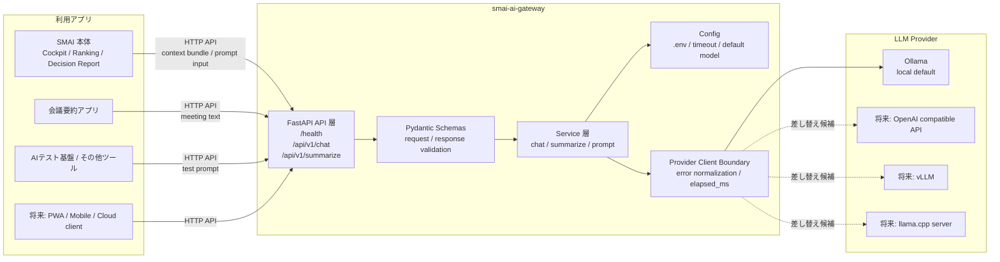

# SMAI AI Gateway

SMAI AI Gateway は、Smart Market AI から LLM 通信を分離するための汎用 API Gateway です。
現時点では SMAI リポジトリ配下に置きますが、将来的に独立リポジトリまたは Git submodule へ切り出せる前提で設計します。

## 目的

- SMAI 本体に LLM provider 固有の実装を密結合させない
- Ollama / OpenAI compatible API / vLLM / llama.cpp server などを差し替えやすくする
- SMAI だけでなく、会議要約アプリ、AI テスト基盤、その他ローカルツールからも使える共通 Gateway にする
- LLM の役割を説明、要約、確認観点の整理に限定し、数値予測やランキング決定を担当させない

## システム構成図



SMAI 本体は `AssistantContextBundle` などの必要な文脈だけを HTTP request として渡します。
Gateway は prompt 実行、provider 呼び出し、timeout、error normalization を担当し、SMAI 本体の Python module は import しません。
LLM provider を変更する場合も、SMAI 側ではなく Gateway の provider client 境界を差し替える設計です。

## 初期 API

- `GET /health`
- `POST /api/v1/chat`
- `POST /api/v1/summarize`

## 起動概要

```bat
run_server.bat
```

既定では `http://127.0.0.1:8088` で起動します。
詳細は [SETUP.md](SETUP.md) を参照してください。

通常テストは Ollama / network に依存しません。
Ollama 実接続は `SMAI_AI_GATEWAY_LIVE_SMOKE=1` を指定した opt-in smoke として分離します。

## SMAI 本体との境界

SMAI 本体からは HTTP API と request / response schema だけで接続します。
この Gateway から SMAI 本体の Python module を import しません。

既存の SMAI RAG / News RAG / Research Evidence 機能は現時点では移動しません。
